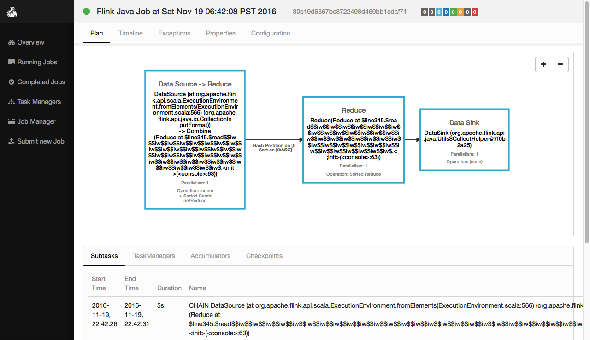

 
##reduce-on-groupBy
```
暗示第二个输入较小的交叉。
拿第一个输入的每一个元素和第二个输入的每一个元素进行交叉操作。
```

###reduce-on-groupBy示例一：使用一个Case Class Fields
执行程序：
```scale
//1.定义 class
case class WC(val word: String, val count: Int) 

//2.定义DataSet[WC]
val words: DataSet[WC] = benv.fromElements(WC("LISI",6),WC("LISI",4),WC("WANGWU",3),WC("ZHAOLIU",7))

//3.使用自定义的reduce方法,使用key-expressions 
val wordCounts1 = words.groupBy("word").reduce {
    (w1, w2) => new WC(w1.word, w1.count + w2.count)
}


//4.使用自定义的reduce方法,使用key-selector
val wordCounts2 = words.groupBy { _.word } reduce {
  (w1, w2) => new WC(w1.word, w1.count + w2.count)
}

//5.显示结果
wordCounts1.collect
wordCounts2.collect
```
执行结果：
```
Scala-Flink> wordCounts1.collect
res75: Seq[WC] = Buffer(WC(LISI,10), WC(WANGWU,3), WC(ZHAOLIU,7))

Scala-Flink> wordCounts1.collec2
res86: Seq[WC] = Buffer(WC(LISI,10), WC(WANGWU,3), WC(ZHAOLIU,7))
```
web ui中的执行效果：
 


###reduce-on-groupBy示例三：使用多个Case Class Fields
执行程序：
```scale
//1.定义 case class
case class Student(val name: String, addr: String, salary: Double)

//2.定义DataSet[Student]
val tuples:DataSet[Student] = benv.fromElements(
Student("lisi","shandong",2400.00),Student("zhangsan","henan",2600.00),
Student("lisi","shandong",2700.00),Student("lisi","guangdong",2800.00))

//3.使用自定义的reduce方法,使用多个Case Class Fields name
val reducedTuples1 = tuples.groupBy("name", "addr").reduce {
  (s1, s2) => Student(s1.name+"-"+s2.name,s1.addr+"-"+s2.addr,s1.salary+s2.salary)
}

//4.使用自定义的reduce方法,使用多个Case Class Fields index
val reducedTuples2 = tuples.groupBy(0, 1).reduce {
  (s1, s2) => Student(s1.name+"-"+s2.name,s1.addr+"-"+s2.addr,s1.salary+s2.salary)
}

//5.使用自定义的reduce方法,name和index混用
val reducedTuples3 = tuples.groupBy(0, 1).reduce {
  (s1, s2) => Student(s1.name+"-"+s2.name,s1.addr+"-"+s2.addr,s1.salary+s2.salary)
}


//6.显示结果
reducedTuples1.collect
reducedTuples2.collect
reducedTuples3.collect
```
执行结果：
```
Scala-Flink> reducedTuples1.collect
res96: Seq[Student] = Buffer(
Student(lisi,guangdong,2800.0),
Student(lisi-lisi,shandong-shandong,5100.0), 
Student(zhangsan,henan,2600.0))

Scala-Flink> reducedTuples2.collect
res97: Seq[Student] = Buffer(
Student(lisi,guangdong,2800.0),
Student(lisi-lisi,shandong-shandong,5100.0), 
Student(zhangsan,henan,2600.0))

Scala-Flink> reducedTuples3.collect
res98: Seq[Student] = Buffer(
Student(lisi,guangdong,2800.0),
Student(lisi-lisi,shandong-shandong,5100.0), 
Student(zhangsan,henan,2600.0))
```
web ui中的执行效果：
 


