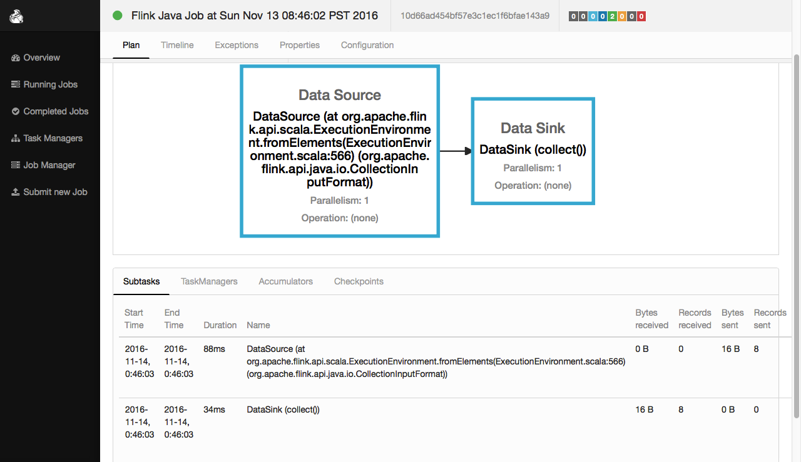
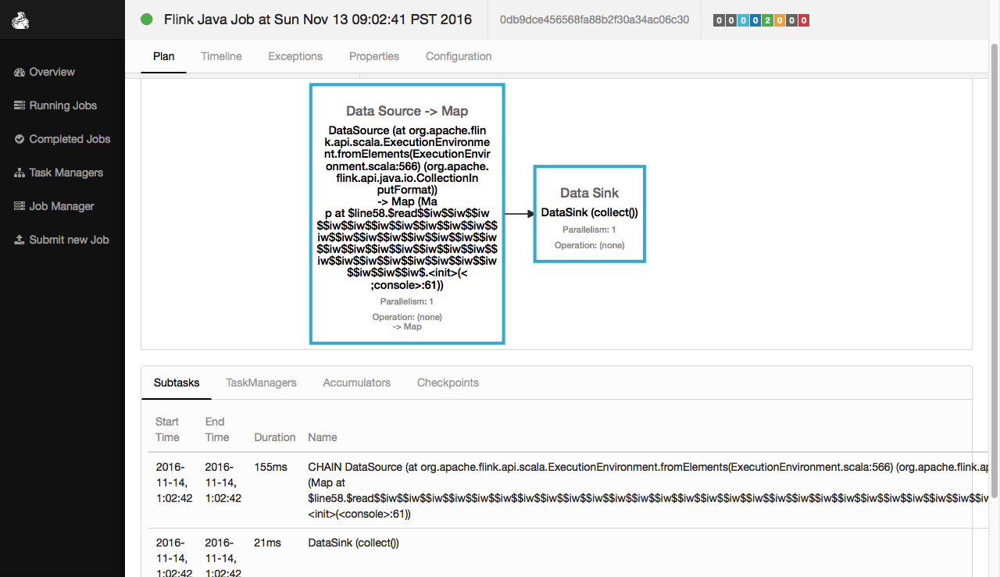
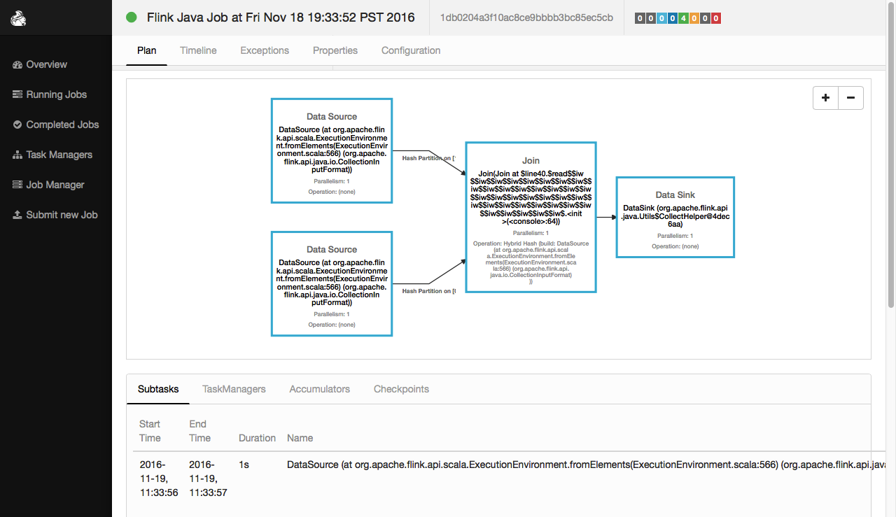

#Flink DateSet的API详解

---
##print()方法    
执行程序：
```scale
val input: DataSet[String] = benv.fromElements("A", "B", "C", "D", "E", "F", "G", "H")

input.print()
```

程序解析：
```scale
//1.创建一个 DataSet其元素为String类型
val input: DataSet[String] = benv.fromElements("A", "B", "C", "D", "E", "F", "G", "H")

//2.将DataSet的内容打印出来
input.print()
```
shell中的执行效果：
 
web ui中的执行效果：
 

---
##map
```
The Map transformation applies a user-defined map function on each element of a DataSet. 
It implements a one-to-one mapping, that is, exactly one element must be returned by the function.
```

###map示例一  
执行程序：
```scale
val input: DataSet[Int] = benv.fromElements(23, 67, 18, 29, 32, 56, 4, 27)

val result=input.map(_*2)
result.print()
```
程序解析：
```scale
//1.创建一个DataSet其元素为Int类型
val input: DataSet[Int] = benv.fromElements(23, 67, 18, 29, 32, 56, 4, 27)

//2.将DataSet中的每个元素乘以2
val result=input.map(_*2)

//3.将DataSet中的每个元素输出出来
result.print()
```
shell中的执行效果：
 
web ui中的执行效果：
    

###map示例二
执行程序：
```scale
val intPairs: DataSet[(Int, Int)] = benv.fromElements((18,4),(19,5),(23,6),(38,3))

val intSums = intPairs.map { pair => pair._1 + pair._2 }
intSums.collect
```
程序解析：
```scale
//1.创建一个DataSet[(Int, Int)] 
Scala-Flink> val intPairs: DataSet[(Int, Int)] = benv.fromElements((18,4),(19,5),(23,6),(38,3))
intPairs: org.apache.flink.api.scala.DataSet[(Int,Int)]=org.apache.flink.api.scala.DataSet@63f562b8

//2.键值对的key+value之和生成新的dataset
Scala-Flink> val intSums = intPairs.map { pair => pair._1 + pair._2 }
intSums: org.apache.flink.api.scala.DataSet[Int] = org.apache.flink.api.scala.DataSet@5f0b3abb

//3.显示结果
Scala-Flink> intSums.collect
res7: Seq[Int] = Buffer(22, 24, 29, 41)

```
shell中的执行效果：
 
web ui中的执行效果：
      

---
##flatMap  
```
The FlatMap transformation applies a user-defined flat-map function on each 
element of a DataSet. This variant of a map function can return arbitrary 
many result elements(including none) for each input element.
```

###flatMap示例一
执行程序：
```scale
val input: DataSet[String] = benv.fromElements("zhangsan boy", "lisi girl")

val result=input.flatMap { _.split(" ") }
result.print()
```
程序解析：
```scale
//1.创建一个 DataSet其元素为String类型
val input: DataSet[String] = benv.fromElements("zhangsan boy", "lisi girl")

//2.将DataSet中的每个元素用空格切割成一组单词
val result=input.flatMap { _.split(" ") }

//3.将这组单词显示出来
result.print()
```
shell中的执行效果：
 
web ui中的执行效果：
 

    
###flatMap示例二  
执行程序：
```scale
val textLines: DataSet[String] =benv.fromElements(
"this is a good job!",
"you can do a lot of things!",
"flink is a framework for bigdata.")

val words = textLines.flatMap { _.split(" ") }
words.collect
    
```
程序解析：
```scale
//1.创建一个DataSet其元素为String类型
Scala-Flink> val textLines: DataSet[String] =benv.fromElements(
"this is a good job!",
"you can do a lot of things!",
"flink is a framework for bigdata.")
textLines:org.apache.flink.api.scala.DataSet[String]=org.apache.flink.api.scala.DataSet@7c48ea9e

//2.对每句话进行单词切分
Scala-Flink> val words = textLines.flatMap { _.split(" ") }
words: org.apache.flink.api.scala.DataSet[String] = org.apache.flink.api.scala.DataSet@5876cd86

//3.显示结果内容
Scala-Flink> words.collect
res1: Seq[String] = Buffer(
this, is, a, good, job!, 
you, can, do, a, lot, of, things!, 
flink, is, a, framework, for, bigdata.)
```
shell中的执行效果：
 
web ui中的执行效果：
    


---
##mapPartition 
```
MapPartition transforms a parallel partition in a single function call. The map-partition
function gets the partition as Iterable and can produce an arbitrary number of result values.
The number of elements in each partition depends on the degree-of-parallelism and previous 
operations.
```
执行程序：
```scale
val input: DataSet[String] = benv.fromElements("zhangsan boy", "lisi is a girl so sex")

val result=input.mapPartition{in => Some(in.size)}
result.print()
```
程序解析：
```scale
//1.创建一个 DataSet其元素为String类型
val input: DataSet[String] = benv.fromElements("zhangsan boy", "lisi is a girl so sex")

//2.??????????????
val result=input.mapPartition{in => Some(in.size)}

//3.将结果显示出来
result.print()
```
shell中的执行效果：
 
web ui中的执行效果：
 


---
##filter
```
The Filter transformation applies a user-defined filter function on each element of 
a DataSet and retains only those elements for which the function returns true.
```
###filter示例一
执行程序：
```scale
val input: DataSet[String] = benv.fromElements("zhangsan boy", "lisi is a girl so sex","wangwu boy")
val result=input.filter{_.contains("boy")} //也可以写成filter(_.contains("boy"))
result.print()
```
程序解析：
```scale
//1.创建一个 DataSet其元素为String类型
val input: DataSet[String] = benv.fromElements("zhangsan boy", "lisi is a girl so sex","wangwu boy")

//2.过滤出包含'boy'字样的元素
val result=input.filter{_.contains("boy")}

//3.将结果显示出来
result.print()
```
shell中的执行效果：
 
web ui中的执行效果：
 

###filter示例二
执行程序：
```scale
val intNumbers: DataSet[Int] =  benv.fromElements(2,4,6,2,3,7)
val naturalNumbers = intNumbers.filter { _ %2== 0 }
naturalNumbers.collect
```
程序解析：
```scale
//1.创建一个DataSet[Int]
Scala-Flink> val intNumbers: DataSet[Int] =  benv.fromElements(2,4,6,2,3,7)
intNumbers: org.apache.flink.api.scala.DataSet[Int] = org.apache.flink.api.scala.DataSet@95e8df8

//2.过滤偶数
Scala-Flink> val naturalNumbers = intNumbers.filter { _ %2== 0 }
naturalNumbers: org.apache.flink.api.scala.DataSet[Int] = org.apache.flink.api.scala.DataSet@51645204

//3.显示结果
Scala-Flink> naturalNumbers.collect
res6: Seq[Int] = Buffer(2, 4, 6, 2)

```
shell中的执行效果：
 
web ui中的执行效果：
 

---
##reduce
```
Combines a group of elements into a single element by repeatedly combining two elements into one. 
Reduce may be applied on a full data set, or on a grouped data set.
```
执行程序：
```scale
//Int类型的DataSet做reduce
val a: DataSet[Int] = benv.fromElements(2,5,9,8,7,3)
val b: DataSet[Int] = a.reduce { _ + _ }
b.collect

//String类型的DataSet做reduce
val a: DataSet[String] = benv.fromElements("zhangsan boy", " lisi girl")
val b:DataSet[String] = a.reduce { _ + _ }
b.collect
```
程序解析：
```scale
//1.创建一个 DataSet其元素为Int类型
Scala-Flink> val a: DataSet[Int] = benv.fromElements(2,5,9,8,7,3)
a: org.apache.flink.api.scala.DataSet[Int] = org.apache.flink.api.scala.DataSet@c7ac49c

//2.将DataSet中的元素，reduce起来
Scala-Flink> val b: DataSet[Int] = a.reduce { _ + _ }
b: org.apache.flink.api.scala.DataSet[Int] = org.apache.flink.api.scala.DataSet@487bc869

//3.显示计算结果
Scala-Flink> b.collect
res6: Seq[Int] = Buffer(34)


//1.创建一个 DataSet其元素为String类型
Scala-Flink> val a: DataSet[String] = benv.fromElements("zhangsan boy", " lisi girl")
a: org.apache.flink.api.scala.DataSet[String] = org.apache.flink.api.scala.DataSet@67426220

//2.将DataSet中的元素，reduce起来
Scala-Flink> val b:DataSet[String] = a.reduce { _ + _ }
b: org.apache.flink.api.scala.DataSet[String] = org.apache.flink.api.scala.DataSet@762d65de

//3.显示计算结果
Scala-Flink> b.collect
res8: Seq[String] = Buffer(zhangsan boy lisi girl)
```
shell中的执行效果：
 
web ui中的执行效果：
 


---
##ReduceGroup???

---
##Aggregate??

---
##distinct
```
Returns the distinct elements of a data set. It removes the duplicate entries from the input DataSet,
with respect to all fields of the elements, or a subset of fields.
```
###distinct示例一，单一项目的去重
执行程序：
```scale
val input: DataSet[String] = benv.fromElements("lisi","zhangsan", "lisi","wangwu")
val result=input.distinct()
result.collect
```
程序解析：
```scale
//1.创建一个 DataSet其元素为String类型
Scala-Flink> val input: DataSet[String] = benv.fromElements("lisi","zhangsan", "lisi","wangwu")
input: org.apache.flink.api.scala.DataSet[String] = org.apache.flink.api.scala.DataSet@5e76aabc

//2.元素去重
Scala-Flink> val result=input.distinct()
result: org.apache.flink.api.scala.DataSet[String] = org.apache.flink.api.scala.DataSet@1f8e30a6

//3.显示结果
Scala-Flink> result.collect
res15: Seq[String] = Buffer(lisi, wangwu, zhangsan)
```
shell中的执行效果：
 
web ui中的执行效果：
 

###distinct示例二，多项目的去重，不指定比较项目，默认是全部比较

执行程序：
```scale
val input: DataSet[(Int, String, Double)] =  benv.fromElements(
(2,"zhagnsan",1654.5),(3,"lisi",2347.8),(2,"zhagnsan",1654.5),
(4,"wangwu",1478.9),(5,"zhaoliu",987.3),(2,"zhagnsan",1654.0))

val output = input.distinct()
output.collect
```
程序解析：
```scale
//1.创建DataSet[(Int, String, Double)] 
Scala-Flink> val input: DataSet[(Int, String, Double)] =  benv.fromElements(
(2,"zhagnsan",1654.5),(3,"lisi",2347.8),(2,"zhagnsan",1654.5),
(4,"wangwu",1478.9),(5,"zhaoliu",987.3),(2,"zhagnsan",1654.0))
input: org.apache.flink.api.scala.DataSet[(Int, String, Double)] = 
org.apache.flink.api.scala.DataSet@5a5b2829

//2.元素去重
Scala-Flink> val output = input.distinct()
output: org.apache.flink.api.scala.DataSet[(Int, String, Double)] =
org.apache.flink.api.scala.DataSet@1f70c1b8

//3.显示结果
Scala-Flink> output.collect
res12: Seq[(Int, String, Double)] = Buffer(
(2,zhagnsan,1654.0), (2,zhagnsan,1654.5), 
(3,lisi,2347.8), (4,wangwu,1478.9), (5,zhaoliu,987.3))
```

###distinct示例三，多项目的去重，指定比较项目

执行程序：
```scale
val input: DataSet[(Int, String, Double)] =  benv.fromElements(
(2,"zhagnsan",1654.5),(3,"lisi",2347.8),(2,"zhagnsan",1654.5),
(4,"wangwu",1478.9),(5,"zhaoliu",987.3),(2,"zhagnsan",1654.0))

val output = input.distinct(0,1)
output.collect
```
程序解析：
```scale
//1.创建DataSet[(Int, String, Double)] 
Scala-Flink> val input: DataSet[(Int, String, Double)] =  benv.fromElements(
     | (2,"zhagnsan",1654.5),(3,"lisi",2347.8),(2,"zhagnsan",1654.5),
     | (4,"wangwu",1478.9),(5,"zhaoliu",987.3),(2,"zhagnsan",1654.0))
input: org.apache.flink.api.scala.DataSet[(Int, String, Double)] = 
org.apache.flink.api.scala.DataSet@2e139467

//2.元素去重:指定比较第0和第1号元素
Scala-Flink> val output = input.distinct(0,1)
output: org.apache.flink.api.scala.DataSet[(Int, String, Double)] = 
org.apache.flink.api.scala.DataSet@344e665a

//3.显示结果
Scala-Flink> output.collect
res15: Seq[(Int, String, Double)] = Buffer(
(2,zhagnsan,1654.5), (3,lisi,2347.8), (4,wangwu,1478.9), (5,zhaoliu,987.3))
```

###distinct示例四，caseClass的去重，指定比较项目

执行程序：
```scale

case class Student(name : String, age : Int) 
val input: DataSet[Student] =  benv.fromElements(
Student("zhangsan",24),Student("zhangsan",24),Student("zhangsan",25),
Student("lisi",24),Student("wangwu",24),Student("lisi",25))

val age_r = input.distinct("age")
age_r.collect

val name_r = input.distinct("name")
name_r.collect

val all_r = input.distinct("age","name")
all_r.collect

val all = input.distinct()
all.collect

val all0 = input.distinct("_")
all0.collect
```
程序解析：
```scale
//1.创建case class Student
Scala-Flink> case class Student(name : String, age : Int)
defined class Student

//2.创建DataSet[Student]
Scala-Flink> val input: DataSet[Student] =  benv.fromElements(
     | Student("zhangsan",24),Student("zhangsan",24),Student("zhangsan",25),
     | Student("lisi",24),Student("wangwu",24),Student("lisi",25))
input: org.apache.flink.api.scala.DataSet[Student] = org.apache.flink.api.scala.DataSet@69831eba

//3.去掉age重复的元素
Scala-Flink> val age_r = input.distinct("age")
age_r: org.apache.flink.api.scala.DataSet[Student] = org.apache.flink.api.scala.DataSet@29393c36

Scala-Flink> age_r.collect
res38: Seq[Student] = Buffer(Student(zhangsan,24), Student(zhangsan,25))

//4.去掉name重复的元素
Scala-Flink> val name_r = input.distinct("name")
name_r: org.apache.flink.api.scala.DataSet[Student]=org.apache.flink.api.scala.DataSet@473cf185

Scala-Flink> name_r.collect
res39: Seq[Student] = Buffer(Student(lisi,24), Student(wangwu,24), Student(zhangsan,24))

//6.去掉name和age重复的元素
Scala-Flink> val all_r = input.distinct("age","name")
all_r: org.apache.flink.api.scala.DataSet[Student] = org.apache.flink.api.scala.DataSet@71b1165c

Scala-Flink> all_r.collect
res40: Seq[Student] = Buffer(Student(lisi,24), Student(lisi,25), Student(wangwu,24),
Student(zhangsan,24), Student(zhangsan,25))

//7.去掉name和age重复的元素
Scala-Flink> val all = input.distinct()
all: org.apache.flink.api.scala.DataSet[Student] = org.apache.flink.api.scala.DataSet@2073f3b6

Scala-Flink> all.collect
res41: Seq[Student] = Buffer(Student(lisi,24), Student(lisi,25), Student(wangwu,24), 
Student(zhangsan,24), Student(zhangsan,25))

//8.去掉name和age重复的元素
Scala-Flink> val all0 = input.distinct("_")
all0: org.apache.flink.api.scala.DataSet[Student] = org.apache.flink.api.scala.DataSet@66f3b11c
Scala-Flink> all0.collect
res47: Seq[Student] = Buffer(Student(lisi,24), Student(lisi,25), Student(wangwu,24),
Student(zhangsan,24), Student(zhangsan,25))
```
web ui中的执行效果：
 


###distinct示例五，根据表达式进行去重

执行程序：
```scale
val input: DataSet[Int] = benv.fromElements(3,-3,4,-4,6,-5,7)

val output = input.distinct {x => Math.abs(x)}
output.collect
```
程序解析：
```scale
Scala-Flink> output.collect
res15: Seq[(Int, String, Double)] = Buffer(
(2,zhagnsan,1654.5), (3,lisi,2347.8), (4,wangwu,1478.9), (5,zhaoliu,987.3))

//1.创建DataSet[Int]
Scala-Flink> val input: DataSet[Int] = benv.fromElements(3,-3,4,-4,6,-5,7)
input: org.apache.flink.api.scala.DataSet[Int] = org.apache.flink.api.scala.DataSet@55ed46a

//2.根据表达式，进行元素去重
Scala-Flink> val output = input.distinct {x => Math.abs(x)}
output: org.apache.flink.api.scala.DataSet[Int] = org.apache.flink.api.scala.DataSet@187272b0

//3.显示结果
Scala-Flink> output.collect
res48: Seq[Int] = Buffer(3, 4, -5, 6, 7)
```

---
##join
```
Joins two data sets by creating all pairs of elements that are equal on their keys. Optionally uses
a JoinFunction to turn the pair of elements into a single element, or a FlatJoinFunction to turn the
pair of elements into arbitrarily many (including none) elements. 
```
###join示例一：
执行程序：
```scale
val input1: DataSet[(Int, String)] =  benv.fromElements(
(2,"zhagnsan"),(3,"lisi"),(4,"wangwu"),(5,"zhaoliu"))

val input2: DataSet[(Double, Int)] =  benv.fromElements(
(1850.98,4),(1950.98,5),(2350.98,6),(3850.98,3))

val result = input1.join(input2).where(0).equalTo(1)
result.collect
```
程序解析：
```scale
//1.创建一个 DataSet其元素为[(Int,String)]类型
Scala-Flink>val input1:DataSet[(Int,String)]=benv.fromElements(
(2,"zhagnsan"),(3,"lisi"),(4,"wangwu"),(5,"zhaoliu"))
input1: org.apache.flink.api.scala.DataSet[(Int, String)] = 
org.apache.flink.api.scala.DataSet@1a7437d8

//2.创建一个 DataSet其元素为[(Double, Int)]类型
Scala-Flink> val input2: DataSet[(Double, Int)] = benv.fromElements(
(1850.98,4),(1950.98,5),(2350.98,6),(3850.98,3))
input2: org.apache.flink.api.scala.DataSet[(Double,Int)]=org.apache.flink.api.scala.DataSet@1ccce165

//3.两个DataSet进行join操作，条件是input1(0)==input2(1)
Scala-Flink> val result = input1.join(input2).where(0).equalTo(1)
result: org.apache.flink.api.scala.JoinDataSet[(Int,String),(Double,Int)]=
org.apache.flink.api.scala.JoinDataSet@3b3dc752

//4.显示结果
Scala-Flink> result.collect
res0: Seq[((Int, String), (Double, Int))] = Buffer(
((4,wangwu),(1850.98,4)),
((5,zhaoliu),(1950.98,5)), 
((3,lisi),(3850.98,3)))
```
shell中的执行效果：
 
web ui中的执行效果：
 


###join示例二：
```
A Join transformation can also call a user-defined join function to process joining tuples. 
A join function receives one element of the first input DataSet and one element of the second 
input DataSet and returns exactly one element.

The following code performs a join of DataSet with custom java objects and a Tuple DataSet using 
key-selector functions and shows how to use a user-defined join function:
```


执行程序：
```scale
case class Rating(name: String, category: String, points: Int)
val ratings: DataSet[Rating] = benv.fromElements(
Rating("moon","youny1",3),Rating("sun","youny2",4),
Rating("cat","youny3",1),Rating("dog","youny4",5))

val weights: DataSet[(String, Double)] = benv.fromElements(
("youny1",4.3),("youny2",7.2),
("youny3",9.0),("youny4",1.5))

val weightedRatings = ratings.join(weights).where("category").equalTo(0) {
  (rating, weight) => (rating.name, rating.points + weight._2)
}

weightedRatings.collect
```
程序解析：
```scale
//1.定义case class
Scala-Flink> case class Rating(name: String, category: String, points: Int)
defined class Rating

//2.创建 DataSet[Rating]
Scala-Flink> val ratings: DataSet[Rating] = benv.fromElements(
     | Rating("moon","youny1",3),Rating("sun","youny2",4),
     | Rating("cat","youny3",1),Rating("dog","youny4",5))
ratings: org.apache.flink.api.scala.DataSet[Rating] = org.apache.flink.api.scala.DataSet@2fbd9785

//3.创建DataSet[(String, Double)] 
Scala-Flink> val weights: DataSet[(String, Double)] = benv.fromElements(
     | ("youny1",4.3),("youny2",7.2),
     | ("youny3",9.0),("youny4",1.5))
weights: org.apache.flink.api.scala.DataSet[(String, Double)] = org.apache.flink.api.scala.DataSet@2a59c706

//4.使用方法进行join
Scala-Flink> val weightedRatings = ratings.join(weights).where("category").equalTo(0) {
     |   (rating, weight) => (rating.name, rating.points + weight._2)
     | }
weightedRatings: org.apache.flink.api.scala.DataSet[(String, Double)] = org.apache.flink.api.scala.DataSet@7049e176

//5.显示结果
Scala-Flink> weightedRatings.collect
res5: Seq[(String, Double)] = Buffer((moon,7.3), (sun,11.2), (cat,10.0), (dog,6.5))

```
web ui中的执行效果：
 


###join示例三：
```
A Join transformation can also call a user-defined join function to process joining tuples. 
A join function receives one element of the first input DataSet and one element of the second 
input DataSet and returns exactly one element.

The following code performs a join of DataSet with custom java objects and a Tuple DataSet using 
key-selector functions and shows how to use a user-defined join function:
```


执行程序：
```scale
import java.util. Collector
case class Rating(name: String, category: String, points: Int)
val ratings: DataSet[Rating] = benv.fromElements(
Rating("moon","youny1",3),Rating("sun","youny2",4),
Rating("cat","youny3",1),Rating("dog","youny4",5))

val weights: DataSet[(String, Double)] = benv.fromElements(
("youny1",4.3),("youny2",7.2),
("youny3",9.0),("youny4",1.5))

val weightedRatings = ratings.join(weights).where("category").equalTo(0) {
  (rating, weight, out: Collector[(String, Double)]) =>
    if (weight._2 > 0.1) out.collect(rating.name, rating.points * weight._2)
}

weightedRatings.collect
```


###join示例四：执行join操作时暗示数据大小
```
在执行join操作时暗示数据大小，可以帮助flink优化它的执行策略，提高执行效率。
```
执行程序：
```scale
val input1: DataSet[(Int, String)] = 
benv.fromElements((3,"zhangsan"),(2,"lisi"),(4,"wangwu"),(6,"zhaoliu"))

val input2: DataSet[(Int, String)] = 
benv.fromElements((4000,"zhangsan"),(70000,"lisi"),(4600,"wangwu"),(53000,"zhaoliu"))

// hint that the second DataSet is very small
val result1 = input1.joinWithTiny(input2).where(1).equalTo(1)
result1.collect

// hint that the second DataSet is very large
val result2 = input1.joinWithHuge(input2).where(1).equalTo(1)
result2.collect
```

```
//1.定义两个 DataSet
Scala-Flink> val input1: DataSet[(Int, String)] =
     | benv.fromElements((3,"zhangsan"),(2,"lisi"),(4,"wangwu"),(6,"zhaoliu"))
input1: org.apache.flink.api.scala.DataSet[(Int, String)] = org.apache.flink.api.scala.DataSet@5accd405

Scala-Flink> val input2: DataSet[(Int, String)] =
     | benv.fromElements((4000,"zhangsan"),(70000,"lisi"),(4600,"wangwu"),(53000,"zhaoliu"))
input2: org.apache.flink.api.scala.DataSet[(Int, String)] = org.apache.flink.api.scala.DataSet@519a0a93

//2.join 并提示input2比较小
Scala-Flink> val result1 = input1.joinWithTiny(input2).where(1).equalTo(1)
result1:org.apache.flink.api.scala.JoinDataSet[(Int,String),(Int,String)]=org.apache.flink.api.scala.JoinDataSet@40f3a46f

Scala-Flink> result1.collect
res12: Seq[((Int, String), (Int, String))] = Buffer(
((3,zhangsan),(4000,zhangsan)), ((2,lisi),(70000,lisi)), 
((4,wangwu),(4600,wangwu)), ((6,zhaoliu),(53000,zhaoliu)))

//3.join 并提示input2比较大
Scala-Flink> val result2 = input1.joinWithHuge(input2).where(1).equalTo(1)
result2:org.apache.flink.api.scala.JoinDataSet[(Int,String),(Int,String)]=org.apache.flink.api.scala.JoinDataSet@2f51ce2a

Scala-Flink> result2.collect
res13: Seq[((Int, String), (Int, String))] = Buffer(
((3,zhangsan),(4000,zhangsan)), ((2,lisi),(70000,lisi)), 
((4,wangwu),(4600,wangwu)), ((6,zhaoliu),(53000,zhaoliu)))
```
web ui中的执行效果：
 


###join示例五：执行join操作时暗示数据大小
```
flink有很多种执行join的策略，你可以指定一个执行策略，以便提高执行效率。
```
执行程序：
```scale
//1.定义两个 DataSet
val input1: DataSet[(Int, String)] = 
benv.fromElements((3,"zhangsan"),(2,"lisi"),(4,"wangwu"),(6,"zhaoliu"))
val input2: DataSet[(Int, String)] = 
benv.fromElements((4000,"zhangsan"),(70000,"lisi"),(4600,"wangwu"),(53000,"zhaoliu"))

//2.暗示input2很小
val result1 = input1.join(input2, JoinHint.BROADCAST_HASH_FIRST).where(1).equalTo(1)

//3.显示结果
result1.collect
```
执行结果：
```
res15: Seq[((Int, String), (Int, String))] = Buffer(
((3,zhangsan),(4000,zhangsan)),
((2,lisi),(70000,lisi)), 
((4,wangwu),(4600,wangwu)),
((6,zhaoliu),(53000,zhaoliu)))
```
暗示项说明：
```
暗示有如下选项：
1.OPTIMIZER_CHOOSES:
    没有明确暗示，让系统自行选择。
2.BROADCAST_HASH_FIRST
    把第一个输入转化成一个哈希表，并广播出去。适用于第一个输入数据较小的情况。
3.BROADCAST_HASH_SECOND:
    把第二个输入转化成一个哈希表，并广播出去。适用于第二个输入数据较小的情况。
4.REPARTITION_HASH_FIRST:（defalut）
    1.如果输入没有分区，系统将把输入重分区。
    2.系统将把第一个输入转化成一个哈希表广播出去。
    3.两个输入依然比较大。
    4.适用于第一个输入小于第二个输入的情况。
5.REPARTITION_HASH_SECOND:
    1.如果输入没有分区，系统将把输入重分区。
    2.系统将把第二个输入转化成一个哈希表广播出去。
    3.两个输入依然比较大。
    4.适用于第二个输入小于第一个输入的情况。
6.REPARTITION_SORT_MERGE:
    1.如果输入没有分区，系统将把输入重分区。
    2.如果输入没有排序，系统将吧输入重排序。
    3.系统将合并两个排序好的输入。
    4.适用于一个或两个分区已经排序好的情况。
    
 
```


参考链接：  
https://ci.apache.org/projects/flink/flink-docs-release-1.1/apis/batch/index.html
https://ci.apache.org/projects/flink/flink-docs-release-1.1/apis/batch/dataset_transformations.html#join