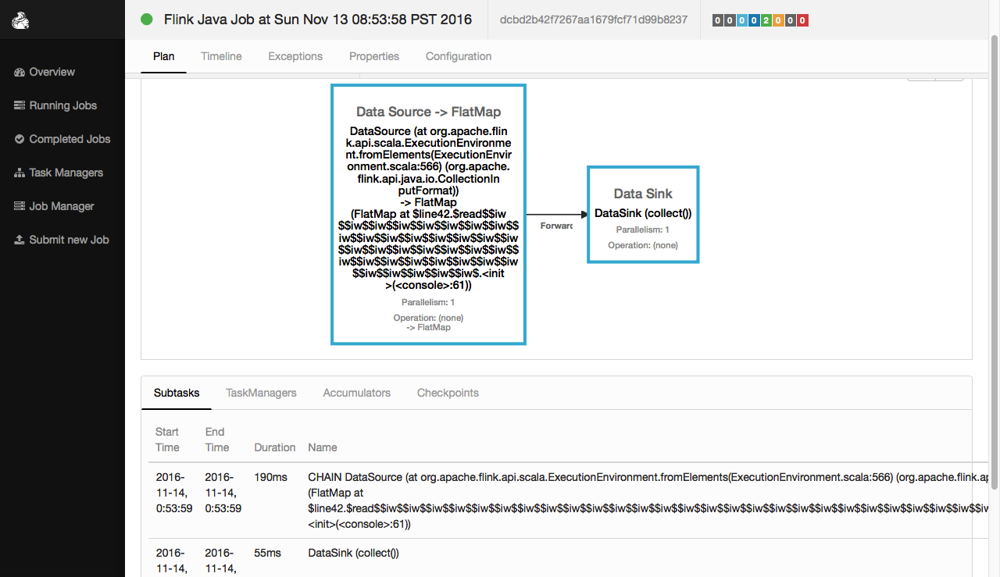
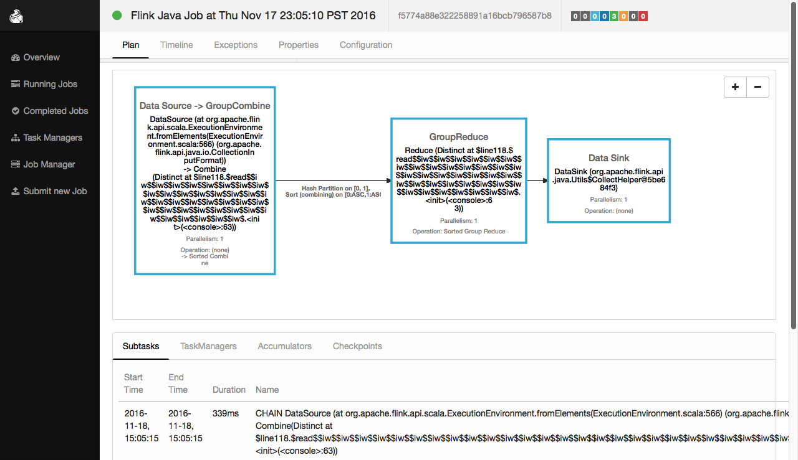
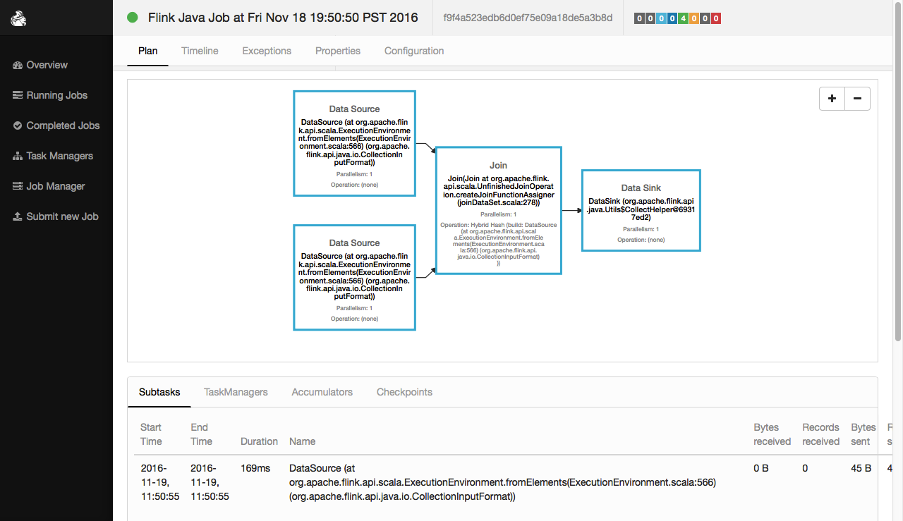
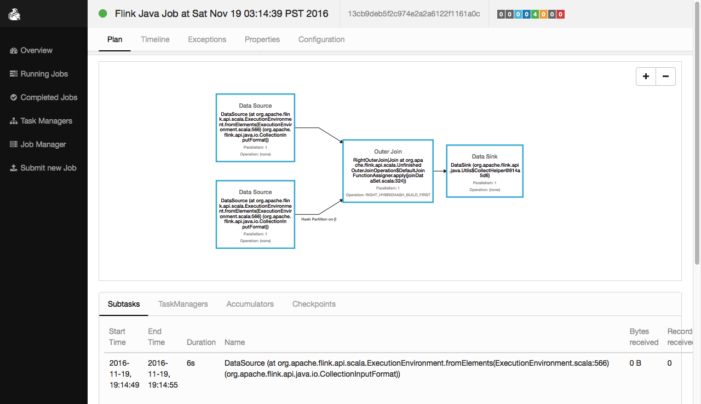
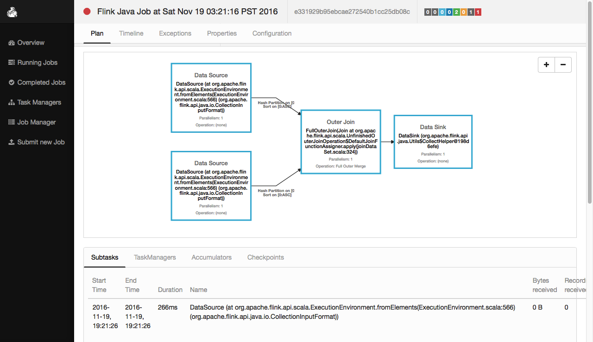
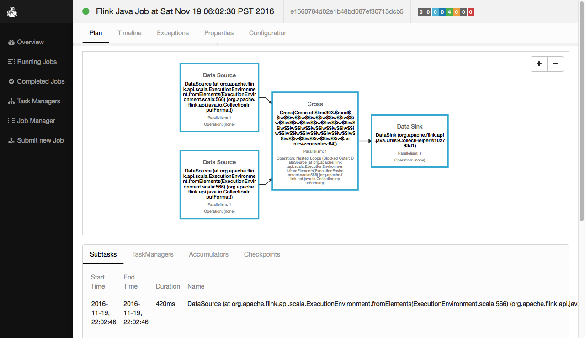
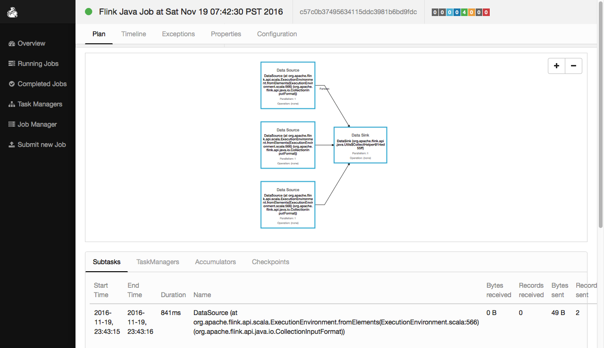

#Flink DateSet的API详解

---
##print()方法    
执行程序：
```scale
//1.创建一个 DataSet其元素为String类型
val input: DataSet[String] = benv.fromElements("A", "B", "C", "D", "E", "F", "G", "H")

//2.将DataSet的内容打印出来
input.print()
```
执行结果：
```scale
A
B
C
D
E
F
G
H
```
web ui中的执行效果：
 

---
##map
```
The Map transformation applies a user-defined map function on each element of a DataSet. 
It implements a one-to-one mapping, that is, exactly one element must be returned by the function.
```

###map示例一  
执行程序：
```scale
//1.创建一个DataSet其元素为Int类型
val input: DataSet[Int] = benv.fromElements(23, 67, 18, 29, 32, 56, 4, 27)

//2.将DataSet中的每个元素乘以2
val result=input.map(_*2)

//3.将DataSet中的每个元素输出出来
result.collect
```
执行结果：
```scale
res47: Seq[Int] = Buffer(46, 134, 36, 58, 64, 112, 8, 54)
```
web ui中的执行效果：
    

###map示例二
执行程序：
```scale
//1.创建一个DataSet[(Int, Int)] 
val intPairs: DataSet[(Int, Int)] = benv.fromElements((18,4),(19,5),(23,6),(38,3))

//2.键值对的key+value之和生成新的dataset
val intSums = intPairs.map { pair => pair._1 + pair._2 }

//3.显示结果
intSums.collect
```
执行结果：
```scale
res44: Seq[Int] = Buffer(22, 24, 29, 41)
```
web ui中的执行效果：
      

---
##flatMap  
```
The FlatMap transformation applies a user-defined flat-map function on each 
element of a DataSet. This variant of a map function can return arbitrary 
many result elements(including none) for each input element.
```

###flatMap示例一
执行程序：
```scale
//1.创建一个 DataSet其元素为String类型
val input: DataSet[String] = benv.fromElements("zhangsan boy", "lisi girl")

//2.将DataSet中的每个元素用空格切割成一组单词
val result=input.flatMap { _.split(" ") }

//3.将这组单词显示出来
result.collect
```
执行结果：
```scale
res46: Seq[String] = Buffer(zhangsan, boy, lisi, girl)
```
web ui中的执行效果：
 

    
###flatMap示例二  
执行程序：
```scale
//1.创建一个DataSet其元素为String类型
val textLines: DataSet[String] =benv.fromElements(
"this is a good job!",
"you can do a lot of things!",
"flink is a framework for bigdata.")

//2.对每句话进行单词切分
val words = textLines.flatMap { _.split(" ") }

//3.显示结果内容
words.collect 
```
执行结果：
```scale
res48: Seq[String] = Buffer
(this, is, a, good, job!, 
you, can, do, a, lot, of, things!,
flink, is, a, framework, for, bigdata.)
```
web ui中的执行效果：
    


---
##mapPartition 
```
MapPartition transforms a parallel partition in a single function call. The map-partition
function gets the partition as Iterable and can produce an arbitrary number of result values.
The number of elements in each partition depends on the degree-of-parallelism and previous 
operations.
```
执行程序：
```scale
//1.创建一个 DataSet其元素为String类型
val input: DataSet[String] = benv.fromElements("zhangsan boy", "lisi is a girl so sex")

//2.??????????????
val result=input.mapPartition{in => Some(in.size)}

//3.将结果显示出来
result.collect
```
执行结果：
```scale
res49: Seq[Int] = Buffer(2)
```
web ui中的执行效果：
 


---
##filter
```
The Filter transformation applies a user-defined filter function on each element of 
a DataSet and retains only those elements for which the function returns true.
```
###filter示例一
执行程序：
```scale
//1.创建一个 DataSet其元素为String类型
val input: DataSet[String] = benv.fromElements("zhangsan boy", "lisi is a girl so sex","wangwu boy")

//2.过滤出包含'boy'字样的元素
val result=input.filter{_.contains("boy")} //也可以写成filter(_.contains("boy"))

//3.将结果显示出来
result.collect
```
执行结果：
```scale
res50: Seq[String] = Buffer(zhangsan boy, wangwu boy)
``` 
web ui中的执行效果：
 

###filter示例二
执行程序：
```scale
//1.创建一个DataSet[Int]
val intNumbers: DataSet[Int] =  benv.fromElements(2,4,6,2,3,7)

//2.过滤偶数
val naturalNumbers = intNumbers.filter { _ %2== 0 }

//3.显示结果
naturalNumbers.collect
```
程序解析：
```scale
res51: Seq[Int] = Buffer(2, 4, 6, 2)
```
web ui中的执行效果：
 

---
##reduce
```
Combines a group of elements into a single element by repeatedly combining two elements into one. 
Reduce may be applied on a full data set, or on a grouped data set.
```
执行程序：
```scale
//Int类型的DataSet做reduce
val a: DataSet[Int] = benv.fromElements(2,5,9,8,7,3)
val b: DataSet[Int] = a.reduce { _ + _ }
b.collect

//String类型的DataSet做reduce
val a: DataSet[String] = benv.fromElements("zhangsan boy", " lisi girl")
val b:DataSet[String] = a.reduce { _ + _ }
b.collect
```
程序解析：
```scale
//1.创建一个 DataSet其元素为Int类型
Scala-Flink> val a: DataSet[Int] = benv.fromElements(2,5,9,8,7,3)
a: org.apache.flink.api.scala.DataSet[Int] = org.apache.flink.api.scala.DataSet@c7ac49c

//2.将DataSet中的元素，reduce起来
Scala-Flink> val b: DataSet[Int] = a.reduce { _ + _ }
b: org.apache.flink.api.scala.DataSet[Int] = org.apache.flink.api.scala.DataSet@487bc869

//3.显示计算结果
Scala-Flink> b.collect
res6: Seq[Int] = Buffer(34)


//1.创建一个 DataSet其元素为String类型
Scala-Flink> val a: DataSet[String] = benv.fromElements("zhangsan boy", " lisi girl")
a: org.apache.flink.api.scala.DataSet[String] = org.apache.flink.api.scala.DataSet@67426220

//2.将DataSet中的元素，reduce起来
Scala-Flink> val b:DataSet[String] = a.reduce { _ + _ }
b: org.apache.flink.api.scala.DataSet[String] = org.apache.flink.api.scala.DataSet@762d65de

//3.显示计算结果
Scala-Flink> b.collect
res8: Seq[String] = Buffer(zhangsan boy lisi girl)
```
web ui中的执行效果：
 


---
##ReduceGroup???

---
##Aggregate??

---
##distinct
```
Returns the distinct elements of a data set. It removes the duplicate entries from the input DataSet,
with respect to all fields of the elements, or a subset of fields.
```
###distinct示例一，单一项目的去重
执行程序：
```scale
//1.创建一个 DataSet其元素为String类型
val input: DataSet[String] = benv.fromElements("lisi","zhangsan", "lisi","wangwu")

//2.元素去重
val result=input.distinct()

//3.显示结果
result.collect
```
执行结果：
```scale
res52: Seq[String] = Buffer(lisi, wangwu, zhangsan)
```
web ui中的执行效果：
 

###distinct示例二，多项目的去重，不指定比较项目，默认是全部比较

执行程序：
```scale
//1.创建DataSet[(Int, String, Double)] 
val input: DataSet[(Int, String, Double)] =  benv.fromElements(
(2,"zhagnsan",1654.5),(3,"lisi",2347.8),(2,"zhagnsan",1654.5),
(4,"wangwu",1478.9),(5,"zhaoliu",987.3),(2,"zhagnsan",1654.0))

//2.元素去重
val output = input.distinct()

//3.显示结果
output.collect
```
执行结果：
```scale
res53: Seq[(Int, String, Double)] = Buffer(
(2,zhagnsan,1654.0), 
(2,zhagnsan,1654.5), 
(3,lisi,2347.8), 
(4,wangwu,1478.9), 
(5,zhaoliu,987.3))
```

###distinct示例三，多项目的去重，指定比较项目

执行程序：
```scale
//1.创建DataSet[(Int, String, Double)] 
val input: DataSet[(Int, String, Double)] =  benv.fromElements(
(2,"zhagnsan",1654.5),(3,"lisi",2347.8),(2,"zhagnsan",1654.5),
(4,"wangwu",1478.9),(5,"zhaoliu",987.3),(2,"zhagnsan",1654.0))

//2.元素去重:指定比较第0和第1号元素
val output = input.distinct(0,1)

//3.显示结果
output.collect
```
执行结果：
```scale
res54: Seq[(Int, String, Double)] = Buffer(
(2,zhagnsan,1654.5),
(3,lisi,2347.8), 
(4,wangwu,1478.9), 
(5,zhaoliu,987.3))
```

###distinct示例四，case class的去重，指定比较项目

执行程序：
```scale
//1.创建case class Student
case class Student(name : String, age : Int) 

//2.创建DataSet[Student]
val input: DataSet[Student] =  benv.fromElements(
Student("zhangsan",24),Student("zhangsan",24),Student("zhangsan",25),
Student("lisi",24),Student("wangwu",24),Student("lisi",25))

//3.去掉age重复的元素
val age_r = input.distinct("age")
age_r.collect

//4.去掉name重复的元素
val name_r = input.distinct("name")
name_r.collect

//5.去掉name和age重复的元素
val all_r = input.distinct("age","name")
all_r.collect

//6.去掉name和age重复的元素
val all = input.distinct()
all.collect

//7.去掉name和age重复的元素
val all0 = input.distinct("_")
all0.collect
```
程序解析：
```scale
Scala-Flink> age_r.collect
res38: Seq[Student] = Buffer(Student(zhangsan,24), Student(zhangsan,25))

Scala-Flink> name_r.collect
res39: Seq[Student] = Buffer(Student(lisi,24), Student(wangwu,24), Student(zhangsan,24))

Scala-Flink> all_r.collect
res40: Seq[Student] = Buffer(Student(lisi,24), Student(lisi,25), Student(wangwu,24),
Student(zhangsan,24), Student(zhangsan,25))

Scala-Flink> all.collect
res41: Seq[Student] = Buffer(Student(lisi,24), Student(lisi,25), Student(wangwu,24), 
Student(zhangsan,24), Student(zhangsan,25))

Scala-Flink> all0.collect
res47: Seq[Student] = Buffer(Student(lisi,24), Student(lisi,25), Student(wangwu,24),
Student(zhangsan,24), Student(zhangsan,25))
```
web ui中的执行效果：
 


###distinct示例五，根据表达式进行去重

执行程序：
```scale
//1.创建DataSet[Int]
val input: DataSet[Int] = benv.fromElements(3,-3,4,-4,6,-5,7)

//2.根据表达式，本例中是根据元素的绝对值进行元素去重
val output = input.distinct {x => Math.abs(x)}

//3.显示结果
output.collect
```
执行结果：
```scale
res55: Seq[Int] = Buffer(3, 4, -5, 6, 7)
```

---
##join
```
Joins two data sets by creating all pairs of elements that are equal on their keys. Optionally uses
a JoinFunction to turn the pair of elements into a single element, or a FlatJoinFunction to turn the
pair of elements into arbitrarily many (including none) elements. 
```
###join示例一：
执行程序：
```scale
//1.创建一个 DataSet其元素为[(Int,String)]类型
val input1: DataSet[(Int, String)] =  benv.fromElements(
(2,"zhagnsan"),(3,"lisi"),(4,"wangwu"),(5,"zhaoliu"))

//2.创建一个 DataSet其元素为[(Double, Int)]类型
val input2: DataSet[(Double, Int)] =  benv.fromElements(
(1850.98,4),(1950.98,5),(2350.98,6),(3850.98,3))

//3.两个DataSet进行join操作，条件是input1(0)==input2(1)
val result = input1.join(input2).where(0).equalTo(1)

//4.显示结果
result.collect
```
执行结果：
```scale
res56: Seq[((Int, String), (Double, Int))] = Buffer(
((4,wangwu),(1850.98,4)), 
((5,zhaoliu),(1950.98,5)), 
((3,lisi),(3850.98,3)))
```
web ui中的执行效果：
 


###join示例二：
```
A Join transformation can also call a user-defined join function to process joining tuples. 
A join function receives one element of the first input DataSet and one element of the second 
input DataSet and returns exactly one element.

The following code performs a join of DataSet with custom java objects and a Tuple DataSet using 
key-selector functions and shows how to use a user-defined join function:
```


执行程序：
```scale
//1.定义case class
case class Rating(name: String, category: String, points: Int)

//2.定义DataSet[Rating]
val ratings: DataSet[Rating] = benv.fromElements(
Rating("moon","youny1",3),Rating("sun","youny2",4),
Rating("cat","youny3",1),Rating("dog","youny4",5))

//3.创建DataSet[(String, Double)] 
val weights: DataSet[(String, Double)] = benv.fromElements(
("youny1",4.3),("youny2",7.2),
("youny3",9.0),("youny4",1.5))

//4.使用方法进行join
val weightedRatings = ratings.join(weights).where("category").equalTo(0) {
  (rating, weight) => (rating.name, rating.points + weight._2)
}

//5.显示结果
weightedRatings.collect
```
程序解析：
```scale
res57: Seq[(String, Double)] = Buffer((moon,7.3), (sun,11.2), (cat,10.0), (dog,6.5))
```
web ui中的执行效果：
 


###join示例三：？？？？？？？？
```
A Join transformation can also call a user-defined join function to process joining tuples. 
A join function receives one element of the first input DataSet and one element of the second 
input DataSet and returns exactly one element.

The following code performs a join of DataSet with custom java objects and a Tuple DataSet using 
key-selector functions and shows how to use a user-defined join function:
```


执行程序：
```scale
import java.util. Collector
case class Rating(name: String, category: String, points: Int)
val ratings: DataSet[Rating] = benv.fromElements(
Rating("moon","youny1",3),Rating("sun","youny2",4),
Rating("cat","youny3",1),Rating("dog","youny4",5))

val weights: DataSet[(String, Double)] = benv.fromElements(
("youny1",4.3),("youny2",7.2),
("youny3",9.0),("youny4",1.5))

val weightedRatings = ratings.join(weights).where("category").equalTo(0) {
  (rating, weight, out: Collector[(String, Double)]) =>
    if (weight._2 > 0.1) out.collect(rating.name, rating.points * weight._2)
}

weightedRatings.collect
```


###join示例四：执行join操作时暗示数据大小
```
在执行join操作时暗示数据大小，可以帮助flink优化它的执行策略，提高执行效率。
```
执行程序：
```scale
//1.定义DataSet[(Int, String)]
val input1: DataSet[(Int, String)] = 
benv.fromElements((3,"zhangsan"),(2,"lisi"),(4,"wangwu"),(6,"zhaoliu"))

//2.定义 DataSet[(Int, String)]
val input2: DataSet[(Int, String)] = 
benv.fromElements((4000,"zhangsan"),(70000,"lisi"),(4600,"wangwu"),(53000,"zhaoliu"))

// 3.暗示第二个输入很小
val result1 = input1.joinWithTiny(input2).where(1).equalTo(1)
result1.collect

// 4.暗示第二个输入很大
val result2 = input1.joinWithHuge(input2).where(1).equalTo(1)
result2.collect
```
执行结果：
```
Scala-Flink> result1.collect
res12: Seq[((Int, String), (Int, String))] = Buffer(
((3,zhangsan),(4000,zhangsan)), ((2,lisi),(70000,lisi)), 
((4,wangwu),(4600,wangwu)), ((6,zhaoliu),(53000,zhaoliu)))


Scala-Flink> result2.collect
res13: Seq[((Int, String), (Int, String))] = Buffer(
((3,zhangsan),(4000,zhangsan)), ((2,lisi),(70000,lisi)), 
((4,wangwu),(4600,wangwu)), ((6,zhaoliu),(53000,zhaoliu)))
```
web ui中的执行效果：
 


###join示例五：执行join操作时暗示数据大小
```
flink有很多种执行join的策略，你可以指定一个执行策略，以便提高执行效率。
```
执行程序：
```scale
//1.定义两个 DataSet
val input1: DataSet[(Int, String)] = 
benv.fromElements((3,"zhangsan"),(2,"lisi"),(4,"wangwu"),(6,"zhaoliu"))
val input2: DataSet[(Int, String)] = 
benv.fromElements((4000,"zhangsan"),(70000,"lisi"),(4600,"wangwu"),(53000,"zhaoliu"))

//2.暗示input2很小
val result1 = input1.join(input2, JoinHint.BROADCAST_HASH_FIRST).where(1).equalTo(1)

//3.显示结果
result1.collect
```
执行结果：
```
res15: Seq[((Int, String), (Int, String))] = Buffer(
((3,zhangsan),(4000,zhangsan)),
((2,lisi),(70000,lisi)), 
((4,wangwu),(4600,wangwu)),
((6,zhaoliu),(53000,zhaoliu)))
```
暗示项说明：
```
暗示有如下选项：
1.JoinHint.OPTIMIZER_CHOOSES:
    没有明确暗示，让系统自行选择。
2.JoinHint.BROADCAST_HASH_FIRST
    把第一个输入转化成一个哈希表，并广播出去。适用于第一个输入数据较小的情况。
3.JoinHint.BROADCAST_HASH_SECOND:
    把第二个输入转化成一个哈希表，并广播出去。适用于第二个输入数据较小的情况。
4.JoinHint.REPARTITION_HASH_FIRST:（defalut）
    1.如果输入没有分区，系统将把输入重分区。
    2.系统将把第一个输入转化成一个哈希表广播出去。
    3.两个输入依然比较大。
    4.适用于第一个输入小于第二个输入的情况。
5.JoinHint.REPARTITION_HASH_SECOND:
    1.如果输入没有分区，系统将把输入重分区。
    2.系统将把第二个输入转化成一个哈希表广播出去。
    3.两个输入依然比较大。
    4.适用于第二个输入小于第一个输入的情况。
6.JoinHint.REPARTITION_SORT_MERGE:
    1.如果输入没有分区，系统将把输入重分区。
    2.如果输入没有排序，系统将吧输入重排序。
    3.系统将合并两个排序好的输入。
    4.适用于一个或两个分区已经排序好的情况。
```


##leftOuterJoin

```
左外连接。
```
###leftOuterJoin示例一
执行程序：
```scale
//1.定义case class
case class Rating(name: String, category: String, points: Int)

//2.定义 DataSet[Rating]
val ratings: DataSet[Rating] = benv.fromElements(
Rating("moon","youny1",3),Rating("sun","youny2",4),
Rating("cat","youny3",1),Rating("dog","youny4",5),Rating("tiger","youny4",5))

//3.定义DataSet[(String, String)] 
val movies: DataSet[(String, String)]  = benv.fromElements(
("moon","ok"),("dog","good"),
("cat","notbad"),("sun","nice"),("water","nice"))

//4.两个dataset进行左外连接，指定方法
val result1 = movies.leftOuterJoin(ratings).where(0).equalTo("name"){
	(m, r) => (m._1, if (r == null) -1 else r.points)
}

//5.显示结果
result1.collect
```
执行结果：
```
res26: Seq[(String, Int)] = Buffer((moon,3), (dog,5), (cat,1), (sun,4), (water,-1))
```
web ui中的执行效果：
 

###leftOuterJoin示例二
执行程序：
```scale
//1.定义case class
case class Rating(name: String, category: String, points: Int)

//2.定义 DataSet[Rating]
val ratings: DataSet[Rating] = benv.fromElements(
Rating("moon","youny1",3),Rating("sun","youny2",4),
Rating("cat","youny3",1),Rating("dog","youny4",5),Rating("tiger","youny4",5))

//3.定义DataSet[(String, String)] 
val movies: DataSet[(String, String)]  = benv.fromElements(
("moon","ok"),("dog","good"),
("cat","notbad"),("sun","nice"),("water","nice"))

//4.两个dataset进行左外连接，指定连接暗示，并指定连接方法
val result1 = movies.leftOuterJoin(ratings, JoinHint.REPARTITION_SORT_MERGE)
.where(0).equalTo("name"){
    (m, r) => (m._1, if (r == null) -1 else r.points)
}

//5.显示结果
result1 .collect
```
执行结果：
```
res26: Seq[(String, Int)] = Buffer((cat,1), (dog,5), (moon,3), (sun,4), (water,-1))
```
暗示项目说明：
```
左外连接支持以下项目：
    JoinHint.OPTIMIZER_CHOOSES
    JoinHint.BROADCAST_HASH_SECOND
    JoinHint.REPARTITION_HASH_SECOND
    JoinHint.REPARTITION_SORT_MERGE
```

##rightOuterJoin

```
右外连接
```
###rightOuterJoin示例一
执行程序：
```scale
//1.定义DataSet[(String, String)] 
val movies: DataSet[(String, String)]  = benv.fromElements(
("moon","ok"),("dog","good"),
("cat","notbad"),("sun","nice"))

//2.定义 DataSet[Rating]
case class Rating(name: String, category: String, points: Int)
val ratings: DataSet[Rating] = benv.fromElements(
Rating("moon","youny1",3),Rating("sun","youny2",4),
Rating("cat","youny3",1),Rating("dog","youny4",5))

//3.两个dataset进行左外连接，指定连接方法
val result1 = movies.rightOuterJoin(ratings).where(0).equalTo("name"){
	(m, r) => (m._1, if (r == null) -1 else r.points)
}

//5.显示结果
result1.collect
```
执行结果：
```
res33: Seq[(String, Int)] = Buffer((moon,3), (sun,4), (cat,1), (dog,5))
```
web ui中的执行效果：
 
###rightOuterJoin示例二

执行程序：
```scale
//1.定义DataSet[(String, String)] 
val movies: DataSet[(String, String)]  = benv.fromElements(
("moon","ok"),("dog","good"),
("cat","notbad"),("sun","nice"))

//2.定义 DataSet[Rating]
case class Rating(name: String, category: String, points: Int)
val ratings: DataSet[Rating] = benv.fromElements(
Rating("moon","youny1",3),Rating("sun","youny2",4),
Rating("cat","youny3",1),Rating("dog","youny4",5))

//3.两个dataset进行左外连接，暗示连接方式，指定连接方法
val result1 = movies.rightOuterJoin(ratings,JoinHint.BROADCAST_HASH_FIRST).where(0).equalTo("name"){
	(m, r) => (m._1, if (r == null) -1 else r.points)
}

//5.显示结果
result1.collect
```
执行结果：
```
res34: Seq[(String, Int)] = Buffer((moon,3), (sun,4), (cat,1), (dog,5))
```
暗示项目说明：
```
左外连接支持以下项目：
    JoinHint.OPTIMIZER_CHOOSES
    JoinHint.BROADCAST_HASH_FIRST
    JoinHint.REPARTITION_HASH_FIRST
    JoinHint.REPARTITION_SORT_MERGE
```

##fullOuterJoin

```
全外连接
```
###fullOuterJoin示例一
执行程序：
```scale
//1.定义DataSet[(String, String)] 
val movies: DataSet[(String, String)]  = benv.fromElements(
("moon","ok"),("dog","good"),
("cat","notbad"),("sun","nice"))

//2.定义 DataSet[Rating]
case class Rating(name: String, category: String, points: Int)
val ratings: DataSet[Rating] = benv.fromElements(
Rating("moon","youny1",3),Rating("sun","youny2",4),
Rating("cat","youny3",1),Rating("dog","youny4",5))

//3.两个dataset进行全外连接，指定连接方法
val result1 = movies.fullOuterJoin(ratings).where(0).equalTo("name"){
	(m, r) => (m._1, if (r == null) -1 else r.points)
}

//5.显示结果
result1.collect
```
执行结果：
```
res33: Seq[(String, Int)] = Buffer((moon,3), (sun,4), (cat,1), (dog,5))
```
web ui中的执行效果：
 

###rightOuterJoin示例二
执行程序：
```scale
//1.定义DataSet[(String, String)] 
val movies: DataSet[(String, String)]  = benv.fromElements(
("moon","ok"),("dog","good"),
("cat","notbad"),("sun","nice"))

//2.定义 DataSet[Rating]
case class Rating(name: String, category: String, points: Int)
val ratings: DataSet[Rating] = benv.fromElements(
Rating("moon","youny1",3),Rating("sun","youny2",4),
Rating("cat","youny3",1),Rating("dog","youny4",5))

//3.两个dataset进行全外连接，指定连接方法
val result1 = movies.fullOuterJoin(ratings,JoinHint.REPARTITION_SORT_MERGE).where(0).equalTo("name"){
	(m, r) => (m._1, if (r == null) -1 else r.points)
}

//5.显示结果
result1.collect
```
执行结果：
```
res41: Seq[(String, Int)] = Buffer((cat,1), (dog,5), (moon,3), (sun,4))
```
暗示项目说明：
```
左外连接支持以下项目：
    JoinHint.OPTIMIZER_CHOOSES
    JoinHint.BROADCAST_HASH_FIRST
    JoinHint.REPARTITION_HASH_FIRST
    JoinHint.REPARTITION_SORT_MERGE
```


##cross
```
交叉。拿第一个输入的每一个元素和第二个输入的每一个元素进行交叉操作。
```
###cross实例一：基本tuple
执行程序：
```scale
//1.定义两个DataSet
val coords1 = benv.fromElements((1,4,7),(2,5,8),(3,6,9))
val coords2 = benv.fromElements((10,40,70),(20,50,80),(30,60,90))

//2.交叉两个DataSet[Coord]
val result1 = coords1.cross(coords2)

//3.显示结果
result1.collect
```
执行结果：
```
res71: Seq[((Int, Int, Int), (Int, Int, Int))] = Buffer(
((1,4,7),(10,40,70)), ((2,5,8),(10,40,70)), ((3,6,9),(10,40,70)), 
((1,4,7),(20,50,80)), ((2,5,8),(20,50,80)), ((3,6,9),(20,50,80)), 
((1,4,7),(30,60,90)), ((2,5,8),(30,60,90)), ((3,6,9),(30,60,90)))
```
web ui中的执行效果：


###cross实例二：case class
执行程序：
```scale
//1.定义 case class
case class Coord(id: Int, x: Int, y: Int)

//2.定义两个DataSet[Coord]
val coords1: DataSet[Coord] = benv.fromElements(Coord(1,4,7),Coord(2,5,8),Coord(3,6,9))
val coords2: DataSet[Coord] = benv.fromElements(Coord(10,40,70),Coord(20,50,80),Coord(30,60,90))

//3.交叉两个DataSet[Coord]
val result1 = coords1.cross(coords2)

//4.显示结果
result1.collect
```
执行结果：
```
res69: Seq[(Coord, Coord)] = Buffer(
(Coord(1,4,7),Coord(10,40,70)), (Coord(2,5,8),Coord(10,40,70)), (Coord(3,6,9),Coord(10,40,70)), 
(Coord(1,4,7),Coord(20,50,80)), (Coord(2,5,8),Coord(20,50,80)), (Coord(3,6,9),Coord(20,50,80)), 
(Coord(1,4,7),Coord(30,60,90)), (Coord(2,5,8),Coord(30,60,90)), (Coord(3,6,9),Coord(30,60,90)))
```


###cross实例三：自定义操作
执行程序：
```scale
//1.定义 case class
case class Coord(id: Int, x: Int, y: Int)

//2.定义两个DataSet[Coord]
val coords1: DataSet[Coord] = benv.fromElements(Coord(1,4,7),Coord(2,5,8),Coord(3,6,9))
val coords2: DataSet[Coord] = benv.fromElements(Coord(1,4,7),Coord(2,5,8),Coord(3,6,9))

//3.交叉两个DataSet[Coord]，使用自定义方法
val r = coords1.cross(coords2) {
  (c1, c2) =>{
        val dist =(c1.x + c2.x) +(c1.y + c2.y)
        (c1.id, c2.id, dist)
    }
}
//4.显示结果
r.collect
```
执行结果：
```
res65: Seq[(Int, Int, Int)] = Buffer(
(1,1,22), (2,1,24), (3,1,26),
(1,2,24), (2,2,26), (3,2,28), 
(1,3,26), (2,3,28), (3,3,30))
```


##crossWithTiny
```
暗示第二个输入较小的交叉。
拿第一个输入的每一个元素和第二个输入的每一个元素进行交叉操作。
```
执行程序：
```scale
//1.定义 case class
case class Coord(id: Int, x: Int, y: Int)

//2.定义两个DataSet[Coord]
val coords1: DataSet[Coord] = benv.fromElements(Coord(1,4,7),Coord(2,5,8),Coord(3,6,9))
val coords2: DataSet[Coord] = benv.fromElements(Coord(10,40,70),Coord(20,50,80),Coord(30,60,90))

//3.交叉两个DataSet[Coord]，暗示第二个输入较小
val result1 = coords1.crossWithTiny(coords2)

//4.显示结果
result1.collect
```
执行结果：
```
res67: Seq[(Coord, Coord)] = Buffer(
(Coord(1,4,7),Coord(10,40,70)), (Coord(1,4,7),Coord(20,50,80)), (Coord(1,4,7),Coord(30,60,90)),
(Coord(2,5,8),Coord(10,40,70)), (Coord(2,5,8),Coord(20,50,80)), (Coord(2,5,8),Coord(30,60,90)), 
(Coord(3,6,9),Coord(10,40,70)), (Coord(3,6,9),Coord(20,50,80)), (Coord(3,6,9),Coord(30,60,90)))
```
web ui中的执行效果：
 


##crossWithHuge
```
暗示第二个输入较大的交叉。
拿第一个输入的每一个元素和第二个输入的每一个元素进行交叉操作。
```
执行程序：
```scale
//1.定义 case class
case class Coord(id: Int, x: Int, y: Int)

//2.定义两个DataSet[Coord]
val coords1: DataSet[Coord] = benv.fromElements(Coord(1,4,7),Coord(2,5,8),Coord(3,6,9))
val coords2: DataSet[Coord] = benv.fromElements(Coord(10,40,70),Coord(20,50,80),Coord(30,60,90))

//3.交叉两个DataSet[Coord]，暗示第二个输入较大
val result1 = coords1.crossWithHuge(coords2)

//4.显示结果
result1.collect
```
执行结果：
```
res68: Seq[(Coord, Coord)] = Buffer(
(Coord(1,4,7),Coord(10,40,70)), (Coord(2,5,8),Coord(10,40,70)), (Coord(3,6,9),Coord(10,40,70)), 
(Coord(1,4,7),Coord(20,50,80)), (Coord(2,5,8),Coord(20,50,80)), (Coord(3,6,9),Coord(20,50,80)), 
(Coord(1,4,7),Coord(30,60,90)), (Coord(2,5,8),Coord(30,60,90)), (Coord(3,6,9),Coord(30,60,90)))
```
web ui中的执行效果：
 


##CoGroup？？？
 
 

##Union
```
合并多个DataSet。
```
执行程序：
```scale
//1.定义 case class
case class Student(val name: String, addr: String, salary: Double)

//2.定义三个DataSet[Student]
val tuples1 = benv.fromElements(
Student("lisi-1","shandong",2400.00),Student("zhangsan-1","henan",2600.00))

val tuples2 = benv.fromElements(
Student("lisi-2","shandong",2400.00),Student("zhangsan-2","henan",2600.00))

val tuples3 = benv.fromElements(
Student("lisi-3","shandong",2400.00),Student("zhangsan-3","henan",2600.00))

//3.将三个DataSet合并起来
val unioned = tuples1.union(tuples2).union(tuples3)

//4.显示结果
unioned.collect

```
执行结果：
```
res113: Seq[Student] = Buffer(
Student(lisi-1,shandong,2400.0), Student(zhangsan-1,henan,2600.0), 
Student(lisi-2,shandong,2400.0), Student(zhangsan-2,henan,2600.0), 
Student(lisi-3,shandong,2400.0), Student(zhangsan-3,henan,2600.0))
```
web ui中的执行效果：
 


##First-n
```
取前n个元素
```
执行程序：
```scale
//1.定义 case class
case class Student(val name: String, addr: String, salary: Double)

//2.定义DataSet[Student]
val in: DataSet[Student] = benv.fromElements(
Student("lisi","shandong",2400.00),Student("zhangsan","hainan",2600.00),
Student("wangwu","shandong",2400.00),Student("zhaoliu","hainan",2600.00),
Student("xiaoqi","guangdong",2400.00),Student("xiaoba","henan",2600.00))

//3.取前2个元素
val out1 = in.first(2)
out1.collect

//3.取前2个元素 ???
val out2 = in.groupBy(0).first(2)
out2.collect

//3.取前3个元素 ???
val out3 = in.groupBy(0).sortGroup(1, Order.ASCENDING).first(3)
out3.collect
```
执行结果：
```
Scala-Flink> out1.collect
res126: Seq[Student] = Buffer(
Student(lisi,shandong,2400.0), Student(zhangsan,hainan,2600.0))

Scala-Flink> out2.collect
res127: Seq[Student] = Buffer(
Student(lisi,shandong,2400.0), Student(wangwu,shandong,2400.0), Student(xiaoba,henan,2600.0),
Student(xiaoqi,guangdong,2400.0), Student(zhangsan,hainan,2600.0), Student(zhaoliu,hainan,2600.0))

Scala-Flink> out3.collect
res128: Seq[Student] = Buffer(
Student(lisi,shandong,2400.0), Student(wangwu,shandong,2400.0), Student(xiaoba,henan,2600.0),
Student(xiaoqi,guangdong,2400.0), Student(zhangsan,hainan,2600.0), Student(zhaoliu,hainan,2600.0))

```


参考链接：  
https://ci.apache.org/projects/flink/flink-docs-release-1.1/apis/batch/index.html
https://ci.apache.org/projects/flink/flink-docs-release-1.1/apis/batch/dataset_transformations.html#join
