#一、Flink DateSet的API详解

##print
```
def print(): Unit
Prints the elements in a DataSet to the standard output stream System.
将信息输出到标准输出设备。
```

执行程序：
```scale
//1.创建一个 DataSet其元素为String类型
val input: DataSet[String] = benv.fromElements("A", "B", "C")

//2.将DataSet的内容打印出来
input.print()
```
执行结果：
```scale
A
B
C
```
web ui中的执行效果：
 


##printToErr 
```
def printToErr(): Unit
Prints the elements in a DataSet to the standard error stream System.
将信息输出到标准错误输出。
```

执行程序：
```scale
//1.创建一个 DataSet其元素为String类型
val input: DataSet[String] = benv.fromElements("A", "B", "C")

//2.将DataSet的内容打印出来
input.printToErr()
```
执行结果：
```scale
A
B
C
```


##count
```
def count(): Long

Convenience method to get the count (number of elements) of a DataSet

计算DataSet中元素的个数。
```

执行程序：
```scale
//1.创建一个 DataSet其元素为String类型
val input: DataSet[String] = benv.fromElements("A", "B", "C")

//2.计算DataSet中元素的个数。
input.count
```
执行结果：
```scale
res83: Long = 3
```


##min
```
def min(field: Int): AggregateDataSet[T]
def min(field: String): AggregateDataSet[T]

Syntactic sugar for aggregate with MIN

获取最小的元素
```
执行程序：
```scale
//1.创建DataSet[Student]
case class Student(age: Int, name: String,height:Double)
val input: DataSet[Student] = benv.fromElements(
Student(16,"zhangasn",194.5),
Student(17,"zhangasn",184.5),
Student(18,"zhangasn",174.5),
Student(16,"lisi",194.5),
Student(17,"lisi",184.5),
Student(18,"lisi",174.5))

//2.获取age最小的元素
val output0: DataSet[Student] = input.min(0)
output0.collect

//3.获取age最小的元素
val output1: DataSet[Student] = input.min("age")
output1.collect

```
执行结果：
```
Scala-Flink> output0.collect
res78: Seq[Student] = Buffer(Student(16,lisi,174.5))

Scala-Flink> output1.collect
res79: Seq[Student] = Buffer(Student(16,lisi,174.5))
```

##max
```
def max(field: String): AggregateDataSet[T]
def max(field: Int): AggregateDataSet[T]

Syntactic sugar for aggregate with MAX

获取最大的元素
```
执行程序：
```scale
//1.创建DataSet[Student]
case class Student(age: Int, name: String,height:Double)
val input: DataSet[Student] = benv.fromElements(
Student(16,"zhangasn",194.5),
Student(17,"zhangasn",184.5),
Student(18,"zhangasn",174.5),
Student(16,"lisi",194.5),
Student(17,"lisi",184.5),
Student(18,"lisi",174.5))

//2.获取age最小的元素
val output0: DataSet[Student] = input.max(0)
output0.collect

//3.获取age最小的元素
val output1: DataSet[Student] = input.max("age")
output1.collect
```
执行结果：
```
Scala-Flink> output0.collect
res79: Seq[Student] = Buffer(Student(18,lisi,174.5))

Scala-Flink> output1.collect
res79: Seq[Student] = Buffer(Student(18,lisi,174.5))
```


##sum
```
def sum(field: String): AggregateDataSet[T]
def sum(field: Int): AggregateDataSet[T]

Syntactic sugar for aggregate with SUM

获取元素的累加和，只能作用于数值类型
```
执行程序：
```scale
//1.创建 DataSet[Student]
case class Student(age: Int, name: String,height:Double)
val input: DataSet[Student] = benv.fromElements(
Student(16,"zhangasn",194.5),
Student(17,"zhangasn",184.5),
Student(18,"zhangasn",174.5),
Student(16,"lisi",194.5),
Student(17,"lisi",184.5),
Student(18,"lisi",174.5))

//2.fieldIndex=0的列进行sum
val s0=input.sum(0)
s0.collect

//3.fieldName="age"的列进行sum
val s1=input.sum("age")
s1.collect

//4.fieldName="height"的列进行sum
val s2=input.sum("height")
s2.collect

```
执行结果：
```
Scala-Flink> s0.collect
res111: Seq[Student] = Buffer(Student(102,lisi,174.5))

Scala-Flink> s1.collect
res112: Seq[Student] = Buffer(Student(102,lisi,174.5))

Scala-Flink> s2.collect
res113: Seq[Student] = Buffer(Student(18,lisi,1107.0))
```


##getType
```
def getType(): TypeInformation[T]

Returns the TypeInformation for the elements of this DataSet.

获取DataSet的元素的类型信息
```
执行程序：
```scale
//1.创建一个 DataSet其元素为String类型
val input: DataSet[String] = benv.fromElements("A", "B", "C")

//2.获取DataSet的元素的类型信息
input.getType
```
执行结果：
```
res89: org.apache.flink.api.common.typeinfo.TypeInformation[String] = String
```


##map
```
def map[R](fun: (T) ⇒ R)(implicit arg0: TypeInformation[R], arg1: ClassTag[R]): DataSet[R]
def map[R](mapper:MapFunction[T,R])(implicit arg0:TypeInformation[R],arg1:ClassTag[R]):DataSet[R]

Creates a new DataSet by applying the given function to every element of this DataSet.

将一个DataSet转化成另一个DataSet。转化操作对每一个元素执行一次。
```

###map示例一  
执行程序：
```scale
//1.创建一个DataSet其元素为Int类型
val input: DataSet[Int] = benv.fromElements(23, 67, 18, 29, 32, 56, 4, 27)

//2.将DataSet中的每个元素乘以2
val result=input.map(_*2)

//3.将DataSet中的每个元素输出出来
result.collect
```
执行结果：
```scale
res47: Seq[Int] = Buffer(46, 134, 36, 58, 64, 112, 8, 54)
```
web ui中的执行效果：
    

###map示例二
执行程序：
```scale
//1.创建一个DataSet[(Int, Int)] 
val intPairs: DataSet[(Int, Int)] = benv.fromElements((18,4),(19,5),(23,6),(38,3))

//2.键值对的key+value之和生成新的dataset
val intSums = intPairs.map { pair => pair._1 + pair._2 }

//3.显示结果
intSums.collect
```
执行结果：
```scale
res44: Seq[Int] = Buffer(22, 24, 29, 41)
```
web ui中的执行效果：
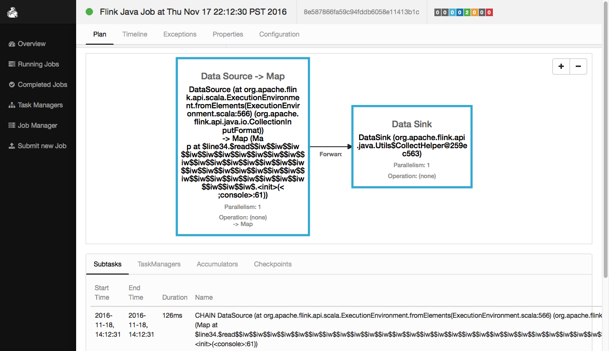      


##flatMap  
```
def flatMap[R](fun:(T)⇒
TraversableOnce[R])(implicit arg0:TypeInformation[R],arg1:ClassTag[R]):DataSet[R]

def flatMap[R](fun:(T, Collector[R])⇒
Unit)(implicit arg0:TypeInformation[R],arg1:ClassTag[R]):DataSet[R]

def flatMap[R](flatMapper:FlatMapFunction[T,R])
(implicit arg0:TypeInformation[R],arg1:ClassTag[R]):DataSet[R]

Creates a new DataSet by applying the given function to every element and flattening the results.
```

###flatMap示例一
执行程序：
```scale
//1.创建一个 DataSet其元素为String类型
val input: DataSet[String] = benv.fromElements("zhangsan boy", "lisi girl")

//2.将DataSet中的每个元素用空格切割成一组单词
val result=input.flatMap { _.split(" ") }

//3.将这组单词显示出来
result.collect
```
执行结果：
```scale
res46: Seq[String] = Buffer(zhangsan, boy, lisi, girl)
```
web ui中的执行效果：
 

    
###flatMap示例二  
执行程序：
```scale
//1.创建一个DataSet其元素为String类型
val textLines: DataSet[String] =benv.fromElements(
"this is a good job!",
"you can do a lot of things!",
"flink is a framework for bigdata.")

//2.对每句话进行单词切分
val words = textLines.flatMap { _.split(" ") }

//3.显示结果内容
words.collect 
```
执行结果：
```scale
res48: Seq[String] = Buffer
(this, is, a, good, job!, 
you, can, do, a, lot, of, things!,
flink, is, a, framework, for, bigdata.)
```
web ui中的执行效果：
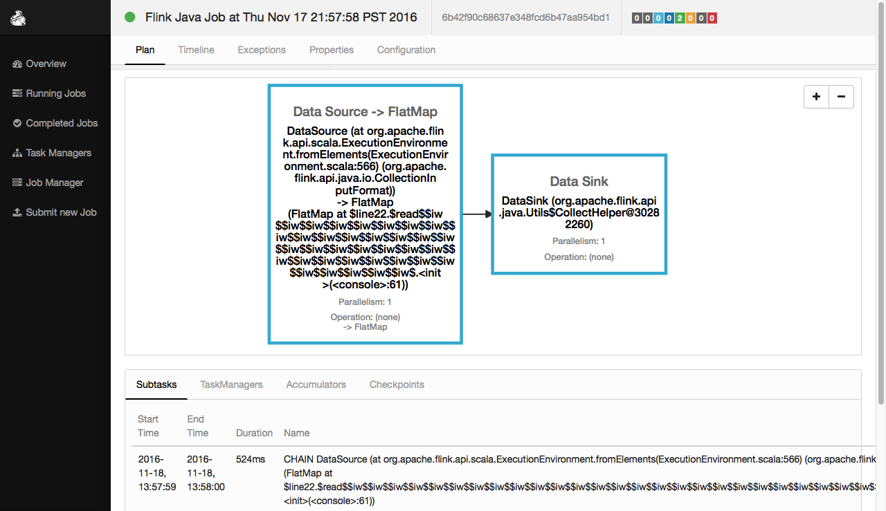    


##mapPartition 
```
def mapPartition[R](fun: (Iterator[T]) ⇒ 
TraversableOnce[R])(implicit arg0: TypeInformation[R], arg1: ClassTag[R]): DataSet[R]

def mapPartition[R](fun: (Iterator[T], Collector[R]) ⇒ 
Unit)(implicit arg0: TypeInformation[R], arg1: ClassTag[R]): DataSet[R]

def mapPartition[R](partitionMapper: MapPartitionFunction[T, R])
(implicit arg0: TypeInformation[R], arg1: ClassTag[R]): DataSet[R]

Creates a new DataSet by applying the given function to each parallel partition of the DataSet.

和map类似，不同它的处理单位是partition，而非element。
```
执行程序：
```scale
//1.创建一个 DataSet其元素为String类型
val input: DataSet[String] = benv.fromElements("zhangsan boy", "lisi is a girl so sex")

//2.??????????????
val result=input.mapPartition{in => Some(in.size)}

//3.将结果显示出来
result.collect
```
执行结果：
```scale
res49: Seq[Int] = Buffer(2)
```
web ui中的执行效果：
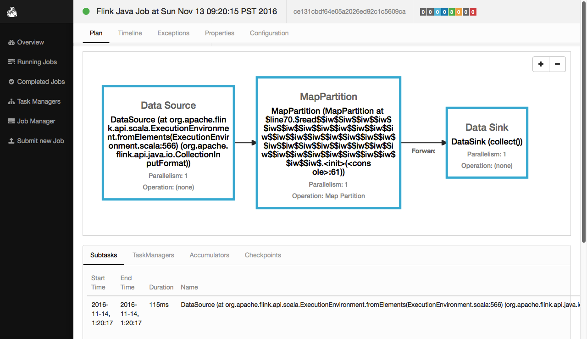 


##filter
```
def filter(fun: (T) ⇒ Boolean): DataSet[T]
def filter(filter: FilterFunction[T]): DataSet[T]

Creates a new DataSet that contains only the elements satisfying the given filter predicate.

过滤满足添加的元素，不满足条件的元素将被丢弃！
```
###filter示例一
执行程序：
```scale
//1.创建一个 DataSet其元素为String类型
val input: DataSet[String] = benv.fromElements("zhangsan boy", "lisi is a girl so sex","wangwu boy")

//2.过滤出包含'boy'字样的元素
val result=input.filter{_.contains("boy")} //也可以写成filter(_.contains("boy"))

//3.将结果显示出来
result.collect
```
执行结果：
```scale
res50: Seq[String] = Buffer(zhangsan boy, wangwu boy)
``` 
web ui中的执行效果：
 

###filter示例二
执行程序：
```scale
//1.创建一个DataSet[Int]
val intNumbers: DataSet[Int] =  benv.fromElements(2,4,6,2,3,7)

//2.过滤偶数
val naturalNumbers = intNumbers.filter { _ %2== 0 }

//3.显示结果
naturalNumbers.collect
```
程序解析：
```scale
res51: Seq[Int] = Buffer(2, 4, 6, 2)
```
web ui中的执行效果：
 


##reduce
```
def reduce(fun: (T, T) ⇒ T): DataSet[T]
def reduce(reducer: ReduceFunction[T]): DataSet[T]

Creates a new DataSet by merging the elements of this DataSet using an associative reduce function.

根据一定的条件和方式来合并DataSet。
```
执行程序：
```scale
//Int类型的DataSet做reduce
val a: DataSet[Int] = benv.fromElements(2,5,9,8,7,3)
val b: DataSet[Int] = a.reduce { _ + _ }
b.collect

//String类型的DataSet做reduce
val a: DataSet[String] = benv.fromElements("zhangsan boy", " lisi girl")
val b:DataSet[String] = a.reduce { _ + _ }
b.collect
```
程序解析：
```scale
//1.创建一个 DataSet其元素为Int类型
Scala-Flink> val a: DataSet[Int] = benv.fromElements(2,5,9,8,7,3)
a: org.apache.flink.api.scala.DataSet[Int] = org.apache.flink.api.scala.DataSet@c7ac49c

//2.将DataSet中的元素，reduce起来
Scala-Flink> val b: DataSet[Int] = a.reduce { _ + _ }
b: org.apache.flink.api.scala.DataSet[Int] = org.apache.flink.api.scala.DataSet@487bc869

//3.显示计算结果
Scala-Flink> b.collect
res6: Seq[Int] = Buffer(34)


//1.创建一个 DataSet其元素为String类型
Scala-Flink> val a: DataSet[String] = benv.fromElements("zhangsan boy", " lisi girl")
a: org.apache.flink.api.scala.DataSet[String] = org.apache.flink.api.scala.DataSet@67426220

//2.将DataSet中的元素，reduce起来
Scala-Flink> val b:DataSet[String] = a.reduce { _ + _ }
b: org.apache.flink.api.scala.DataSet[String] = org.apache.flink.api.scala.DataSet@762d65de

//3.显示计算结果
Scala-Flink> b.collect
res8: Seq[String] = Buffer(zhangsan boy lisi girl)
```
web ui中的执行效果：
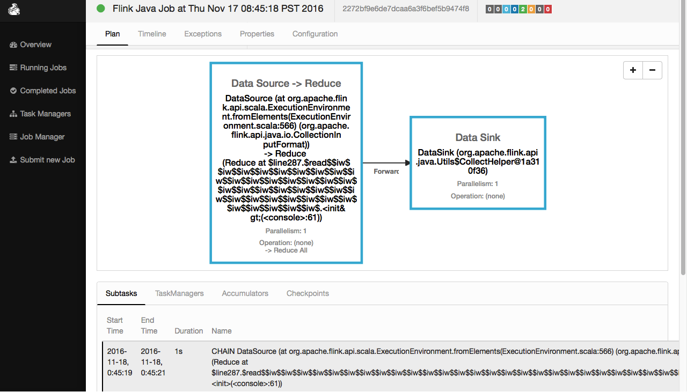 


##groupBy
```
def groupBy(firstField: String, otherFields: String*): GroupedDataSet[T]
def groupBy(fields: Int*): GroupedDataSet[T]
def groupBy[K](fun: (T) ⇒ K)(implicit arg0: TypeInformation[K]): GroupedDataSet[T]

Creates a GroupedDataSet which provides operations on groups of elements.

暗示第二个输入较小的交叉。
拿第一个输入的每一个元素和第二个输入的每一个元素进行交叉操作。
```

###groupBy示例一：使用一个Case Class Fields
执行程序：
```scale
//1.定义 class
case class WC(val word: String, val salary: Int) 

//2.定义DataSet[WC]
val words: DataSet[WC] = benv.fromElements(
WC("LISI",600),WC("LISI",400),WC("WANGWU",300),WC("ZHAOLIU",700))

//3.使用自定义的reduce方法,使用key-expressions 
val wordCounts1 = words.groupBy("word").reduce {
    (w1, w2) => new WC(w1.word, w1.salary + w2.salary)
}


//4.使用自定义的reduce方法,使用key-selector
val wordCounts2 = words.groupBy { _.word } reduce {
     (w1, w2) => new WC(w1.word, w1.salary + w2.salary)
}

//5.显示结果
wordCounts1.collect
wordCounts2.collect
```
执行结果：
```
Scala-Flink> wordCounts1.collect
res5: Seq[WC] = Buffer(WC(LISI,1000), WC(WANGWU,300), WC(ZHAOLIU,700))


Scala-Flink> wordCounts1.collec2
res6: Seq[WC] = Buffer(WC(LISI,1000), WC(WANGWU,300), WC(ZHAOLIU,700))

```
web ui中的执行效果：
 

###groupBy示例二：使用多个Case Class Fields
执行程序：
```scale
//1.定义 case class
case class Student(val name: String, addr: String, salary: Double)

//2.定义DataSet[Student]
val tuples:DataSet[Student] = benv.fromElements(
Student("lisi","shandong",2400.00),Student("zhangsan","henan",2600.00),
Student("lisi","shandong",2700.00),Student("lisi","guangdong",2800.00))

//3.使用自定义的reduce方法,使用多个Case Class Fields name
val reducedTuples1 = tuples.groupBy("name", "addr").reduce {
  (s1, s2) => Student(s1.name+"-"+s2.name,s1.addr+"-"+s2.addr,s1.salary+s2.salary)
}

//4.使用自定义的reduce方法,使用多个Case Class Fields index
val reducedTuples2 = tuples.groupBy(0, 1).reduce {
  (s1, s2) => Student(s1.name+"-"+s2.name,s1.addr+"-"+s2.addr,s1.salary+s2.salary)
}

//5.使用自定义的reduce方法,name和index混用
val reducedTuples3 = tuples.groupBy(0, 1).reduce {
  (s1, s2) => Student(s1.name+"-"+s2.name,s1.addr+"-"+s2.addr,s1.salary+s2.salary)
}


//6.显示结果
reducedTuples1.collect
reducedTuples2.collect
reducedTuples3.collect
```
执行结果：
```
Scala-Flink> reducedTuples1.collect
res96: Seq[Student] = Buffer(
Student(lisi,guangdong,2800.0),
Student(lisi-lisi,shandong-shandong,5100.0), 
Student(zhangsan,henan,2600.0))

Scala-Flink> reducedTuples2.collect
res97: Seq[Student] = Buffer(
Student(lisi,guangdong,2800.0),
Student(lisi-lisi,shandong-shandong,5100.0), 
Student(zhangsan,henan,2600.0))

Scala-Flink> reducedTuples3.collect
res98: Seq[Student] = Buffer(
Student(lisi,guangdong,2800.0),
Student(lisi-lisi,shandong-shandong,5100.0), 
Student(zhangsan,henan,2600.0))
```
web ui中的执行效果：
 


##ReduceGroup
```
def reduceGroup[R](fun:(Iterator[T])⇒R)(implicit arg0:TypeInformation[R],arg1:ClassTag[R]):DataSet[R]

def reduceGroup[R](fun: (Iterator[T], Collector[R]) ⇒ 
Unit(implicit arg0: TypeInformation[R], arg1: ClassTag[R]): DataSet[R]

def reduceGroup[R](reducer: GroupReduceFunction[T, R])
(implicit arg0: TypeInformation[R], arg1: ClassTag[R]): DataSet[R]

Creates a new DataSet by passing all elements in this DataSet to the group reduce function.

此函数和reduce函数类似，不过它每次处理一个grop而非一个元素。
```
###ReduceGroup示例一，操作tuple
执行程序：
```scale
//1.定义 DataSet[(Int, String)]
val input: DataSet[(Int, String)] = benv.fromElements(
(20,"zhangsan"),(22,"zhangsan"),
(22,"lisi"),(20,"zhangsan"))

//2.先用string分组，然后对分组进行reduceGroup
val output = input.groupBy(1).reduceGroup {
     //将相同的元素用set去重
     (in, out: Collector[(Int, String)]) =>
        in.toSet foreach (out.collect)
}

//3.显示结果
output.collect
```
执行结果：
```scala
res14: Seq[(Int, String)] = Buffer((22,lisi), (20,zhangsan), (22,zhangsan))
```
web ui中的执行效果：
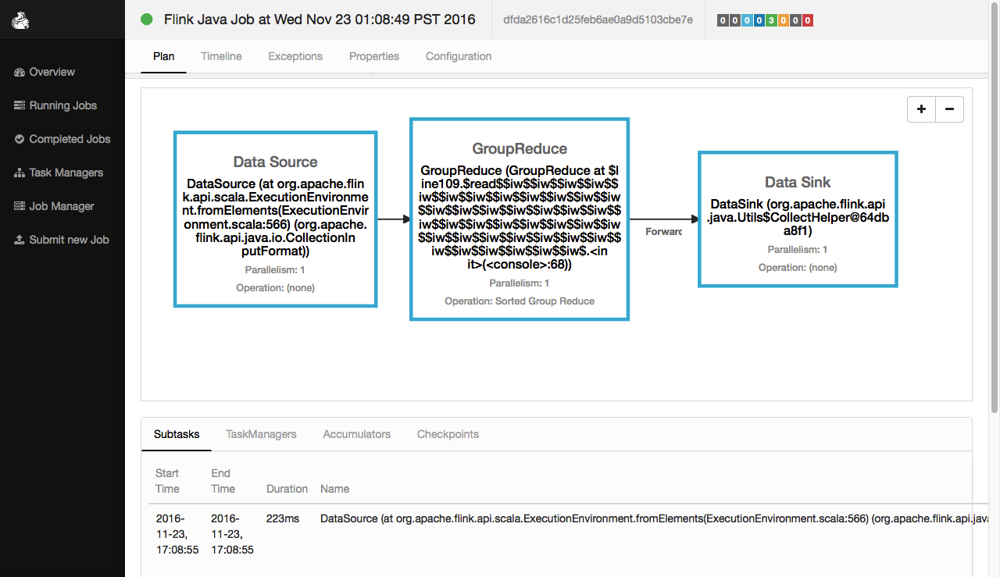 

###ReduceGroup示例二，操作case class
```scala
//1.定义case class
case class Student(age: Int, name: String)

//2.创建DataSet[Student]
val input: DataSet[Student] = benv.fromElements(
Student(20,"zhangsan"),
Student(22,"zhangsan"),
Student(22,"lisi"),
Student(20,"zhangsan"))
//3.以age进行分组，然后对分组进行reduceGroup
val output = input.groupBy(_.age).reduceGroup {
      //将相同的元素用set去重
      (in, out: Collector[Student]) =>
        in.toSet foreach (out.collect)
 }
 
//4.显示结果
output.collect
```
执行结果：
```scala
res16: Seq[Student] = Buffer(Student(20,zhangsan), Student(22,zhangsan), Student(22,lisi))
```


##sortGroup
```
Adds a secondary sort key to this GroupedDataSet. This will only have an effect if you use one
of the group-at-a-time, i.e. reduceGroup.
```
执行程序：
```scale
//1.创建 DataSet[(Int, String)]
val input: DataSet[(Int, String)] = benv.fromElements(
(20,"zhangsan"),
(22,"zhangsan"),
(22,"lisi"),
(22,"lisi"),
(22,"lisi"),
(18,"zhangsan"),
(18,"zhangsan"))

//2.用int分组，用int对分组进行排序
val sortdata = input.groupBy(0).sortGroup(0, Order.ASCENDING)

//3.对排序好的分组进行reduceGroup
val outputdata =sortdata.reduceGroup {
      //将相同的元素用set去重
      (in, out: Collector[(Int, String)]) =>
        in.toSet foreach (out.collect)
}
//4.显示结果
outputdata.collect
```
执行结果：
```scale
res25: Seq[(Int, String)] = Buffer((18,zhangsan), (20,zhangsan), (22,zhangsan), (22,lisi))
```
web ui中的执行效果：
 


##minBy
```
def minBy(fields: Int*): DataSet[T]
Applies a special case of a reduce transformation minBy on a grouped DataSet. 

在分组后的数据中，获取每组最小的元素。
```
执行程序：
```scale
//1.定义case class
case class Student(age: Int, name: String,height:Double)

//2.创建DataSet[Student]
val input: DataSet[Student] = benv.fromElements(
Student(16,"zhangasn",194.5),
Student(17,"zhangasn",184.5),
Student(18,"zhangasn",174.5),
Student(16,"lisi",194.5),
Student(17,"lisi",184.5),
Student(18,"lisi",174.5))

//3.以name进行分组，获取age最小的元素
val output0: DataSet[Student] = input.groupBy(_.name).minBy(0)
output0.collect

//4.以name进行分组，获取height和age最小的元素
val output1: DataSet[Student] = input.groupBy(_.name).minBy(2,0)
output1.collect

```
执行结果：
```scale
Scala-Flink> output0.collect
res73: Seq[Student] = Buffer(Student(16,lisi,194.5), Student(16,zhangasn,194.5))

Scala-Flink> output1.collect
res74: Seq[Student] = Buffer(Student(18,lisi,174.5), Student(18,zhangasn,174.5))
```
web ui中的执行效果：
 


##maxBy
```
def maxBy(fields: Int*): DataSet[T]
def max(field: Int): AggregateDataSet[T]

Applies a special case of a reduce transformation maxBy on a grouped DataSet 
在分组后的数据中，获取每组最大的元素。
```
执行程序：
```scale
//1.定义case class
case class Student(age: Int, name: String,height:Double)

//2.创建DataSet[Student]
val input: DataSet[Student] = benv.fromElements(
Student(16,"zhangasn",194.5),
Student(17,"zhangasn",184.5),
Student(18,"zhangasn",174.5),
Student(16,"lisi",194.5),
Student(17,"lisi",184.5),
Student(18,"lisi",174.5))

//3.以name进行分组，获取age最大的元素
val output0: DataSet[Student] = input.groupBy(_.name).maxBy(0)
output0.collect

//4.以name进行分组，获取height和age最大的元素
val output1: DataSet[Student] = input.groupBy(_.name).maxBy(2,0)
output1.collect
```
执行结果：
```scale
Scala-Flink> output0.collect
res75: Seq[Student] = Buffer(Student(18,lisi,174.5), Student(18,zhangasn,174.5))

Scala-Flink> output1.collect
res76: Seq[Student] = Buffer(Student(16,lisi,194.5), Student(16,zhangasn,194.5))
```
web ui中的执行效果：
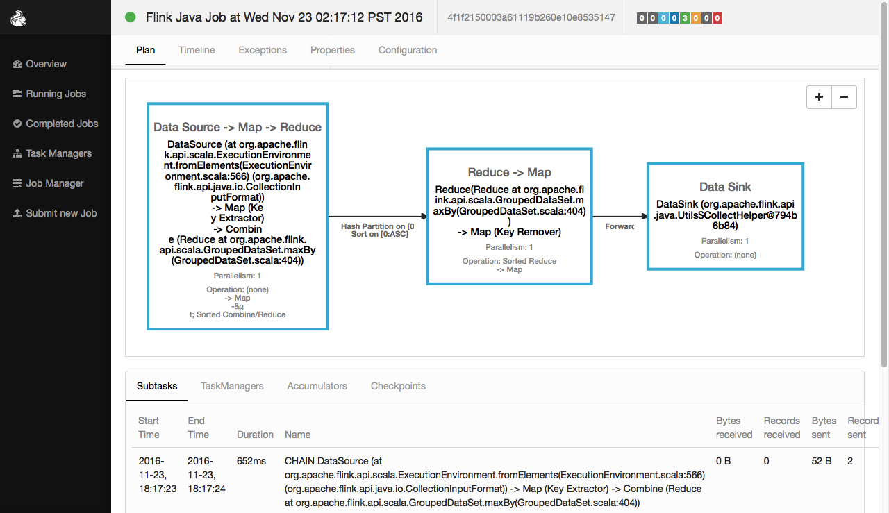 


##distinct
```

def distinct(firstField: String, otherFields: String*): DataSet[T]
def distinct(fields: Int*): DataSet[T]
def distinct(): DataSet[T]
def distinct[K](fun: (T) ⇒ K)(implicit arg0: TypeInformation[K]): DataSet[T]

Creates a new DataSet containing the distinct elements of this DataSet.

对DataSet中的元素进行去重。
```
###distinct示例一，单一项目的去重
执行程序：
```scale
//1.创建一个 DataSet其元素为String类型
val input: DataSet[String] = benv.fromElements("lisi","zhangsan", "lisi","wangwu")

//2.元素去重
val result=input.distinct()

//3.显示结果
result.collect
```
执行结果：
```scale
res52: Seq[String] = Buffer(lisi, wangwu, zhangsan)
```
web ui中的执行效果：
 

###distinct示例二，多项目的去重，不指定比较项目，默认是全部比较

执行程序：
```scale
//1.创建DataSet[(Int, String, Double)] 
val input: DataSet[(Int, String, Double)] =  benv.fromElements(
(2,"zhagnsan",1654.5),(3,"lisi",2347.8),(2,"zhagnsan",1654.5),
(4,"wangwu",1478.9),(5,"zhaoliu",987.3),(2,"zhagnsan",1654.0))

//2.元素去重
val output = input.distinct()

//3.显示结果
output.collect
```
执行结果：
```scale
res53: Seq[(Int, String, Double)] = Buffer(
(2,zhagnsan,1654.0), 
(2,zhagnsan,1654.5), 
(3,lisi,2347.8), 
(4,wangwu,1478.9), 
(5,zhaoliu,987.3))
```

###distinct示例三，多项目的去重，指定比较项目

执行程序：
```scale
//1.创建DataSet[(Int, String, Double)] 
val input: DataSet[(Int, String, Double)] =  benv.fromElements(
(2,"zhagnsan",1654.5),(3,"lisi",2347.8),(2,"zhagnsan",1654.5),
(4,"wangwu",1478.9),(5,"zhaoliu",987.3),(2,"zhagnsan",1654.0))

//2.元素去重:指定比较第0和第1号元素
val output = input.distinct(0,1)

//3.显示结果
output.collect
```
执行结果：
```scale
res54: Seq[(Int, String, Double)] = Buffer(
(2,zhagnsan,1654.5),
(3,lisi,2347.8), 
(4,wangwu,1478.9), 
(5,zhaoliu,987.3))
```

###distinct示例四，case class的去重，指定比较项目

执行程序：
```scale
//1.创建case class Student
case class Student(name : String, age : Int) 

//2.创建DataSet[Student]
val input: DataSet[Student] =  benv.fromElements(
Student("zhangsan",24),Student("zhangsan",24),Student("zhangsan",25),
Student("lisi",24),Student("wangwu",24),Student("lisi",25))

//3.去掉age重复的元素
val age_r = input.distinct("age")
age_r.collect

//4.去掉name重复的元素
val name_r = input.distinct("name")
name_r.collect

//5.去掉name和age重复的元素
val all_r = input.distinct("age","name")
all_r.collect

//6.去掉name和age重复的元素
val all = input.distinct()
all.collect

//7.去掉name和age重复的元素
val all0 = input.distinct("_")
all0.collect
```
程序解析：
```scale
Scala-Flink> age_r.collect
res38: Seq[Student] = Buffer(Student(zhangsan,24), Student(zhangsan,25))

Scala-Flink> name_r.collect
res39: Seq[Student] = Buffer(Student(lisi,24),Student(wangwu,24),Student(zhangsan,24))

Scala-Flink> all_r.collect
res40: Seq[Student] = Buffer(Student(lisi,24), Student(lisi,25), Student(wangwu,24),
Student(zhangsan,24), Student(zhangsan,25))

Scala-Flink> all.collect
res41: Seq[Student] = Buffer(Student(lisi,24), Student(lisi,25), Student(wangwu,24), 
Student(zhangsan,24), Student(zhangsan,25))

Scala-Flink> all0.collect
res47: Seq[Student] = Buffer(Student(lisi,24), Student(lisi,25), Student(wangwu,24),
Student(zhangsan,24), Student(zhangsan,25))
```
web ui中的执行效果：
 


###distinct示例五，根据表达式进行去重

执行程序：
```scale
//1.创建DataSet[Int]
val input: DataSet[Int] = benv.fromElements(3,-3,4,-4,6,-5,7)

//2.根据表达式，本例中是根据元素的绝对值进行元素去重
val output = input.distinct {x => Math.abs(x)}

//3.显示结果
output.collect
```
执行结果：
```scale
res55: Seq[Int] = Buffer(3, 4, -5, 6, 7)
```


##join
```
def join[O](other: DataSet[O], strategy: JoinHint): UnfinishedJoinOperation[T, O]
def join[O](other: DataSet[O]): UnfinishedJoinOperation[T, O]

Creates a new DataSet by joining this DataSet with the other DataSet.

将两个DataSet进行join操作
```
###join示例一：
执行程序：
```scale
//1.创建一个 DataSet其元素为[(Int,String)]类型
val input1: DataSet[(Int, String)] =  benv.fromElements(
(2,"zhagnsan"),(3,"lisi"),(4,"wangwu"),(5,"zhaoliu"))

//2.创建一个 DataSet其元素为[(Double, Int)]类型
val input2: DataSet[(Double, Int)] =  benv.fromElements(
(1850.98,4),(1950.98,5),(2350.98,6),(3850.98,3))

//3.两个DataSet进行join操作，条件是input1(0)==input2(1)
val result = input1.join(input2).where(0).equalTo(1)

//4.显示结果
result.collect
```
执行结果：
```scale
res56: Seq[((Int, String), (Double, Int))] = Buffer(
((4,wangwu),(1850.98,4)), 
((5,zhaoliu),(1950.98,5)), 
((3,lisi),(3850.98,3)))
```
web ui中的执行效果：
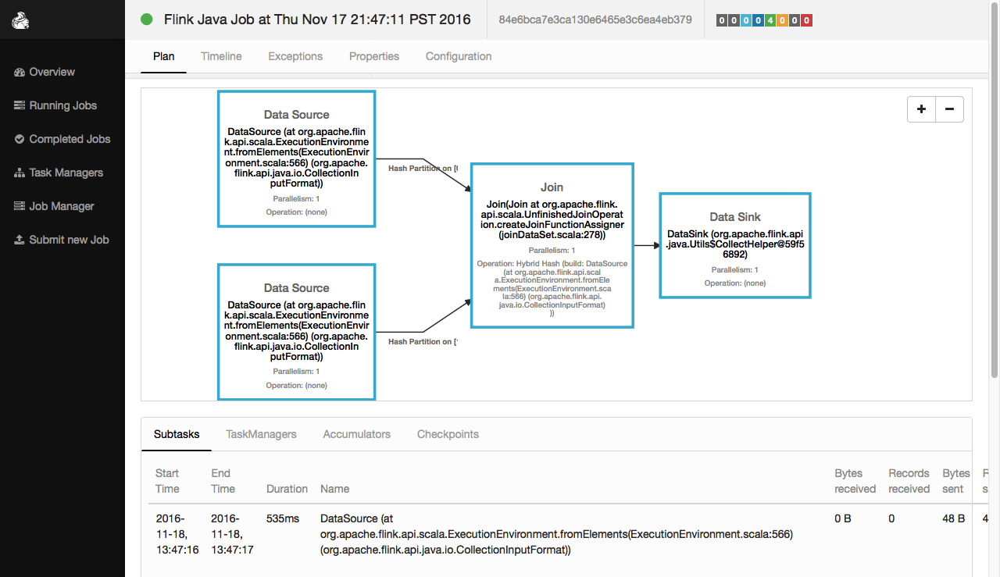 


###join示例二：
```
A Join transformation can also call a user-defined join function to process joining tuples. 
A join function receives one element of the first input DataSet and one element of the second 
input DataSet and returns exactly one element.

The following code performs a join of DataSet with custom java objects and a Tuple DataSet using 
key-selector functions and shows how to use a user-defined join function:
```


执行程序：
```scale
//1.定义case class
case class Rating(name: String, category: String, points: Int)

//2.定义DataSet[Rating]
val ratings: DataSet[Rating] = benv.fromElements(
Rating("moon","youny1",3),Rating("sun","youny2",4),
Rating("cat","youny3",1),Rating("dog","youny4",5))

//3.创建DataSet[(String, Double)] 
val weights: DataSet[(String, Double)] = benv.fromElements(
("youny1",4.3),("youny2",7.2),
("youny3",9.0),("youny4",1.5))

//4.使用方法进行join
val weightedRatings = ratings.join(weights).where("category").equalTo(0) {
  (rating, weight) => (rating.name, rating.points + weight._2)
}

//5.显示结果
weightedRatings.collect
```
程序解析：
```scale
res57: Seq[(String, Double)] = Buffer((moon,7.3), (sun,11.2), (cat,10.0), (dog,6.5))
```
web ui中的执行效果：
 


###join示例三：？？？
```
A Join transformation can also call a user-defined join function to process joining tuples. 
A join function receives one element of the first input DataSet and one element of the second 
input DataSet and returns exactly one element.

The following code performs a join of DataSet with custom java objects and a Tuple DataSet using 
key-selector functions and shows how to use a user-defined join function:
```


执行程序：
```scale

case class Rating(name: String, category: String, points: Int)
val ratings: DataSet[Rating] = benv.fromElements(
Rating("moon","youny1",3),Rating("sun","youny2",4),
Rating("cat","youny3",1),Rating("dog","youny4",5))

val weights: DataSet[(String, Double)] = benv.fromElements(
("youny1",4.3),("youny2",7.2),
("youny3",9.0),("youny4",1.5))

val weightedRatings = ratings.join(weights).where("category").equalTo(0) {
  (rating, weight, out: Collector[(String, Double)]) =>
    if (weight._2 > 0.1) out.collect(rating.name, rating.points * weight._2)
}

weightedRatings.collect
```


###join示例四：执行join操作时暗示数据大小
```
在执行join操作时暗示数据大小，可以帮助flink优化它的执行策略，提高执行效率。
```
执行程序：
```scale
//1.定义DataSet[(Int, String)]
val input1: DataSet[(Int, String)] = 
benv.fromElements((3,"zhangsan"),(2,"lisi"),(4,"wangwu"),(6,"zhaoliu"))

//2.定义 DataSet[(Int, String)]
val input2: DataSet[(Int, String)] = 
benv.fromElements((4000,"zhangsan"),(70000,"lisi"),(4600,"wangwu"),(53000,"zhaoliu"))

// 3.暗示第二个输入很小
val result1 = input1.joinWithTiny(input2).where(1).equalTo(1)
result1.collect

// 4.暗示第二个输入很大
val result2 = input1.joinWithHuge(input2).where(1).equalTo(1)
result2.collect
```
执行结果：
```
Scala-Flink> result1.collect
res12: Seq[((Int, String), (Int, String))] = Buffer(
((3,zhangsan),(4000,zhangsan)), ((2,lisi),(70000,lisi)), 
((4,wangwu),(4600,wangwu)), ((6,zhaoliu),(53000,zhaoliu)))


Scala-Flink> result2.collect
res13: Seq[((Int, String), (Int, String))] = Buffer(
((3,zhangsan),(4000,zhangsan)), ((2,lisi),(70000,lisi)), 
((4,wangwu),(4600,wangwu)), ((6,zhaoliu),(53000,zhaoliu)))
```
web ui中的执行效果：
 


###join示例五：执行join操作时暗示数据大小
```
flink有很多种执行join的策略，你可以指定一个执行策略，以便提高执行效率。
```
执行程序：
```scale
//1.定义两个 DataSet
val input1: DataSet[(Int, String)] = 
benv.fromElements((3,"zhangsan"),(2,"lisi"),(4,"wangwu"),(6,"zhaoliu"))
val input2: DataSet[(Int, String)] = 
benv.fromElements((4000,"zhangsan"),(70000,"lisi"),(4600,"wangwu"),(53000,"zhaoliu"))

//2.暗示input2很小
val result1 = input1.join(input2, JoinHint.BROADCAST_HASH_FIRST).where(1).equalTo(1)

//3.显示结果
result1.collect
```
执行结果：
```
res15: Seq[((Int, String), (Int, String))] = Buffer(
((3,zhangsan),(4000,zhangsan)),
((2,lisi),(70000,lisi)), 
((4,wangwu),(4600,wangwu)),
((6,zhaoliu),(53000,zhaoliu)))
```
暗示项说明：
```
暗示有如下选项：
1.JoinHint.OPTIMIZER_CHOOSES:
    没有明确暗示，让系统自行选择。
2.JoinHint.BROADCAST_HASH_FIRST
    把第一个输入转化成一个哈希表，并广播出去。适用于第一个输入数据较小的情况。
3.JoinHint.BROADCAST_HASH_SECOND:
    把第二个输入转化成一个哈希表，并广播出去。适用于第二个输入数据较小的情况。
4.JoinHint.REPARTITION_HASH_FIRST:（defalut）
    1.如果输入没有分区，系统将把输入重分区。
    2.系统将把第一个输入转化成一个哈希表广播出去。
    3.两个输入依然比较大。
    4.适用于第一个输入小于第二个输入的情况。
5.JoinHint.REPARTITION_HASH_SECOND:
    1.如果输入没有分区，系统将把输入重分区。
    2.系统将把第二个输入转化成一个哈希表广播出去。
    3.两个输入依然比较大。
    4.适用于第二个输入小于第一个输入的情况。
6.JoinHint.REPARTITION_SORT_MERGE:
    1.如果输入没有分区，系统将把输入重分区。
    2.如果输入没有排序，系统将吧输入重排序。
    3.系统将合并两个排序好的输入。
    4.适用于一个或两个分区已经排序好的情况。
```


##leftOuterJoin

```
def leftOuterJoin[O](other: DataSet[O], strategy: JoinHint): UnfinishedOuterJoinOperation[T, O]
def leftOuterJoin[O](other: DataSet[O]): UnfinishedOuterJoinOperation[T, O]

An outer join on the left side.

左外连接。
```
###leftOuterJoin示例一
执行程序：
```scale
//1.定义case class
case class Rating(name: String, category: String, points: Int)

//2.定义 DataSet[Rating]
val ratings: DataSet[Rating] = benv.fromElements(
Rating("moon","youny1",3),Rating("sun","youny2",4),
Rating("cat","youny3",1),Rating("dog","youny4",5),Rating("tiger","youny4",5))

//3.定义DataSet[(String, String)] 
val movies: DataSet[(String, String)]  = benv.fromElements(
("moon","ok"),("dog","good"),
("cat","notbad"),("sun","nice"),("water","nice"))

//4.两个dataset进行左外连接，指定方法
val result1 = movies.leftOuterJoin(ratings).where(0).equalTo("name"){
	(m, r) => (m._1, if (r == null) -1 else r.points)
}

//5.显示结果
result1.collect
```
执行结果：
```
res26: Seq[(String, Int)] = Buffer((moon,3), (dog,5), (cat,1), (sun,4), (water,-1))
```
web ui中的执行效果：
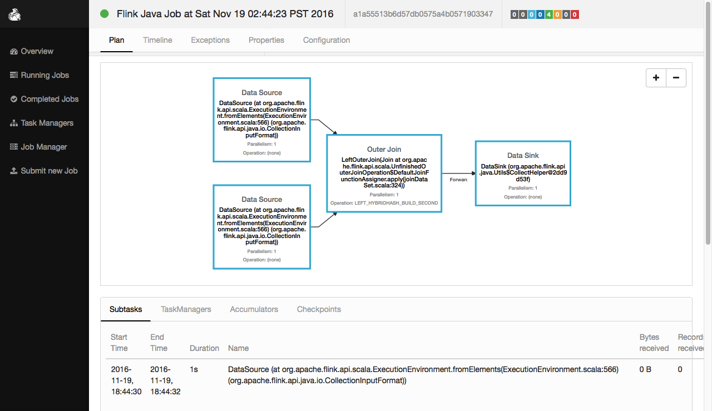 

###leftOuterJoin示例二
执行程序：
```scale
//1.定义case class
case class Rating(name: String, category: String, points: Int)

//2.定义 DataSet[Rating]
val ratings: DataSet[Rating] = benv.fromElements(
Rating("moon","youny1",3),Rating("sun","youny2",4),
Rating("cat","youny3",1),Rating("dog","youny4",5),Rating("tiger","youny4",5))

//3.定义DataSet[(String, String)] 
val movies: DataSet[(String, String)]  = benv.fromElements(
("moon","ok"),("dog","good"),
("cat","notbad"),("sun","nice"),("water","nice"))

//4.两个dataset进行左外连接，指定连接暗示，并指定连接方法
val result1 = movies.leftOuterJoin(ratings, JoinHint.REPARTITION_SORT_MERGE)
.where(0).equalTo("name"){
    (m, r) => (m._1, if (r == null) -1 else r.points)
}

//5.显示结果
result1 .collect
```
执行结果：
```
res26: Seq[(String, Int)] = Buffer((cat,1), (dog,5), (moon,3), (sun,4), (water,-1))
```
暗示项目说明：
```
左外连接支持以下项目：
    JoinHint.OPTIMIZER_CHOOSES
    JoinHint.BROADCAST_HASH_SECOND
    JoinHint.REPARTITION_HASH_SECOND
    JoinHint.REPARTITION_SORT_MERGE
```

##rightOuterJoin

```
def rightOuterJoin[O](other: DataSet[O], strategy: JoinHint): UnfinishedOuterJoinOperation[T, O]
def rightOuterJoin[O](other: DataSet[O]): UnfinishedOuterJoinOperation[T, O]

An outer join on the right side.

右外连接
```
###rightOuterJoin示例一
执行程序：
```scale
//1.定义DataSet[(String, String)] 
val movies: DataSet[(String, String)]  = benv.fromElements(
("moon","ok"),("dog","good"),
("cat","notbad"),("sun","nice"))

//2.定义 DataSet[Rating]
case class Rating(name: String, category: String, points: Int)
val ratings: DataSet[Rating] = benv.fromElements(
Rating("moon","youny1",3),Rating("sun","youny2",4),
Rating("cat","youny3",1),Rating("dog","youny4",5))

//3.两个dataset进行左外连接，指定连接方法
val result1 = movies.rightOuterJoin(ratings).where(0).equalTo("name"){
	(m, r) => (m._1, if (r == null) -1 else r.points)
}

//5.显示结果
result1.collect
```
执行结果：
```
res33: Seq[(String, Int)] = Buffer((moon,3), (sun,4), (cat,1), (dog,5))
```
web ui中的执行效果：
 
###rightOuterJoin示例二

执行程序：
```scale
//1.定义DataSet[(String, String)] 
val movies: DataSet[(String, String)]  = benv.fromElements(
("moon","ok"),("dog","good"),
("cat","notbad"),("sun","nice"))

//2.定义 DataSet[Rating]
case class Rating(name: String, category: String, points: Int)
val ratings: DataSet[Rating] = benv.fromElements(
Rating("moon","youny1",3),Rating("sun","youny2",4),
Rating("cat","youny3",1),Rating("dog","youny4",5))

//3.两个dataset进行左外连接，暗示连接方式，指定连接方法
val result1 = movies.rightOuterJoin(ratings,JoinHint.BROADCAST_HASH_FIRST).where(0).equalTo("name"){
	(m, r) => (m._1, if (r == null) -1 else r.points)
}

//5.显示结果
result1.collect
```
执行结果：
```
res34: Seq[(String, Int)] = Buffer((moon,3), (sun,4), (cat,1), (dog,5))
```
暗示项目说明：
```
左外连接支持以下项目：
    JoinHint.OPTIMIZER_CHOOSES
    JoinHint.BROADCAST_HASH_FIRST
    JoinHint.REPARTITION_HASH_FIRST
    JoinHint.REPARTITION_SORT_MERGE
```

##fullOuterJoin

```
def fullOuterJoin[O](other: DataSet[O], strategy: JoinHint): UnfinishedOuterJoinOperation[T, O]
deffullOuterJoin[O](other: DataSet[O]): UnfinishedOuterJoinOperation[T, O]

Special fullOuterJoin operation for explicitly telling the system what join strategy to use.

全外连接
```
###fullOuterJoin示例一
执行程序：
```scale
//1.定义DataSet[(String, String)] 
val movies: DataSet[(String, String)]  = benv.fromElements(
("moon","ok"),("dog","good"),
("cat","notbad"),("sun","nice"))

//2.定义 DataSet[Rating]
case class Rating(name: String, category: String, points: Int)
val ratings: DataSet[Rating] = benv.fromElements(
Rating("moon","youny1",3),Rating("sun","youny2",4),
Rating("cat","youny3",1),Rating("dog","youny4",5))

//3.两个dataset进行全外连接，指定连接方法
val result1 = movies.fullOuterJoin(ratings).where(0).equalTo("name"){
	(m, r) => (m._1, if (r == null) -1 else r.points)
}

//5.显示结果
result1.collect
```
执行结果：
```
res33: Seq[(String, Int)] = Buffer((moon,3), (sun,4), (cat,1), (dog,5))
```
web ui中的执行效果：
 

###rightOuterJoin示例二
执行程序：
```scale
//1.定义DataSet[(String, String)] 
val movies: DataSet[(String, String)]  = benv.fromElements(
("moon","ok"),("dog","good"),
("cat","notbad"),("sun","nice"))

//2.定义 DataSet[Rating]
case class Rating(name: String, category: String, points: Int)
val ratings: DataSet[Rating] = benv.fromElements(
Rating("moon","youny1",3),Rating("sun","youny2",4),
Rating("cat","youny3",1),Rating("dog","youny4",5))

//3.两个dataset进行全外连接，指定连接方法
val result1 = movies.fullOuterJoin(ratings,JoinHint.REPARTITION_SORT_MERGE).where(0).equalTo("name"){
	(m, r) => (m._1, if (r == null) -1 else r.points)
}

//5.显示结果
result1.collect
```
执行结果：
```
res41: Seq[(String, Int)] = Buffer((cat,1), (dog,5), (moon,3), (sun,4))
```
暗示项目说明：
```
左外连接支持以下项目：
    JoinHint.OPTIMIZER_CHOOSES
    JoinHint.BROADCAST_HASH_FIRST
    JoinHint.REPARTITION_HASH_FIRST
    JoinHint.REPARTITION_SORT_MERGE
```


##cross
```
def cross[O](other: DataSet[O]): CrossDataSet[T, O]

Creates a new DataSet by forming the cartesian product of this DataSet and the other DataSet.

交叉。拿第一个输入的每一个元素和第二个输入的每一个元素进行交叉操作。
```
###cross实例一：基本tuple
执行程序：
```scale
//1.定义两个DataSet
val coords1 = benv.fromElements((1,4,7),(2,5,8),(3,6,9))
val coords2 = benv.fromElements((10,40,70),(20,50,80),(30,60,90))

//2.交叉两个DataSet[Coord]
val result1 = coords1.cross(coords2)

//3.显示结果
result1.collect
```
执行结果：
```
res71: Seq[((Int, Int, Int), (Int, Int, Int))] = Buffer(
((1,4,7),(10,40,70)), ((2,5,8),(10,40,70)), ((3,6,9),(10,40,70)), 
((1,4,7),(20,50,80)), ((2,5,8),(20,50,80)), ((3,6,9),(20,50,80)), 
((1,4,7),(30,60,90)), ((2,5,8),(30,60,90)), ((3,6,9),(30,60,90)))
```
web ui中的执行效果：


###cross实例二：case class
执行程序：
```scale
//1.定义 case class
case class Coord(id: Int, x: Int, y: Int)

//2.定义两个DataSet[Coord]
val coords1: DataSet[Coord] = benv.fromElements(Coord(1,4,7),Coord(2,5,8),Coord(3,6,9))
val coords2: DataSet[Coord] = benv.fromElements(Coord(10,40,70),Coord(20,50,80),Coord(30,60,90))

//3.交叉两个DataSet[Coord]
val result1 = coords1.cross(coords2)

//4.显示结果
result1.collect
```
执行结果：
```
res69: Seq[(Coord, Coord)] = Buffer(
(Coord(1,4,7),Coord(10,40,70)), (Coord(2,5,8),Coord(10,40,70)), (Coord(3,6,9),Coord(10,40,70)), 
(Coord(1,4,7),Coord(20,50,80)), (Coord(2,5,8),Coord(20,50,80)), (Coord(3,6,9),Coord(20,50,80)), 
(Coord(1,4,7),Coord(30,60,90)), (Coord(2,5,8),Coord(30,60,90)), (Coord(3,6,9),Coord(30,60,90)))
```


###cross实例三：自定义操作
执行程序：
```scale
//1.定义 case class
case class Coord(id: Int, x: Int, y: Int)

//2.定义两个DataSet[Coord]
val coords1: DataSet[Coord] = benv.fromElements(Coord(1,4,7),Coord(2,5,8),Coord(3,6,9))
val coords2: DataSet[Coord] = benv.fromElements(Coord(1,4,7),Coord(2,5,8),Coord(3,6,9))

//3.交叉两个DataSet[Coord]，使用自定义方法
val r = coords1.cross(coords2) {
  (c1, c2) =>{
        val dist =(c1.x + c2.x) +(c1.y + c2.y)
        (c1.id, c2.id, dist)
    }
}
//4.显示结果
r.collect
```
执行结果：
```
res65: Seq[(Int, Int, Int)] = Buffer(
(1,1,22), (2,1,24), (3,1,26),
(1,2,24), (2,2,26), (3,2,28), 
(1,3,26), (2,3,28), (3,3,30))
```


##crossWithTiny
```
def
crossWithTiny[O](other: DataSet[O]): CrossDataSet[T, O]
Special cross operation for explicitly telling the system that the right side 
is assumed to be a lot smaller than the left side of the cartesian product.

暗示第二个输入较小的交叉。
拿第一个输入的每一个元素和第二个输入的每一个元素进行交叉操作。
```
执行程序：
```scale
//1.定义 case class
case class Coord(id: Int, x: Int, y: Int)

//2.定义两个DataSet[Coord]
val coords1: DataSet[Coord] = benv.fromElements(Coord(1,4,7),Coord(2,5,8),Coord(3,6,9))
val coords2: DataSet[Coord] = benv.fromElements(Coord(10,40,70),Coord(20,50,80),Coord(30,60,90))

//3.交叉两个DataSet[Coord]，暗示第二个输入较小
val result1 = coords1.crossWithTiny(coords2)

//4.显示结果
result1.collect
```
执行结果：
```
res67: Seq[(Coord, Coord)] = Buffer(
(Coord(1,4,7),Coord(10,40,70)), (Coord(1,4,7),Coord(20,50,80)), (Coord(1,4,7),Coord(30,60,90)),
(Coord(2,5,8),Coord(10,40,70)), (Coord(2,5,8),Coord(20,50,80)), (Coord(2,5,8),Coord(30,60,90)), 
(Coord(3,6,9),Coord(10,40,70)), (Coord(3,6,9),Coord(20,50,80)), (Coord(3,6,9),Coord(30,60,90)))
```
web ui中的执行效果：
 


##crossWithHuge
```
def crossWithHuge[O](other: DataSet[O]): CrossDataSet[T, O]
Special cross operation for explicitly telling the system that the left side 
is assumed to be a lot smaller than the right side of the cartesian product.

暗示第二个输入较大的交叉。
拿第一个输入的每一个元素和第二个输入的每一个元素进行交叉操作。
```
执行程序：
```scale
//1.定义 case class
case class Coord(id: Int, x: Int, y: Int)

//2.定义两个DataSet[Coord]
val coords1: DataSet[Coord] = benv.fromElements(Coord(1,4,7),Coord(2,5,8),Coord(3,6,9))
val coords2: DataSet[Coord] = benv.fromElements(Coord(10,40,70),Coord(20,50,80),Coord(30,60,90))

//3.交叉两个DataSet[Coord]，暗示第二个输入较大
val result1 = coords1.crossWithHuge(coords2)

//4.显示结果
result1.collect
```
执行结果：
```
res68: Seq[(Coord, Coord)] = Buffer(
(Coord(1,4,7),Coord(10,40,70)), (Coord(2,5,8),Coord(10,40,70)), (Coord(3,6,9),Coord(10,40,70)), 
(Coord(1,4,7),Coord(20,50,80)), (Coord(2,5,8),Coord(20,50,80)), (Coord(3,6,9),Coord(20,50,80)), 
(Coord(1,4,7),Coord(30,60,90)), (Coord(2,5,8),Coord(30,60,90)), (Coord(3,6,9),Coord(30,60,90)))
```
web ui中的执行效果：
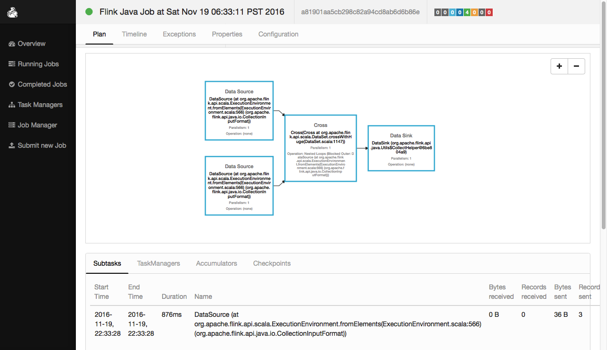 


##Union
```
def union(other: DataSet[T]): DataSet[T]

Creates a new DataSet containing the elements from both this DataSet and the other DataSet.

合并多个DataSet。
```
执行程序：
```scale
//1.定义 case class
case class Student(val name: String, addr: String, salary: Double)

//2.定义三个DataSet[Student]
val tuples1 = benv.fromElements(
Student("lisi-1","shandong",2400.00),Student("zhangsan-1","henan",2600.00))

val tuples2 = benv.fromElements(
Student("lisi-2","shandong",2400.00),Student("zhangsan-2","henan",2600.00))

val tuples3 = benv.fromElements(
Student("lisi-3","shandong",2400.00),Student("zhangsan-3","henan",2600.00))

//3.将三个DataSet合并起来
val unioned = tuples1.union(tuples2).union(tuples3)

//4.显示结果
unioned.collect

```
执行结果：
```
res113: Seq[Student] = Buffer(
Student(lisi-1,shandong,2400.0), Student(zhangsan-1,henan,2600.0), 
Student(lisi-2,shandong,2400.0), Student(zhangsan-2,henan,2600.0), 
Student(lisi-3,shandong,2400.0), Student(zhangsan-3,henan,2600.0))
```
web ui中的执行效果：
 


##first

```
def first(n: Int): DataSet[T]

Creates a new DataSet containing the first n elements of this DataSet

取前n个元素
```
执行程序：
```scale
//1.定义 case class
case class Student(val name: String, addr: String, salary: Double)

//2.定义DataSet[Student]
val in: DataSet[Student] = benv.fromElements(
Student("lisi","shandong",2400.00),Student("zhangsan","hainan",2600.00),
Student("wangwu","shandong",2400.00),Student("zhaoliu","hainan",2600.00),
Student("xiaoqi","guangdong",2400.00),Student("xiaoba","henan",2600.00))

//3.取前2个元素
val out1 = in.first(2)
out1.collect

//3.取前2个元素 ???
val out2 = in.groupBy(0).first(2)
out2.collect

//3.取前3个元素 ???
val out3 = in.groupBy(0).sortGroup(1, Order.ASCENDING).first(3)
out3.collect
```
执行结果：
```
Scala-Flink> out1.collect
res126: Seq[Student] = Buffer(
Student(lisi,shandong,2400.0), Student(zhangsan,hainan,2600.0))

Scala-Flink> out2.collect
res127: Seq[Student] = Buffer(
Student(lisi,shandong,2400.0), Student(wangwu,shandong,2400.0), Student(xiaoba,henan,2600.0),
Student(xiaoqi,guangdong,2400.0), Student(zhangsan,hainan,2600.0), Student(zhaoliu,hainan,2600.0))

Scala-Flink> out3.collect
res128: Seq[Student] = Buffer(
Student(lisi,shandong,2400.0), Student(wangwu,shandong,2400.0), Student(xiaoba,henan,2600.0),
Student(xiaoqi,guangdong,2400.0), Student(zhangsan,hainan,2600.0), Student(zhaoliu,hainan,2600.0))

```


##getParallelism
```
def getParallelism: Int

Returns the parallelism of this operation.

获取DataSet的并行度。
```
执行程序：
```scale
//1.创建一个 DataSet其元素为String类型
val input0: DataSet[String] = benv.fromElements("A", "B", "C")

//2.获取DataSet的并行度。
input0.getParallelism
```
执行结果：
```
res98: Int = 1
```


##setParallelism
```
def setParallelism(parallelism: Int): DataSet[T]

Sets the parallelism of this operation. This must be greater than 1.

设置DataSet的并行度，设置的并行度必须大于1
```
执行程序：
```scale
//1.创建一个 DataSet其元素为String类型
val input0: DataSet[String] = benv.fromElements("A", "B", "C")

//2.设置DataSet的并行度。
input0.setParallelism(2)

//3.获取DataSet的并行度。
input0.getParallelism
```
执行结果：
```
res102: Int = 2
```


##writeAsText
```
def writeAsText(filePath: String, writeMode: WriteMode = null): DataSink[T]

Writes this DataSet to the specified location.

将DataSet写出到存储系统。不同的存储系统写法不一样。

hdfs文件路径：
    hdfs:///path/to/data
本地文件路径：
    file:///path/to/data
```
执行程序：
```scale
//1.创建 DataSet[Student]
case class Student(age: Int, name: String,height:Double)
val input: DataSet[Student] = benv.fromElements(
Student(16,"zhangasn",194.5),
Student(17,"zhangasn",184.5),
Student(18,"zhangasn",174.5),
Student(16,"lisi",194.5),
Student(17,"lisi",184.5),
Student(18,"lisi",174.5))

//2.将DataSet写出到存储系统
input.writeAsText("hdfs:///output/flink/dataset/testdata/students.txt")

//3.执行程序
benv.execute()
```

hadoop web ui中的执行效果：
 
terminal中查看文件效果：
 


##writeAsCsv
```
def writeAsCsv(filePath: String, rowDelimiter: String = ..., 
fieldDelimiter: String = ..., writeMode: WriteMode = null): DataSink[T]
参数说明：
rowDelimiter：行分隔符
fieldDelimiter：列分隔符

Writes this DataSet to the specified location as CSV file(s).

将DataSet以CSV格式写出到存储系统。路径写法参考writeAsText。


```
执行程序：
```scale
//1.创建 DataSet[Student]
case class Student(age: Int, name: String,height:Double)
val input: DataSet[Student] = benv.fromElements(
Student(16,"zhangasn",194.5),
Student(17,"zhangasn",184.5),
Student(18,"zhangasn",174.5),
Student(16,"lisi",194.5),
Student(17,"lisi",184.5),
Student(18,"lisi",174.5))

//2.将DataSet写出到存储系统
input. writeAsCsv("hdfs:///output/flink/dataset/testdata/students.csv","#","|")

//3.执行程序
benv.execute()
```

hadoop web ui中的执行效果：
 
terminal中查看文件效果：
 


##getExecutionEnvironment
```
def getExecutionEnvironment: ExecutionEnvironment

Returns the execution environment associated with the current DataSet.

获取DataSet的执行环境上下文,这个歌上下文和当前的DataSet有关，不是全局的。
```
执行程序：
```scale
//1.创建一个 DataSet其元素为String类型
val input0: DataSet[String] = benv.fromElements("A", "B", "C")
val input1: DataSet[String] = benv.fromElements("A", "B")

//2.获取DataSet的执行环境上下文。
benv 

val env0=input0.getExecutionEnvironment

val env1=input1.getExecutionEnvironment

env0==env1
```
执行结果：
```
Scala-Flink> benv
res96: org.apache.flink.api.scala.ExecutionEnvironment = 
org.apache.flink.api.scala.ExecutionEnvironment@2efd2f21

Scala-Flink> val env0=input0.getExecutionEnvironment
env0: org.apache.flink.api.scala.ExecutionEnvironment = 
org.apache.flink.api.scala.ExecutionEnvironment@4f87dfc6

Scala-Flink> val env1=input1.getExecutionEnvironment
env1: org.apache.flink.api.scala.ExecutionEnvironment =
 org.apache.flink.api.scala.ExecutionEnvironment@1a46d614

Scala-Flink> env0==env1
res97: Boolean = false
```


##Aggregate???
```
def aggregate(agg: Aggregations, field: String): AggregateDataSet[T]
def aggregate(agg: Aggregations, field: Int): AggregateDataSet[T]

Creates a new DataSet by aggregating the specified tuple field using the given aggregation function.
```


##CoGroup？？？
```
def
coGroup[O](other: DataSet[O])(implicit arg0: ClassTag[O]): UnfinishedCoGroupOperation[T, O]

For each key in this DataSet and the other DataSet, create a tuple 
containing a list of elements for that key from both DataSets.
```


##combineGroup???

```
def combineGroup[R](fun: (Iterator[T], Collector[R]) ⇒ 
Unit)(implicit arg0: TypeInformation[R], arg1: ClassTag[R]): DataSet[R]
def combineGroup[R](combiner: GroupCombineFunction[T, R])
(implicit arg0: TypeInformation[R], arg1: ClassTag[R]): DataSet[R]

Applies a GroupCombineFunction on a grouped DataSet.
```


#二、Flink DataSetUtils常用API
##self
```
val self: DataSet[T]

Data Set

获取DataSet本身。
```
执行程序：
```scale
//1.创建一个 DataSet其元素为String类型
val input: DataSet[String] = benv.fromElements("A", "B", "C", "D", "E", "F")

//2.获取input本身
val s=input.self

//3.比较对象引用
s==input
```
执行结果：
```
res133: Boolean = true
```


##countElementsPerPartition
```
def countElementsPerPartition: DataSet[(Int, Long)]

Method that goes over all the elements in each partition in order to 
retrieve the total number of elements.

获取DataSet的每个分片中元素的个数。
```
执行程序：
```scale
//1.创建一个 DataSet其元素为String类型
val input: DataSet[String] = benv.fromElements("A", "B", "C", "D", "E", "F")

//2.设置分片前
val p0=input.getParallelism
val c0=input.countElementsPerPartition
c0.collect

//2.设置分片后
//设置并行度为3，实际上是将数据分片为3
input.setParallelism(3)
val p1=input.getParallelism
val c1=input.countElementsPerPartition
c1.collect
```
执行结果：
```
//设置分片前
p0: Int = 1
c0: Seq[(Int, Long)] = Buffer((0,6))

//设置分片后
p1: Int = 3
c1: Seq[(Int, Long)] = Buffer((0,2), (1,2), (2,2))
```


##checksumHashCode
```
def checksumHashCode(): ChecksumHashCode

Convenience method to get the count (number of elements) of a DataSet
as well as the checksum (sum over element hashes).

获取DataSet的hashcode和元素的个数
```
执行程序：
```scale
//1.创建一个 DataSet其元素为String类型
val input: DataSet[String] = benv.fromElements("A", "B", "C", "D", "E", "F")

//2.获取DataSet的hashcode和元素的个数
input.checksumHashCode
```
执行结果：
```
res140: org.apache.flink.api.java.Utils.ChecksumHashCode = 
ChecksumHashCode 0x0000000000000195, count 6
```

##zipWithIndex
```
defzipWithIndex: DataSet[(Long, T)]

Method that takes a set of subtask index, total number of elements mappings
and assigns ids to all the elements from the input data set.

元素和元素的下标进行zip操作。
```
执行程序：
```scale
//1.创建一个 DataSet其元素为String类型
val input: DataSet[String] = benv.fromElements("A", "B", "C", "D", "E", "F")

//2.元素和元素的下标进行zip操作。
val result: DataSet[(Long, String)] = input.zipWithIndex

//3.显示结果
result.collect
```
执行结果：
```
res134: Seq[(Long, String)] = Buffer((0,A), (1,B), (2,C), (3,D), (4,E), (5,F))
```
flink web ui中的执行效果：
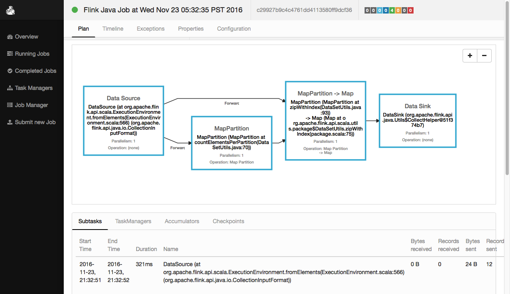 


##zipWithIndex
```
def zipWithUniqueId: DataSet[(Long, T)]

Method that assigns a unique id to all the elements of the input data set.

元素和随机唯一的ID进行zip操作。
```
执行程序：
```scale
//1.创建一个 DataSet其元素为String类型
val input: DataSet[String] = benv.fromElements("A", "B", "C", "D", "E", "F")

//2.元素和随机唯一的ID进行zip操作。
val result: DataSet[(Long, String)] = input.zipWithUniqueId

//3.显示结果
result.collect
```
执行结果：
```
res137: Seq[(Long, String)] = Buffer((0,A), (1,B), (2,C), (3,D), (4,E), (5,F))
```
flink web ui中的执行效果：
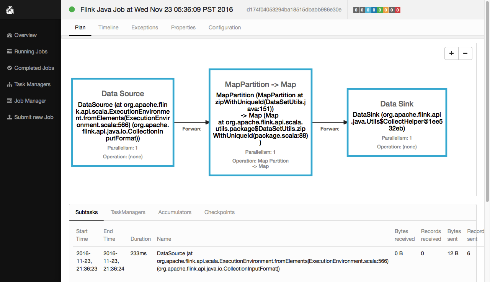 


#三、Flink DataSet API增强
##注意：必须引入

```
import org.apache.flink.api.scala.extensions._
```

##mapWith
```
def mapWith[R](fun: (T) ⇒ R)(implicit arg0: TypeInformation[R], arg1: ClassTag[R]):DataSet[R]

Applies a function fun to each item of the data set

可以使用偏函数进行map操作。
```
##mapWith示例一：全函数
执行程序：
```
//1.引入增强依赖
import org.apache.flink.api.scala.extensions._

//2.创建DataSet[Point]
case class Point(x: Double, y: Double)
val ds = benv.fromElements(Point(1, 2), Point(3, 4), Point(5, 6))

//3.使用mapWith进行元素转化
val r=ds.mapWith {
	case Point(x, y) => Point( x*2,y+1)
}

//4.显示结果
r.collect
```
执行结果：
```
res156: Seq[Point] = Buffer(Point(2.0,3.0), Point(6.0,5.0), Point(10.0,7.0))
```

##mapWith示例二：偏函数
执行程序：
```
//1.引入增强依赖
import org.apache.flink.api.scala.extensions._

//2.创建DataSet[Point]
case class Point(x: Double, y: Double)
val ds = benv.fromElements(Point(1, 2), Point(3, 4), Point(5, 6))

//3.使用mapWith进行元素转化
val r=ds.mapWith {
	case Point(x, _) => x*2
}

//4.显示结果
r.collect
```
执行结果：
```
res155: Seq[Double] = Buffer(2.0, 6.0, 10.0)
```


##filterWith
```
def filterWith(fun: (T) ⇒ Boolean): DataSet[T]
Applies a predicate fun to each item of the data set,
keeping only those for which the predicate holds

可以使用片函数进行filter操作。
```

###filterWith示例一：全函数
执行程序：
```
//1.引入增强依赖
import org.apache.flink.api.scala.extensions._

//2.创建DataSet[Point]
case class Point(x: Double, y: Double)
val ds = benv.fromElements(Point(1, 2), Point(3, 4), Point(5, 6))

//3.使用filterWith进行元素过滤
val r=ds.filterWith {
	case Point(x, y) => x > 1 && y <5
}

//4.显示结果
r.collect
```
执行结果：
```
res153: Seq[Point] = Buffer(Point(3.0,4.0))
```
flink web ui中的执行效果：
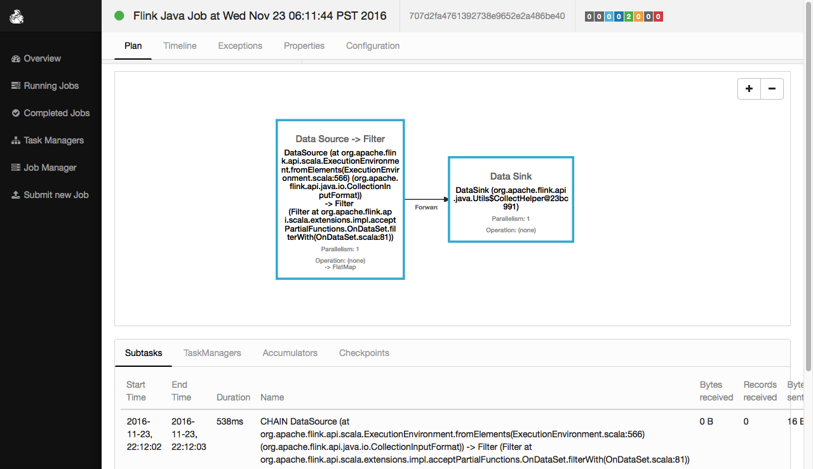 

###filterWith示例二：全函数
执行程序：
```
//1.引入增强依赖
import org.apache.flink.api.scala.extensions._

//2.创建DataSet[Point]
case class Point(x: Double, y: Double)
val ds = benv.fromElements(Point(1, 2), Point(3, 4), Point(5, 6))

//3.使用filterWith进行元素过滤
val r=ds.filterWith {
	case Point(x, _) => x > 1
}

//4.显示结果
r.collect
```
执行结果：
```
res154: Seq[Point] = Buffer(Point(3.0,4.0), Point(5.0,6.0))
```


##reduceWith
```
def reduceWith(fun: (T, T) ⇒ T): DataSet[T]
Applies a reducer fun to the data set

可以使用偏函数进行reduce操作。
```
执行程序：
```
//1.引入增强依赖
import org.apache.flink.api.scala.extensions._

//2.创建DataSet[Point]
case class Point(x: Double, y: Double)
val ds = benv.fromElements(Point(1, 2), Point(3, 4), Point(5, 6))


//3.使用reduceWith进行元素的merger
val r=ds.reduceWith {
    case (Point(x1, y1), (Point(x2, y2))) => Point(x1 + x2, y1 + y2)
}

//4.显示结果
r.collect
```
执行结果：
```
res159: Seq[Point] = Buffer(Point(9.0,12.0))
```


##flatMapWith
```
def flatMapWith[R](fun: (T) ⇒ 
TraversableOnce[R])(implicit arg0: TypeInformation[R], arg1: ClassTag[R]): DataSet[R]

Applies a function fun to each item of the dataset, producing a 
collection of items that will be flattened in the resulting data set

可以使用偏函数进行flatMap操作。
```
执行程序：
```
//1.引入增强依赖
import org.apache.flink.api.scala.extensions._

//2.创建DataSet[Point]
case class Point(x: Double, y: Double)
val ds = benv.fromElements(Point(1, 2), Point(3, 4), Point(5, 6))

//3.使用reduceWith进行元素的merger
val r0=ds.flatMapWith {
  case Point(x, y) => Seq("x" -> x, "y" -> y)
}

//4.显示结果
r0.collect
```
执行结果：
```
res1: Seq[(String, Double)] = Buffer((x,1.0), (y,2.0), (x,3.0), (y,4.0), (x,5.0), (y,6.0))
```


