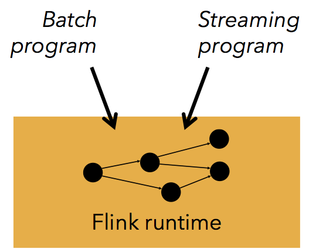

##一、流处理特性
###1.高吞吐，低延时  
有图有真相，有比较有差距。且看下图：
 
```
1.flink的吞吐量大
2.flink的延时低
3.flink的配置少
```

###2.支持Event-Time 和乱序-Event
 
```
1.flink支持流处理
2.flink支持在Event-Time上的窗口处理
3.因为有Event-Time做保障，即使消息乱序或延时也能轻松应对。
```

###3.支持Stateful-data的Exactly-once处理方式
 
```
1.flink支持自定义状态
2.flink的checkpoint机制保障即便在failure的情况下Stateful-data的Exactly-once处理方式。
```
   
###4.支持高度灵活的窗口操作
 
```
1.flink支持time-Window，count-window, session-window,data-window等多种窗口操作。
2.flink支持多种触发窗口操作的条件，以便应对各种流处理的情况。
```

###5.通过Backpressure机制支持不间断的流处理
 
```
1.flink支持long-live流处理。
2.flink支持slow-sinks背压fast-sources,以保障流处理的不间断
```

###6.通过轻量级分布式Snapshot机制支持Fault-tolerance
 
```
1.flink支持Chandy-Lamport轻量级分布式快照来保障容错处理
2.Chandy-Lamport快照是轻量级的，在保障强一致性的同时，不影响其高吞吐。
```


##二、流处理，批处理合二为一

###1.同一个运行时环境，同时支持流处理，批处理
 
```
1.flink的一套runtime环境，统一了流处理，批处理，两大业务场景
2.flink本质是一个流处理系统，同时它将批处理看出特殊的流处理，因此也能应付批处理的场景

注意：
1.这与spark相反，spark本质是一个批处理系统，它将流处理看成特殊的批处理的。
2.spark-streaming本质是mirc-batch，无论多么mirc依然是batch,因此延时较大。
3.spark的本质是批处理，它将流处理看出无边界的批处理
4.flink的本质是流处理，它将批处理看出有边界的流处理。
```

###2.实现了自己的内存管理机制
 
```
1.flinK在jvm内部实现了自己的内存管理机制，以提高内存使用效率，防止大规模GC.
2.flink将大规模的数据存放到out-heap内存，以防止在jvm的heap中创建大量对象，而引起大规模GC.

注意：
不知spark是否受到flink的启发，现如今spark也实现了自己的内存管理机制，那就是Tungsten计划。
```


###3.支持迭代和增量迭代
 
```
1.flinK支持迭代和增量迭代操作（这一特性在图计算和机器学习领域非常有用）
2.增量迭代可以根据计算的依赖关系，优化计算环境，获得最好的计算效率

注意：
spark和Hadoop的迭代计算都是在driver端由用户自己实现的，flink是原生支持迭代计算。这一点上做的比较优秀。
```


###4.支持程序优化
 
```
1.flink的批处理场景下可以根据计算的依赖关系，自动的避免一些昂贵的不必要的中间操作（诸如：sort,shuffle等）
2.flink会自动缓存一些中间结果，以便后续计算的多次使用，这样能显著的提高效率。
```


##三、类库和API

###1.流处理程序

```
flink的 DataStream API在流处理的业务场景下，支持多种数据转换，支持用户自定义状态的操作，支持灵活的窗口操作！
```

示例程序：  
```scala

//1.定义case class
case class Word(word: String, freq: Long)

//2.定义数据源
val texts: DataStream[String] = ...

//3.支持数据的流操作
val counts = text
  .flatMap { line => line.split("\\W+") }
  .map { token => Word(token, 1) }
  .keyBy("word")
  .timeWindow(Time.seconds(5), Time.seconds(1))
  .sum("freq")
```
程序说明：
```
以上程序演示了如何在一个数据流上，对源源不断流入的消息进行一个word-count操作！
```