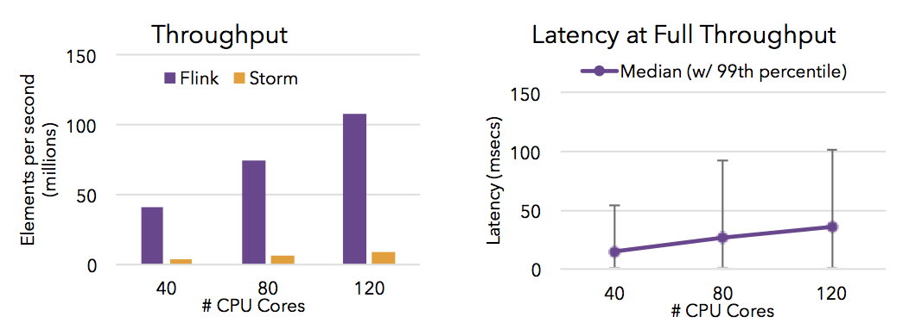
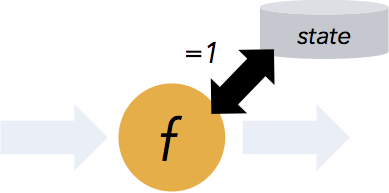

##一、流处理
###1.高吞吐，低延时  
有图有真相，有比较有差距。且看下图：
 
```
1.flink的吞吐量大
2.flink的延时低
3.flink的配置少
```

###2.支持Event-Time 和乱序-Event
 
```
1.flink支持流处理
2.flink支持在Event-Time上的窗口处理
3.因为有Event-Time做保障，即使消息乱序或延时也能轻松应对。
```

###3.支持Stateful-data的Exactly-once处理方式
 
```
1.flink支持自定义状态
2.flink的checkpoint机制保障即便在failure的情况下Stateful-data的Exactly-once处理方式。
```
   
###4.支持高度灵活的窗口操作
 
```
1.flink支持time-Window，count-window, session-window,data-window等多种窗口操作。
2.flink支持多种触发窗口操作的条件，以便应对各种流处理的情况。
```

###5.通过Backpressure机制支持不间断的流处理
 
```
1.flink支持long-live流处理。
2.flink支持slow-sinks背压fast-sources,以保障流处理的不间断
```

###6.通过轻量级分布式Snapshot机制支持Fault-tolerance
 
```
1.flink支持Chandy-Lamport轻量级分布式快照来保障容错处理
2.Chandy-Lamport快照是轻量级的，在保障强一致性的同时，不影响其高吞吐。
```
