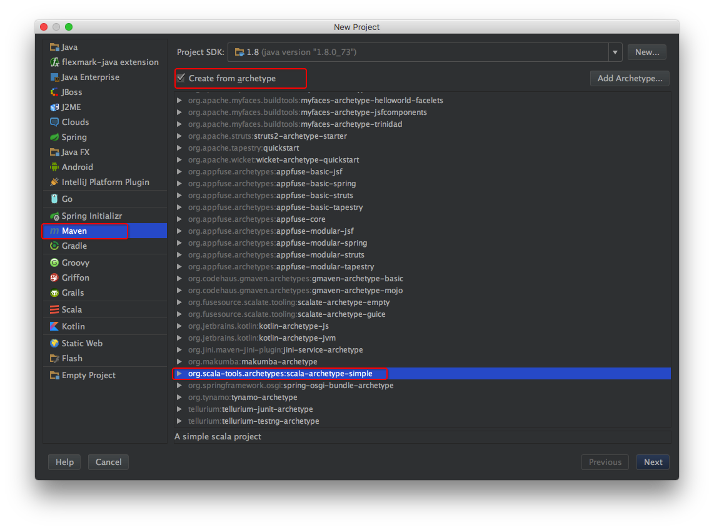
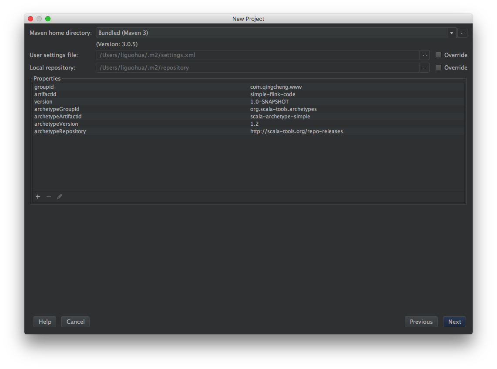
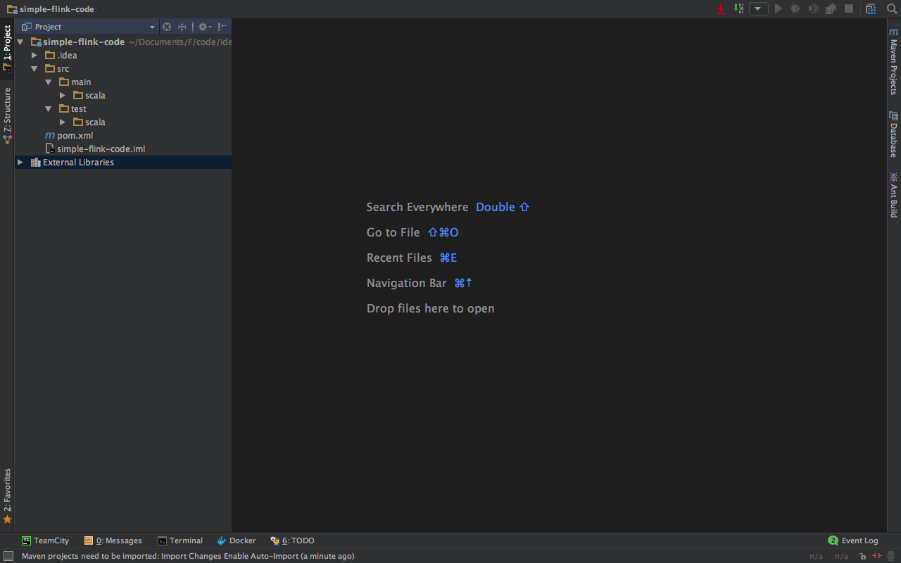
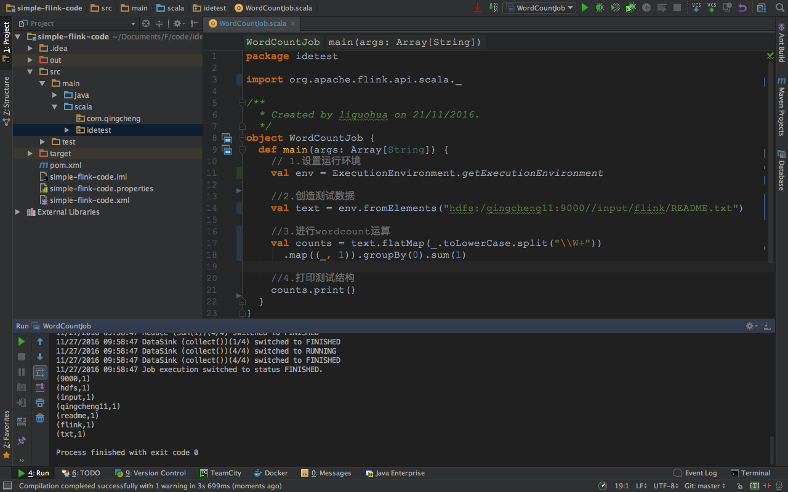
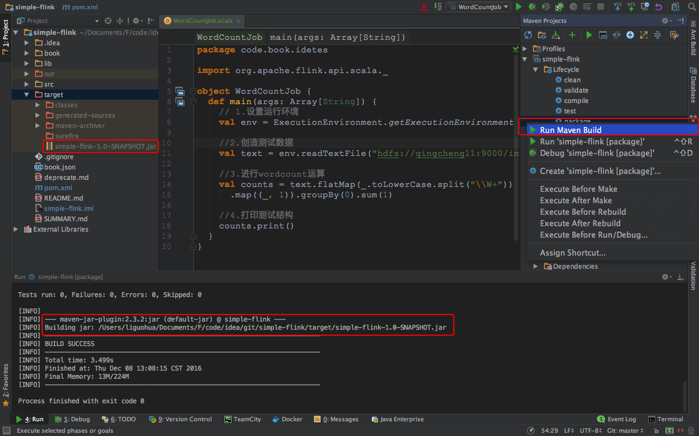

##一、准备flink的开发环境
###1.创建scala的maven项目
 
###2.输入项目的基本信息
 
###3.验证项目的基本信息
 
###4.输入项目名称
 
###5.生成的目录结构
 
###6.设置src和test目录
 
###7.寻找项目依赖
```
https://ci.apache.org/projects/flink/flink-docs-release-1.1/apis/common/index.html
```
###8.添加到pom.xml中的内容
```
<!-- Use this dependency if you are using the DataStream API -->
<dependency>
  <groupId>org.apache.flink</groupId>
  <artifactId>flink-streaming-java_2.10</artifactId>
  <version>1.1.3</version>
</dependency>
<!-- Use this dependency if you are using the DataSet API -->
<dependency>
  <groupId>org.apache.flink</groupId>
  <artifactId>flink-java</artifactId>
  <version>1.1.3</version>
</dependency>
<dependency>
  <groupId>org.apache.flink</groupId>
  <artifactId>flink-clients_2.10</artifactId>
  <version>1.1.3</version>
</dependency>
```
##二、开发并运行flink程序
###1.创建package和object（略）
###2.编写程序
```scala
package code.book.idetes
import org.apache.flink.api.scala._
object WordCountJob {
  def main(args: Array[String]) {
    // 1.设置运行环境
    val env = ExecutionEnvironment.getExecutionEnvironment

    //2.创造测试数据
    val text = env.readTextFile("hdfs://qingcheng11:9000/input/flink/README.txt")

    //3.进行wordcount运算
    val counts = text.flatMap(_.toLowerCase.split("\\W+"))
      .map((_, 1)).groupBy(0).sum(1)

    //4.打印测试结构
    counts.print()
  }
}
```
3.运行效果
 

##三、打包到服务器上运行
###1.在pom.xml的<project></project>中配置打包插件
```
<project>
    <build>
        <!--设置src的目录和test的根目录-->
        <sourceDirectory>src/main/scala</sourceDirectory>
        <testSourceDirectory>src/test/scala</testSourceDirectory>
        <pluginManagement>
            <plugins>
                <plugin>
                    <groupId>org.apache.maven.plugins</groupId>
                    <artifactId>maven-jar-plugin</artifactId>
                    <configuration>
                        <archive>
                            <manifest>
                                <!--设置程序的入口类-->
                                <mainClass>code.book.idetes.WordCountJob</mainClass>
                                <addClasspath>true</addClasspath>
                                <classpathPrefix>lib/</classpathPrefix>
                            </manifest>
                        </archive>
                        <classesDirectory>
                        </classesDirectory>
                    </configuration>
                </plugin>
            </plugins>
        </pluginManagement>
        <plugins>
            <plugin>
                <groupId>org.apache.maven.plugins</groupId>
                <artifactId>maven-compiler-plugin</artifactId>
                <configuration>
                    <source>1.8</source>
                    <target>1.8</target>
                </configuration>
            </plugin>
        </plugins>
    </build>
</project>
```
###2.打包程序
 
```
如果顺利的话，在进行package操作后，将会生成。simple-flink-1.0-SNAPSHOT.jar文件
此文件的名称跟我们在maven的pom.xml配置是有关系的。因为在pom.xml中配置了
<artifactId>simple-flink</artifactId>
<version>1.0-SNAPSHOT</version>
所以产生了文件simple-flink-1.0-SNAPSHOT.jar
```
 

###3.上传到服务器，并运行jar
```
${FLINK_HOME}/bin/flink run  -m qingcheng11:6123  simple-flink-1.0-SNAPSHOT.jar
```
