####一、flink软件包的下载与解压   
1.从flink官网获得下载链接
1.1进入官网链接：  
http://flink.apache.org
 
1.2进入下载页面：   
http://flink.apache.org/downloads.html
 
1.3获取下载地址：
 
选择相应的版本，下载地址为http://mirrors.tuna.tsinghua.edu.cn/apache/flink/flink-1.1.3/flink-1.1.3-bin-hadoop27-scala_2.10.tgz   
2.下载并解压flink
2.1下载命令：
```
wget http://mirrors.tuna.tsinghua.edu.cn/apache/flink/flink-1.1.3/flink-1.1.3-bin-hadoop27-scala_2.10.tgz
```
得到flink-1.1.3-bin-hadoop27-scala_2.10.tgz软件压缩包

2.2解压命令：
```
tar -zxvf flink-1.1.3-bin-hadoop27-scala_2.10.tgz
```
解压得到flink-1.1.3文件夹，文件夹中的内容如下：   
    
3.分发flink及其环境变量  
3.1分发flink  
分发命令：  
```
scp -r /bigdata/software/flink-1.1.3  qingcheng12:/bigdata/software/
scp -r /bigdata/software/flink-1.1.3  qingcheng13:/bigdata/software/
```

3.2分发flink的环境变量  
配置FLINK_HOME环境变量  
```
1.编辑环境变量文件
执行命令：
    vim ~/.bashrc
编辑内容：
    在环境办理文件中加入如下内容
    export FLINK_HOME=/bigdata/software/flink-1.1.3
    export PATH=$FLINK_HOME/bin:$PATH
2.分发环境变量文件到其他机器
执行命令：
    scp ~/.bashrc  qingcheng12:~/.bashrc
    scp ~/.bashrc  qingcheng13:~/.bashrc
3.在每个机器上刷新环境变量
执行命令：
    source   ~/.bashrc
4.测试环境环境变量是否配置成功 
执行命令：
    $FLINK_HOME
执行效果：
    出现如下字样说明配置成功
   -bash: /bigdata/software/flink-1.1.3: Is a directory
```

####二、flink在standalone模式主节点下无HA的部署实战
1.部署规划：  
   
2.配置flink-conf.yaml文件  
执行命令：
```
vim ${FLINK_HOME}/conf/flink-conf.yaml
```
添加内容：  
    在flink-conf.yaml文件中进行一些基本的配置，本此要修改的内容如下。  
```
# The TaskManagers will try to connect to the JobManager on that host.
jobmanager.rpc.address: qingcheng11

# The heap size for the JobManager JVM
jobmanager.heap.mb: 1024

# The heap size for the TaskManager JVM
taskmanager.heap.mb: 1024

# The number of task slots that each TaskManager offers. Each slot runs one parallel pipeline.
taskmanager.numberOfTaskSlots: 4

# The parallelism used for programs that did not specify and other parallelism.
parallelism.default: 12

# You can also directly specify the paths to hdfs-default.xml and hdfs-site.xml
# via keys 'fs.hdfs.hdfsdefault' and 'fs.hdfs.hdfssite'.
 fs.hdfs.hadoopconf: /bigdata/software/hadoop-2.7.2
```

3.配置slaves文件  
此文件用于指定从节点，一行一个节点.   
执行命令：
```
vim ${FLINK_HOME}/conf/slaves
```
添加内容：  
    在slaves文件中添加如下内容，表示集群的taskManager.
```
qingcheng11
qingcheng12
qingcheng13
```
4.分发配置文件
执行命令：
```
scp -r ${FLINK_HOME}/conf/*  qingcheng12:${FLINK_HOME}/conf/
scp -r ${FLINK_HOME}/conf/*  qingcheng13:${FLINK_HOME}/conf/
```

5.启动flink服务
执行命令：
```
${FLINK_HOME}/bin/start-cluster.sh
```
执行效果：
 

6.验证flink服务   
6.1查看进程验证flink服务，在所有机器上执行，可以看到各自对应的进程名称。   
执行命令：
```
jps
```
执行效果：
 

6.2查看flink的web界面验证服务  
打开网址：  
    在浏览器中打开如下网址
```
http://qingcheng11:8081
```
执行效果：  
集群情况：
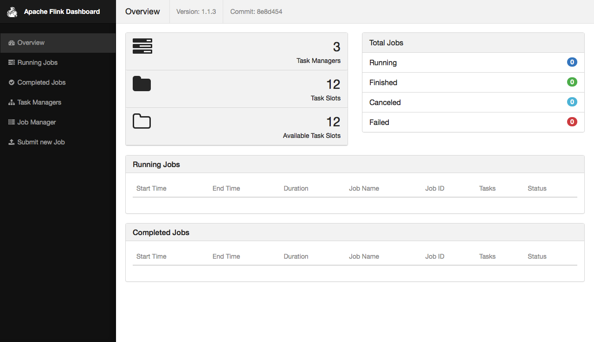 
Job Manager情况：
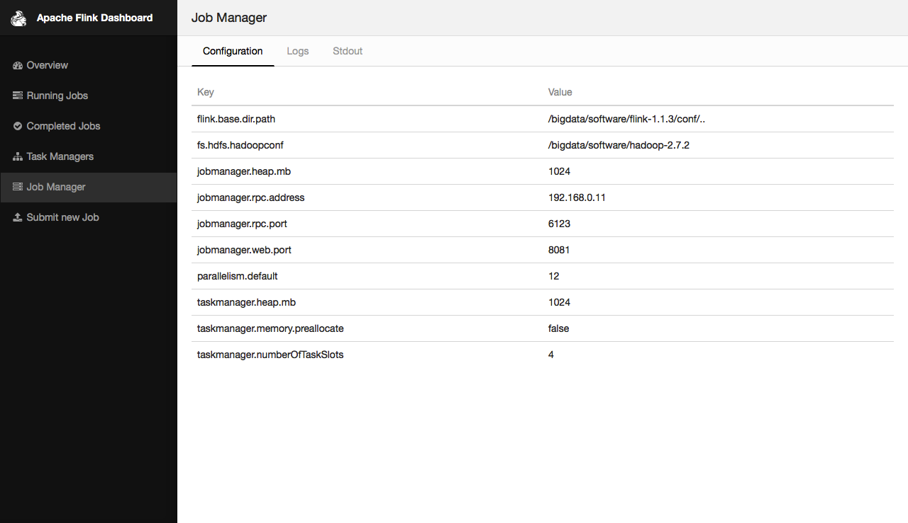 
Task Manager情况：
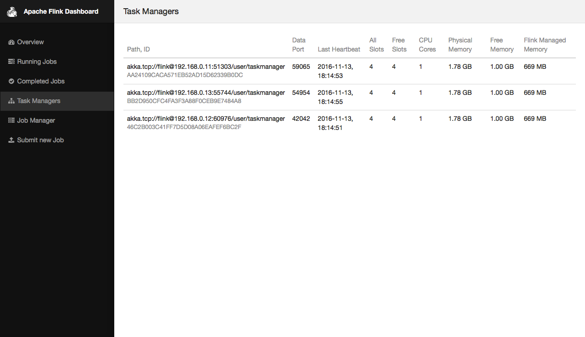 
可以看出flink集群的整体情况。说明flink在standalone模式下主节点无HA的部署实战是成功的。

7.flink的常用命令
```
1.启动集群
    ${FLINK_HOME}/bin/start-cluster.sh 
2.关闭集群
    ${FLINK_HOME}/bin/stop-cluster.sh
3.启动web客户端
    ${FLINK_HOME}/bin/webclient.sh start
4.关闭web客户端
    ${FLINK_HOME}/bin/webclient.sh stop
5.启动Scala-shell
    ${FLINK_HOME}/bin/start-scala-shell.sh remote qingcheng11 6123
```
       
  
####三、flink第一个程序      
1.创建文件夹并上传flink的readme文件  
执行命令：
```
hadoop fs -mkdir -p  /input/flink
hadoop fs -put  ${FLINK_HOME}/README.txt  /input/flink/
```
执行效果：
   
   
  
2.打开start-scala-shell.sh
${FLINK_HOME}/bin/start-scala-shell.sh是flink提供的交互式clinet,可以用于代码片段的测试，方便开发工作。
它有两种启动方式，一种是工作在本地，另一种是工作到集群。本例中因为机器连接非常方便，就直接使用集群进行测试，在
开发中，如果集群连接不是非常方便，可以连接到本地，在本地开发测试通过后，再连接到集群进行部署工作。如果程序有
依赖的jar包，则可以使用 -a <path/to/jar.jar> 或 --addclasspath <path/to/jar.jar>参数来添加依赖。

```
1.本地连接
    ${FLINK_HOME}/bin/start-scala-shell.sh local
    
2.集群连接    
    ${FLINK_HOME}/bin/start-scala-shell.sh remote <hostname> <portnumber>
    
3.带有依赖包的格式
    ${FLINK_HOME}/bin/start-scala-shell.sh [local | remote <host> <port>] --addclasspath <path/to/jar.jar>
```
执行命令：
```
${FLINK_HOME}/bin/start-scala-shell.sh remote qingcheng11 6123
```
执行效果：
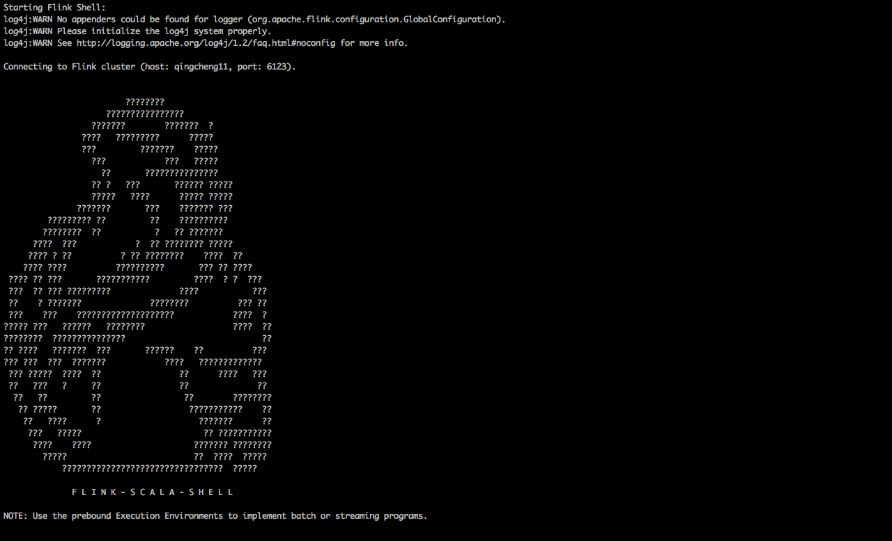   
   
3.执行第一个flink程序
执行程序：
```
val file=benv.readTextFile("hdfs://qingcheng11:9000/input/flink/README.txt")
val flinks=file.filter(l =>l.contains("flink"))
flinks.print()
val count=flinks.count
```
shell执行效果：
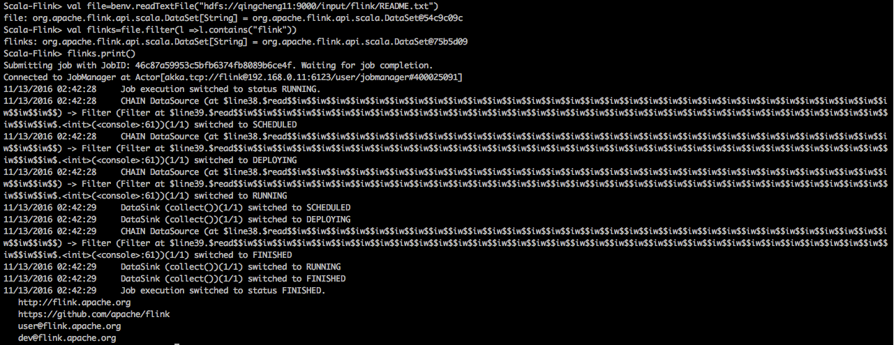
web执行效果一：
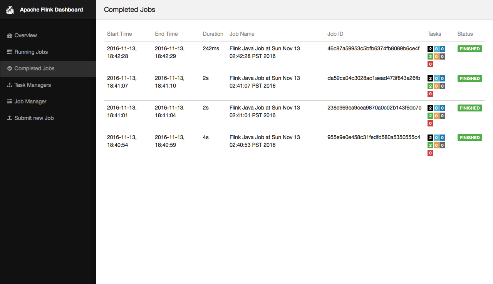
web执行效果二：
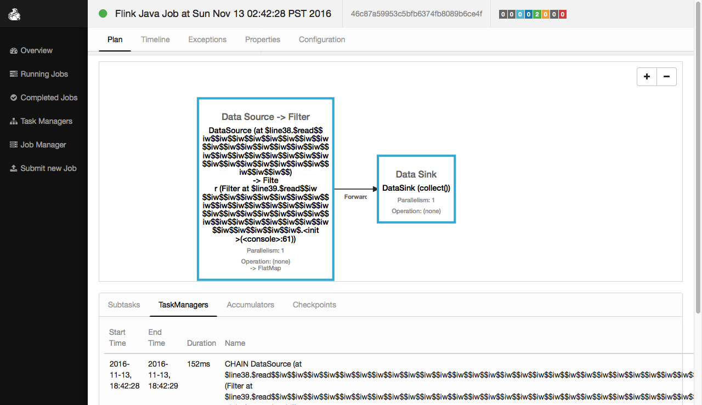             
       
####四、flink批处理测试       
       
1.创建文件夹并上传flink的readme文件  
执行命令：
```
hadoop fs -mkdir -p  /input/flink
hadoop fs -put  ${FLINK_HOME}/README.txt  /input/flink/
```
执行效果：  
     
2.运行wordcount程序  
2.1检查安装包中是否存在WordCount.jar  
执行命令：
```
cd ${FLINK_HOME}/examples/batch
ll
```
执行效果：  
             
2.2运行wordcount程序  
计算hdfs://qingcheng11:9000/input/flink/README.txt中单词的个数      
执行命令：
```
${FLINK_HOME}/bin/flink run -p 8 ${FLINK_HOME}/examples/batch/WordCount.jar \
--input  hdfs://qingcheng11:9000/input/flink/README.txt \
--output hdfs://qingcheng11:9000/output/flink/readme_result

其中：-p 8：是设置8个任务并发执行，也就是Job parallelism=8，每个任务输出一个结果到hdfs上hdfs上将生产8个结果文件。
```
执行效果：  
   
fink web ui中的效果：  
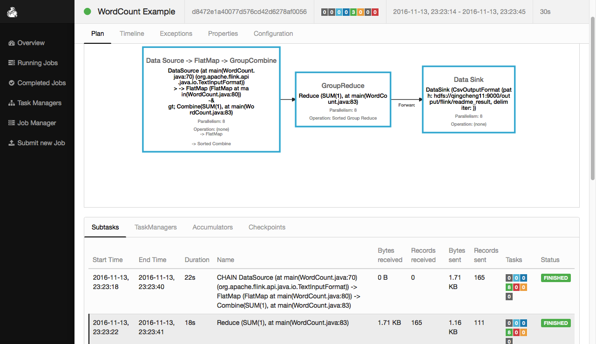  
hadoop hdfs  web ui中的效果：  
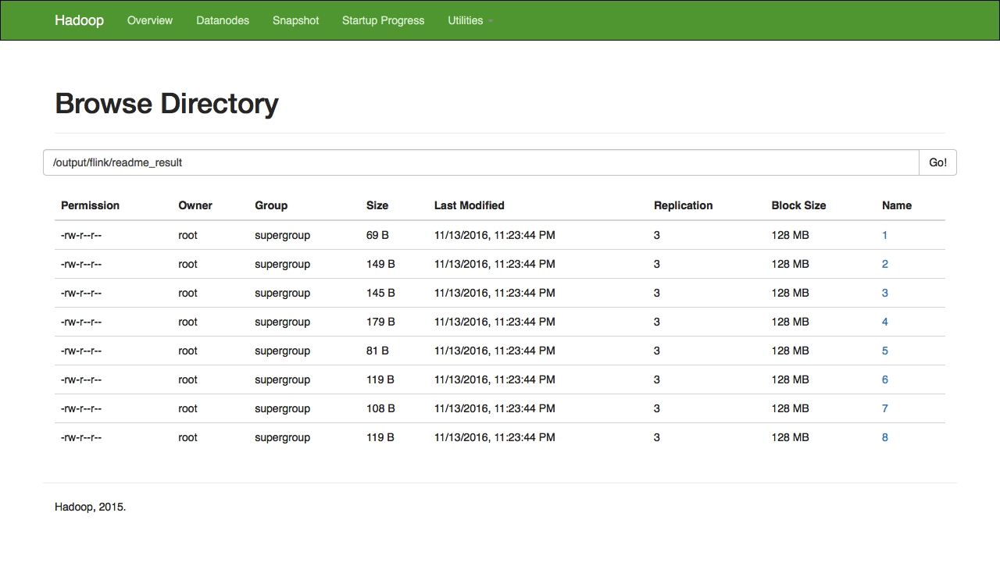 
分别查看结果文件中的内容：     
```
 hadoop fs -text /output/flink/readme_result/1
 hadoop fs -text /output/flink/readme_result/2
 hadoop fs -text /output/flink/readme_result/3
 hadoop fs -text /output/flink/readme_result/4
 hadoop fs -text /output/flink/readme_result/5
 hadoop fs -text /output/flink/readme_result/6
 hadoop fs -text /output/flink/readme_result/7
 hadoop fs -text /output/flink/readme_result/8
```
             
      
####五、flink流处理测试        
0.测试规划如下：  
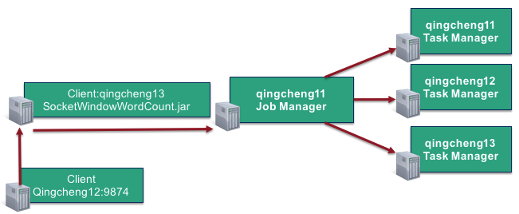  
```
1.消息发送者
    在qingcheng12的9874端口发送消息
2.消息处理者
    qingcheng13上提交${FLINK_HOME}/examples/streaming/SocketWindowWordCount.jar 
3.消息处理集群
    主节点：
        qingcheng11
    从节点：
        qingcheng11
        qingcheng12
        qingcheng13
4.结果输出
    计算结果将输出到主节点的${FLINK_HOME}/log/中
    也就是本例中的${FLINK_HOME}/log/flink-root-taskmanager-1-qingcheng11.out
```

1.打开消息发送端
执行命令：
```
nc -l -p  9874
```
执行效果：  
     
       
2.打开消息处理端  
打开flink流消息处理client程序  
执行命令：
```
${FLINK_HOME}/bin/flink run  ${FLINK_HOME}/examples/streaming/SocketWindowWordCount.jar \
--hostname  qingcheng12 \
--port   9874
```
执行效果：  
          
       
3.打开消息输出端  
3.1找到输出文件  
找到有输出内容的flink-*-taskmanager-*-*.out文件，这里讲会有处理日志的输出。  
```
cd ${FLINK_HOME}/log/
ll
```
执行效果：  
         
本例中找的的文件名为flink-root-taskmanager-1-qingcheng11.out
3.2查看输出文件内容
```
tail -f flink-root-taskmanager-1-qingcheng11.out
```   
    
4.输入数据 ，运行程序     
在消息发送端不断的输入单词，则可以看到在消息输出端有新内容不断的输出。  
4.1在本例中，像下面的样子发送数据：    
```
flink spark
storm hadoop
hadoop hue
flink flink
spark flume
...........
...........
...........
```         
4.2在本例中，输出的数据像下面的样子：    
```
hadoop : 4
flume : 1
hue : 1
flink : 3
storm : 1
spark : 2
hadoop : 2
flume : 1
...........
...........
........... 
```          
4.3在本例中，执行效果像下面的样子：  
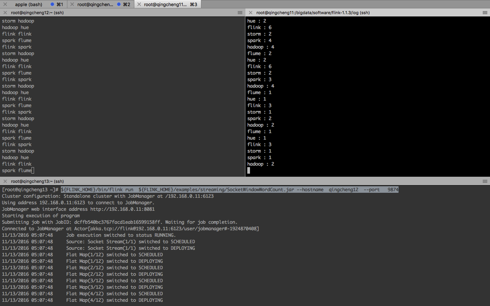                
4.4在本例中，flink的webUI效果像下面的样子：  
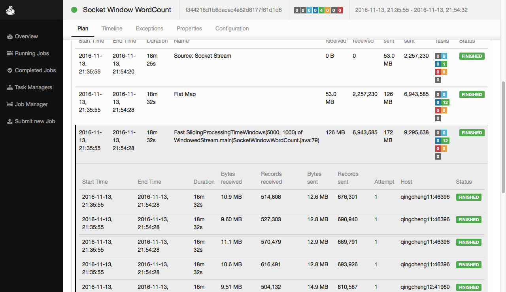          
              
       
       
       
       
       
