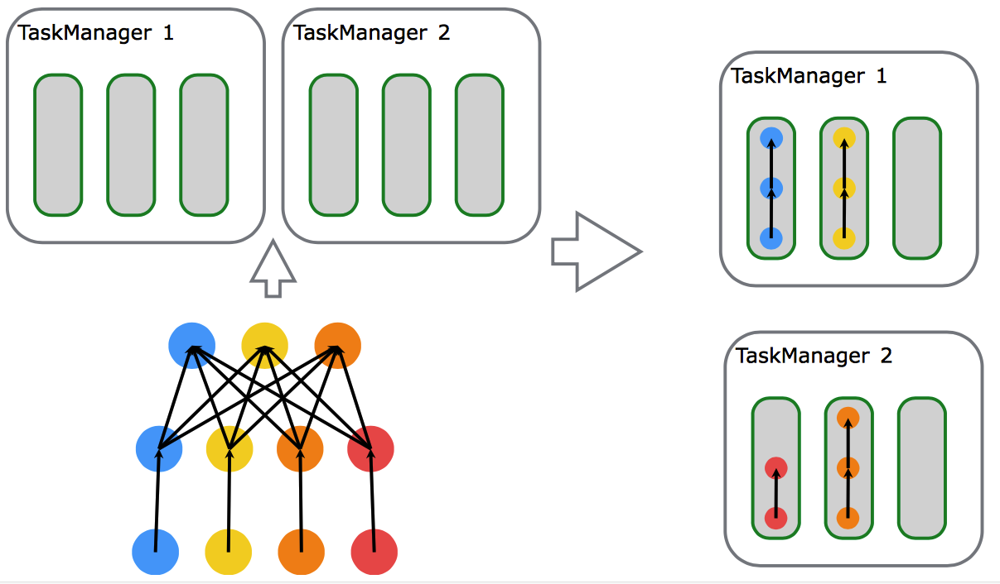
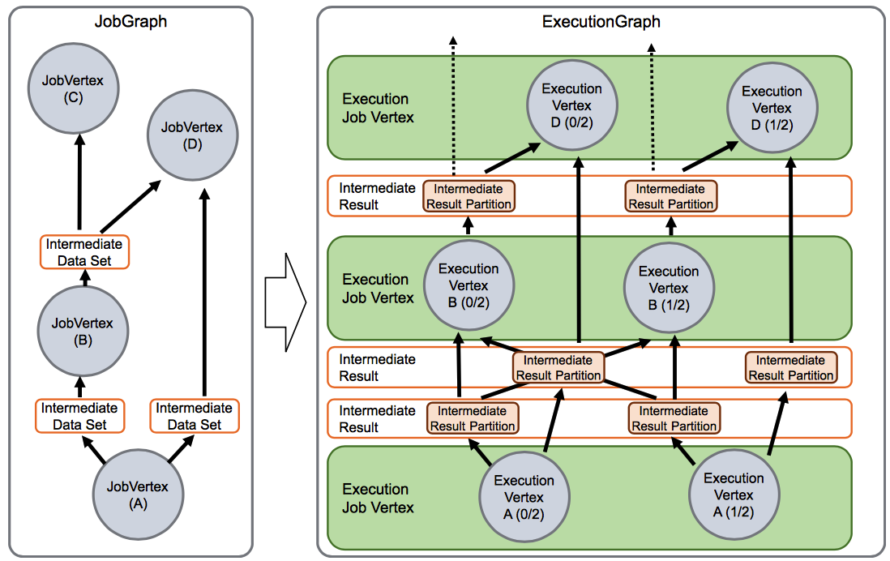
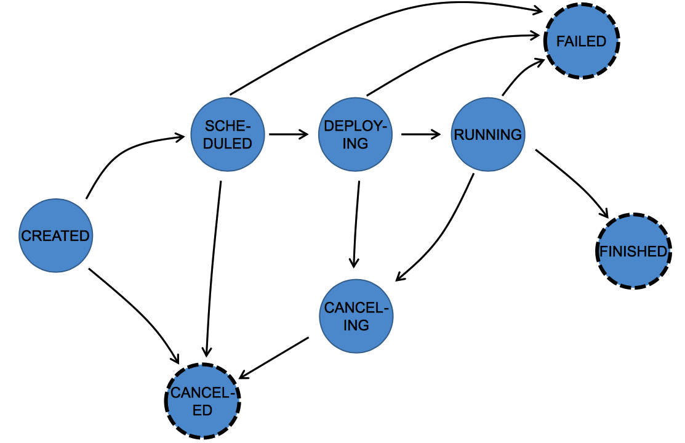
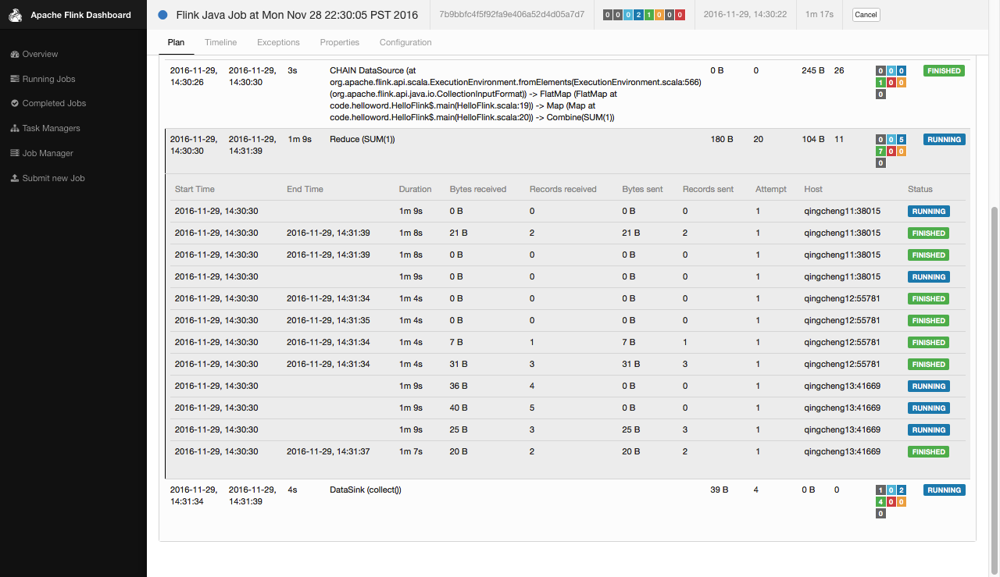
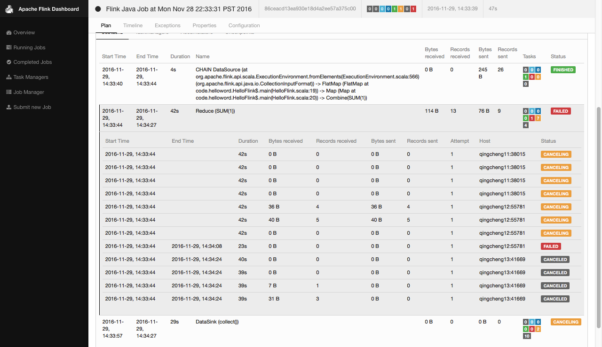

##一、作业（Job）和调度（Scheduling）
###1.调度（Scheduling）
```
1.Flink集群一般有一个或多个TaskManager，每个TaskManager有一个或多个slot来区分不同的资源（当前是内存）
2.每个slot都可以运行整个pipeline，这些pipeline中的并行任务都可以并行的运行在各个slot之中
3.可通过SlotSharingGroup和CoLocationGroup来定义任务在共享任务槽的行为，可定义为自由共享，
  或是严格定义某些任务部署到同一个任务槽中。
```
 
```
1.本例中有2个TaskManager，每个TaskManager划分了3个slot，一共6个slot。
2.本例是一个source-map-reduce的pipeline例子，source并行度为4，map并行度为4，reduce并行度为3.最大并行度为4.
3.图中可见TaskManager1使用2个slot,分别运行蓝，黄2个subtask的pipeline。
4.图中可见TaskManager2使用2个slot,分别运行红，橙2个subtask的pipeline。
```
###2.JobManager数据结构（JobManager Data Structures）
 
```
1.client将program解析成dataflow,并将dataflow的描述信息JobGraph提交给JobManager。
  JobGraph包含Operator(JobVertex),IntermediateResult(IntermediateDataSet),并行度,执行代码,附加的库等信息。
2.JobManager将JobGraph并行化处理成ExecutionGraph。
  Operator（JobVertex）处理成包含多个Subtask(ExecutionVertex)的ExecutionJobVertex。
  IntermediateResult(IntermediateDataSet)并行化成包含多个IntermediateResultPartition的IntermediateResult.
  也就是
  任务并行化： JobVertex->ExecutionJobVertex(含多个ExecutionVertex)
  数据并行化： IntermediateResult->IntermediateResult(含多个IntermediateResultPartition)
```

###2.Flink的任务调度转化图
 
```
1.flink的定了了job运行的状态有2种。
2.最正常的状态是created->running->finished
3.running的job还可能被取消，运行失败，挂起运行等，这样job就会切换到相应的状态
```
 
```
1.在程序执行期间，每个并行任务要经过多个阶段，从created到finished或failed
2.一个任务可能被多次执行（如在失效恢复的过程中），所以我们以一个Exection跟踪一个ExecutionVertex。
3.每个ExecutionVertex都有一个当前Execution(current execution)和一个前驱Execution(prior execution)
```
####2.1Job状态转化在terminal中的体现
 
####2.2Job状态转化在webUI中的体现（执行成功）
 
####2.3Job状态转化在webUI中的体现（执行失败）
 
