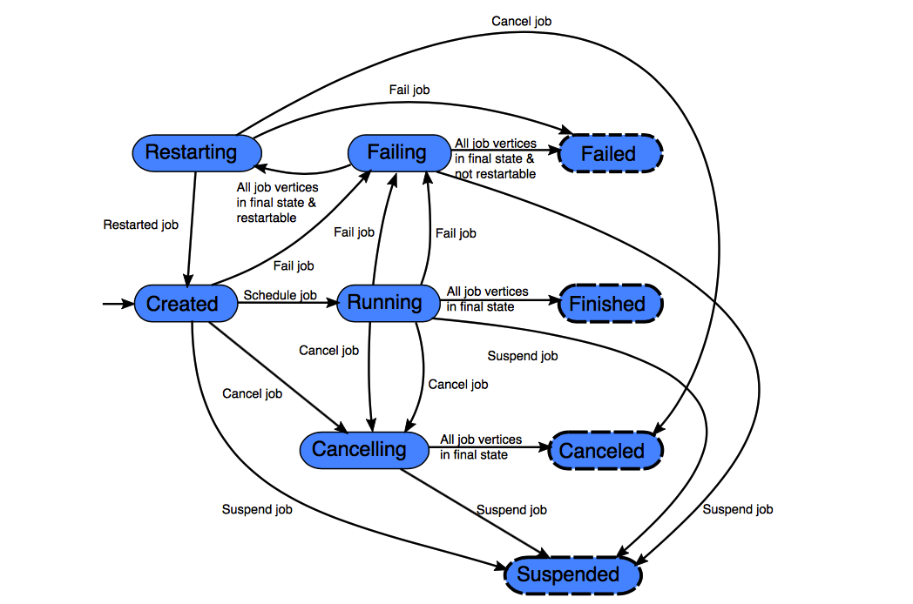

##一、程
###1.调度（Scheduling）
```
1.Flink集群一般有一个或多个TaskManager，每个TaskManager有一个或多个slot来区分不同的资源（当前是内存）
2.每个slot都可以运行整个pipeline，这些pipeline中的并行任务都可以并行的运行在各个slot之中
3.可通过SlotSharingGroup和CoLocationGroup来定义任务在共享任务槽的行为，可定义为自由共享，
  或是严格定义某些任务部署到同一个任务槽中。
```
 
```
1.本例中有2个TaskManager，每个TaskManager划分了3个slot，一共6个slot。
2.本例是一个source-map-reduce的pipeline例子，source并行度为4，map并行度为4，reduce并行度为3.最大并行度为4.
3.图中可见TaskManager1使用2个slot,分别运行蓝，黄2个subtask的pipeline。
4.图中可见TaskManager2使用2个slot,分别运行红，橙2个subtask的pipeline。
```
#####1.1SlotSharingGroup源码
```scala
package org.apache.flink.runtime.jobmanager.scheduler;

import java.util.Collections;
import java.util.Set;
import java.util.TreeSet;

import org.apache.flink.runtime.instance.SlotSharingGroupAssignment;
import org.apache.flink.runtime.jobgraph.JobVertexID;

/**
 * A slot sharing units defines which different task (from different job vertices) can be
 * deployed together within a slot. This is a soft permission,
   in contrast to the hard constraint
 * defined by a co-location hint.
 */
public class SlotSharingGroup implements java.io.Serializable {
	
	private static final long serialVersionUID = 1L;
	

	private final Set<JobVertexID> ids = new TreeSet<JobVertexID>();
	
	/** Mapping of tasks to subslots. This field is only needed 
	inside the JobManager, and is not RPCed. */
	private transient SlotSharingGroupAssignment taskAssignment;
	
	
	public SlotSharingGroup() {}
	
	public SlotSharingGroup(JobVertexID ... sharedVertices) {
		for (JobVertexID id : sharedVertices) {
			this.ids.add(id);
		}
	}

	// --------------------------------------------------------------------------------------------
	
	public void addVertexToGroup(JobVertexID id) {
		this.ids.add(id);
	}
	
	public void removeVertexFromGroup(JobVertexID id) {
		this.ids.remove(id);
	}
	
	public Set<JobVertexID> getJobVertexIds() {
		return Collections.unmodifiableSet(ids);
	}
	
	
	public SlotSharingGroupAssignment getTaskAssignment() {
		if (this.taskAssignment == null) {
			this.taskAssignment = new SlotSharingGroupAssignment();
		}
		
		return this.taskAssignment;
	}
	
	public void clearTaskAssignment() {
		if (this.taskAssignment != null) {
			if (this.taskAssignment.getNumberOfSlots() > 0) {
				throw new IllegalStateException("SlotSharingGroup cannot clear task assignment,
				group still has allocated resources.");
			}
		}
		this.taskAssignment = null;
	}
	
	// ------------------------------------------------------------------------
	//  Utilities
	// ------------------------------------------------------------------------
	
	@Override
	public String toString() {
		return "SlotSharingGroup " + this.ids.toString();
	}
}
```
#####1.2CoLocationGroup源码
```
package org.apache.flink.runtime.jobmanager.scheduler;

import java.util.ArrayList;
import java.util.List;

import org.apache.flink.runtime.jobgraph.JobVertex;
import org.apache.flink.util.AbstractID;
import org.apache.flink.util.Preconditions;

/**
 * A Co-location group is a group of JobVertices, where the <i>i-th</i> subtask of one vertex
 * has to be executed on the same TaskManager as the <i>i-th</i> subtask of all
 * other JobVertices in the same group.
 * 
 * <p>The co-location group is used for example to make sure that the i-th subtasks for iteration
 * head and iteration tail are scheduled to the same TaskManager.</p>
 */
public class CoLocationGroup implements java.io.Serializable {
	
	private static final long serialVersionUID = -2605819490401895297L;


	/** The ID that describes the slot co-location-constraint as a group */ 
	private final AbstractID id = new AbstractID();
	
	/** The vertices participating in the co-location group */
	private final List<JobVertex> vertices = new ArrayList<JobVertex>();
	
	/** The constraints, which hold the shared slots for the co-located operators */
	private transient ArrayList<CoLocationConstraint> constraints;
	
	// --------------------------------------------------------------------------------------------
	
	public CoLocationGroup() {}
	
	public CoLocationGroup(JobVertex... vertices) {
		for (JobVertex v : vertices) {
			this.vertices.add(v);
		}
	}
	
	// --------------------------------------------------------------------------------------------
	
	public void addVertex(JobVertex vertex) {
		Preconditions.checkNotNull(vertex);
		this.vertices.add(vertex);
	}
	
	public void mergeInto(CoLocationGroup other) {
		Preconditions.checkNotNull(other);
		
		for (JobVertex v : this.vertices) {
			v.updateCoLocationGroup(other);
		}
		
		// move vertex membership
		other.vertices.addAll(this.vertices);
		this.vertices.clear();
	}
	
	// --------------------------------------------------------------------------------------------
	
	public CoLocationConstraint getLocationConstraint(int subtask) {
		ensureConstraints(subtask + 1);
		return constraints.get(subtask);
	}
	
	private void ensureConstraints(int num) {
		if (constraints == null) {
			constraints = new ArrayList<CoLocationConstraint>(num);
		} else {
			constraints.ensureCapacity(num);
		}
		
		if (num > constraints.size()) {
			constraints.ensureCapacity(num);
			for (int i = constraints.size(); i < num; i++) {
				constraints.add(new CoLocationConstraint(this));
			}
		}
	}

	/**
	 * Gets the ID that identifies this co-location group.
	 * 
	 * @return The ID that identifies this co-location group.
	 */
	public AbstractID getId() {
		return id;
	}

	/**
	 * Resets this co-location group, meaning that future calls to {@link #getLocationConstraint(int)}
	 * will give out new CoLocationConstraints.
	 * 
	 * <p>This method can only be called when no tasks from any of the CoLocationConstraints are
	 * executed any more.</p>
	 */
	public void resetConstraints() {
		for (CoLocationConstraint c : this.constraints) {
			if (c.isAssignedAndAlive()) {
				throw new IllegalStateException(
						"Cannot reset co-location group: some constraints still have live tasks");
			}
		}
		this.constraints.clear();
	}
}
```

###2.JobManager数据结构（JobManager Data Structures）
 
 
 