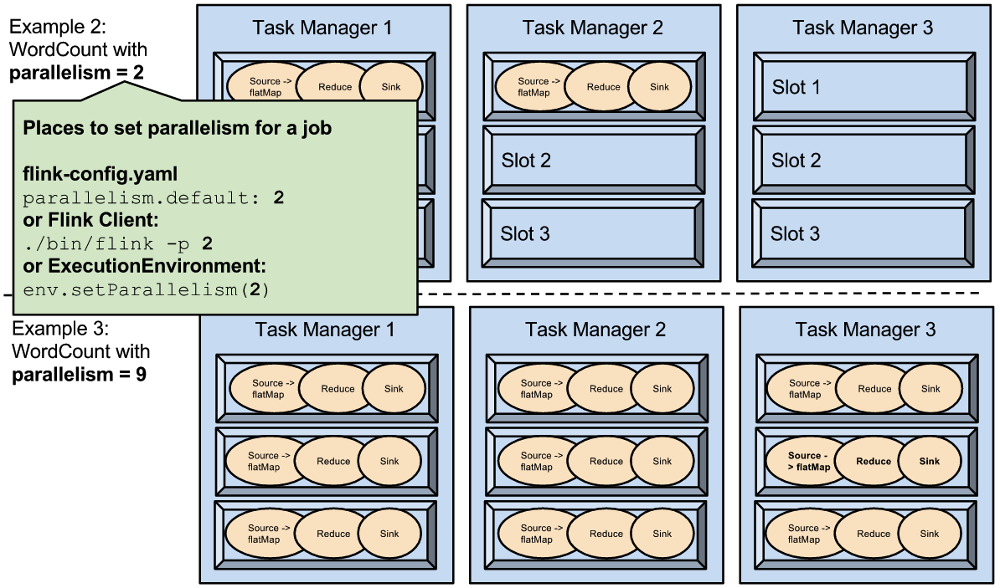
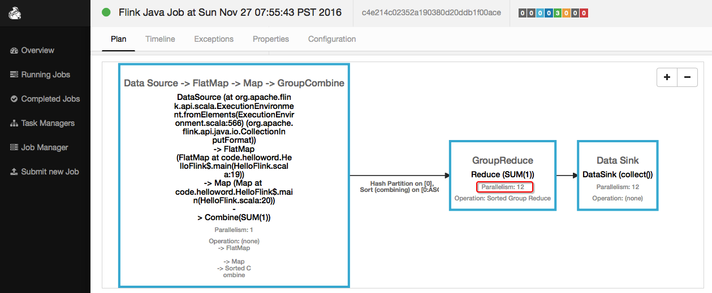

##一、slot和parallelism的关系
###1.slot是指taskmanager的并发执行能力
 
```
taskmanager.numberOfTaskSlots:3
每一个taskmanager中的分配3个TaskSlot,3个taskmanager一共有9个TaskSlot
```

###2.parallelism是指taskmanager实际使用的并发能力
 
```
parallelism.default:1 
运行程序默认的并行度为1，9个TaskSlot只用了1个，有8个空闲。设置合适的并行度才能提高效率。
```

###3.parallelism是可配置、可指定的
 
 
```
1.可以通过修改$FLINK_HOME/conf/flink-conf.yaml文件的方式更改并行度。
2.可以通过设置$FLINK_HOME/bin/flink 的-p参数修改并行度
3.可以通过设置executionEnvironmentk的方法修改并行度
4.可以通过设置flink的编程API修改过并行度
5.这些并行度设置优先级从低到高排序，排序为api>env>p>file.
6.设置合适的并行度，能提高运算效率
7.parallelism不能多与slot个数。
```
###4.slot和parallelism总结
```
1.slot是静态的概念，是指taskmanager具有的并发执行能力
2.parallelism是动态的概念，是指程序运行时实际使用的并发能力
3.设置合适的parallelism能提高运算效率，太多了和太少了都不行
4.设置parallelism有多中方式，优先级为api>env>p>file
```


##二、设置parallelism的方法
###1.在操作符级别上设置parallelism
```scala
val env = StreamExecutionEnvironment.getExecutionEnvironment
val text = [...]
val wordCounts = text
    .flatMap{ _.split(" ") map { (_, 1) } }
    .keyBy(0)
    .timeWindow(Time.seconds(5))
    
    //设置parallelism为5
    .sum(1).setParallelism(5)
wordCounts.print()
env.execute("Word Count Example")
```

###2.在运行环境级别上设置parallelism
```scala
val env = StreamExecutionEnvironment.getExecutionEnvironment

//设置parallelism为5
env.setParallelism(3)

val text = [...]
val wordCounts = text
    .flatMap{ _.split(" ") map { (_, 1) } }
    .keyBy(0)
    .timeWindow(Time.seconds(5))
    .sum(1)
wordCounts.print()

env.execute("Word Count Example")
```

###3.在客户端级别上设置parallelism
####3.1通过p参数设置parallelism
```scala
//设置parallelism为10
./bin/flink run -p 10 ../examples/*WordCount-java*.jar
```
####3.1通过ClientAPI设置parallelism
```scala
try {
    PackagedProgram program = new PackagedProgram(file, args)
    InetSocketAddress jobManagerAddress =RemoteExecutor.getInetFromHostport("localhost:6123")
    Configuration config = new Configuration()
    
    Client client=new Client(jobManagerAddress,new Configuration(),program.getUserCodeClassLoader())
    
    //设置parallelism为10
    client.run(program, 10, true)

} catch {
    case e: Exception => e.printStackTrace
}
```

###4.在系统级别上设置parallelism
```scala
1.配置文件
    $FLINK_HOME/conf/flink-conf.yaml
2.配置属性
    parallelism.default
```

###5.实战总结
```
1.系统级别的设置是全局的，对所有的job有效。
2.其他级别的设置是局部的，对当前的job有效。
3.多个级别上混合设置，高优先级的设置会覆盖低优先级的设置。
```
##三、在webUI上分析parallelism
###1.集群情况
```
3个taskManager,每个taskmanager有4个slot,共12slot,完全被占用，0个Available。
```
 

###2.job使用parallelism情况
```
Reduce操作和DataSink操作都是12个parallelism，正好占完所有的slot.
```
 
###3.查看具体的操作执行情况
```
不难看出，每个机器上有4个subtask在执行，实际上就是thread。
```
 
###4.查看具体的操作调度情况
```
可以分析出，各个subtask在相应的机器上的调度时间。
```
 
###5.job在terminal中的执行情况
```
从terminal输出的日志不难看出各个操作符号的subtask的执行情况
```
 


##四、parallelism超过slot错误分析
###1.集群slot情况
 
```
1.集群中有两个TaskManager
2.每个TaskManager有4个slot，一共8个slot
```

###2.申请parallelism情况
 
```
操作符上申请12个parallelism，已经超过slot的总数8
```

###3.错误日志分析
 
```
日志中显示
Caused by: org.apache.flink.runtime.jobmanager.scheduler.NoResourceAvailableException:
Not enough free slots available to run the job. You can decrease the operator parallelism
or increase the number of slots per TaskManager in the configuration. Task to schedule: 
< Attempt #0 (Reduce (SUM(1)) (9/12)) @ (unassigned) - [SCHEDULED] > with groupID 
< 70a2ad904bfc721e56fdd4653db09010 > in sharing group < SlotSharingGroup 
[fea21ff89d7e74ea81f34e90de4ddda2,9323a052e7ec5273c4b85ea0f9beb7fa,70a2ad904bfc721e56fdd4653db09010] 
>. Resources available to scheduler:Number of instances=2,total number of slots=8,available slots=0
```
