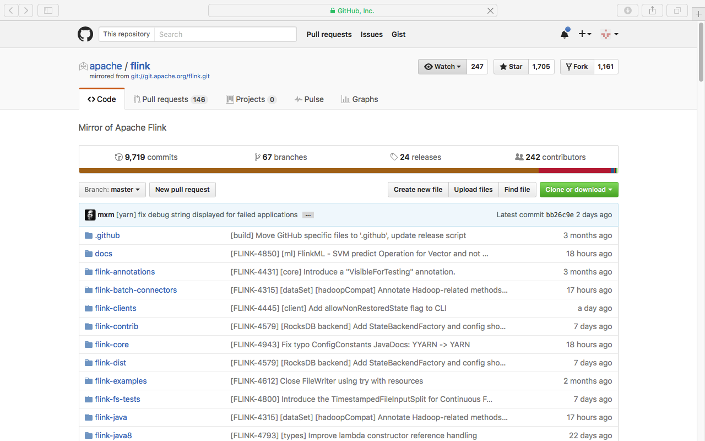
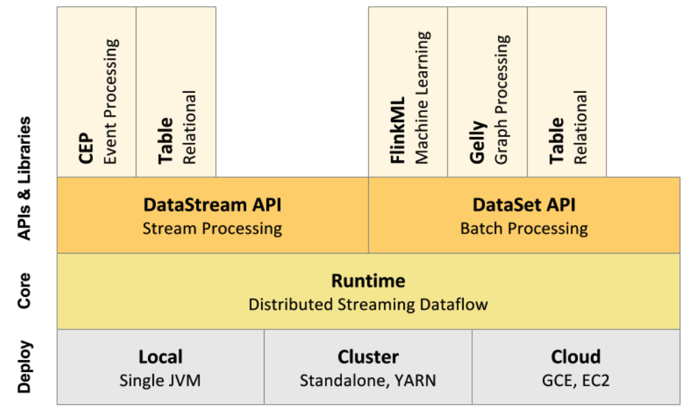

##《flink简介》
flink早在2008年就是德国柏林理工大学一个研究性项目，在2014被Apache孵化器所接受，然后迅速地成为了ASFApache Software Foundation的顶级项目。
截止到2016.11.3最新的稳定版本是Latest stable release (v1.1.3)。

####flink官网&github

官方网站：https://flink.apache.org
 

github地址：https://github.com/apache/flink
 

####flink基本架构
flink和Hadoop一样是一个主从式的分布式系统。

 
>
.主节点
负责分发计算任务
负责监控计算任务的执行情况
.从节点
负责执行计算任务
负责报告计算任务的执行情况

内部结构架构？？？？？？？


内部结构架构
 
####flink软件栈
 
```
flink deploy:
    有三种部署方式
    1.本地部署：在本地启动基于单个jvm的flink实例。
    2.集群部署：在集群中可以单独部署成standalone模式，也可以采用hadoop的YARN进行部署成yarn模式
    3.云部署：兼容Google的云服务GCE(Google Compute Engine)，也兼容amazon的云服务AWS(Amazon Web Services)。
flink core:
    flink的核心是一个分布式基于流的数据处理引擎,将一切处理都认为是流处理，将批处理看成流处理的一个特例。
    这与spark正好相反，spark是将一切处理都认为是批处理，将流处理看成批处理的一个特例。spark的流处理不是真正的流处理
    它是一种微型批处理（micro batch），因此spark的流处理实的时性不是很高，spark streaming定位是准实时流处理引擎。
    而flink是真正的流处理系统，它的实时性要比spark高出不少，它对标是Twitter开源的storm和heron,他是一个真正的大数据实时分析系统。
flink API: 
    flink的API分为两个部分
    1.流处理API，流处理主要是基于dataStream
    2.批处理API，批处理主要是基于dataSet
flink liberaries:    
    Flink还针对特定的应用领域提供了相应的软件库，方便适应特定领域的操作。主要包括
    1.flink table：主要用于处理关系型的结构化数据，对结构化数据进行查询操作，将结构化数据抽象成关系表，并通过类SQL的DSL对关系表进行各种查询操作。
       提供SQL on bigdata的功能,flink table既可以在流处理中使用SQL,也可以在批处理中使用SQL,对应sparkSQL.
    2.flink gelly：主要用于图计算领域，提供相关的图计算API和图计算算法的实现,对应spark graph。
    3.flink ML（machine leaning）：主要用于机器学习领域，提供了机器学习Pipelines APIh和多种机器学习算法的实现，对应sparkML
    4.flink CEP（Complex event processing）：
```

####flink生态圈
 

