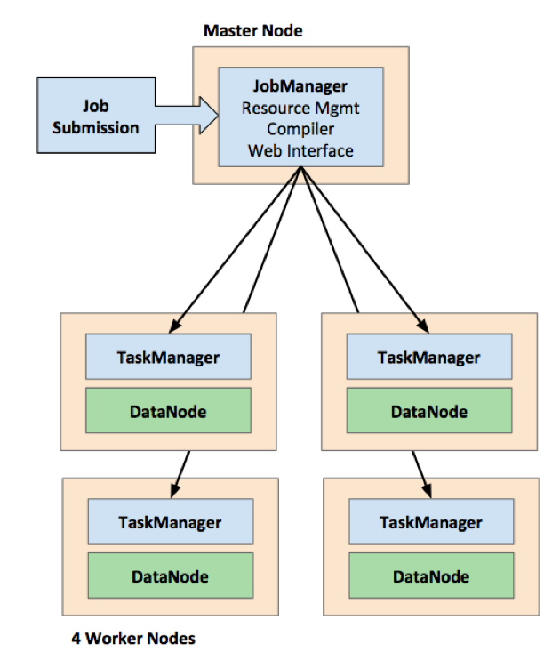
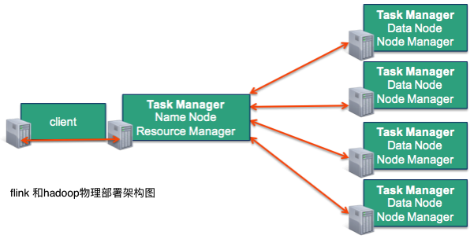

##《flink简介》
```
flink早在2008年就是德国柏林理工大学一个研究性项目，在2014被Apache孵化器所接受，
然后迅速地成为了ASF(Apache Software Foundation)的顶级项目。
```
###1.官方网站
```
https://flink.apache.org
```

###2.github地址
```
https://github.com/apache/flink
```

###3.flink基本架构
 
```
1.flink和Hadoop一样是一个主从式的分布式系统,有主节点（master）和从节点（worker）组成。
2.如果主节点不做HA，那么系统中有一个主节点和多个从节点组成。
3.如果主节点做了HA，那么系统中有多个主节点和多个从节点组成。
4.主节点的：负责分发计算任务，负责监控计算任务的执行情况。
5.从节点的：负责执行计算任务，负责报告计算任务的执行情况。
6.flinK使用一个client来提交计算任务。
```


######flink物理部署架构图
 
######flink和HDFS结合后的架构
 
 
```
Flink运行时包含了两种类型的处理器：
    1.Master (Job Manager): 处理job的提交，资源的调度，元数据的管理，运行状态监控等。
    2.Workers (Task Managers):分解job变成各种operation，并执行operation完成job任务。
    3.数据在node之间流动，优先计算本datanode中的data block，本node没有，才考虑拉取其他node上的block。
    4.所有操作都基于内存，在计算完成后可以写入各种持久化存储系统，如hdfs,hbase等。
```


 
 
######flink运行时架构
 
>
```
Flink运行时包含了两种类型的处理器：
master处理器：也称之为JobManagers用于协调分布式执行。它们用来调度task，协调检查点，协调失败时恢复等。
Flink运行时至少存在一个master处理器。一个高可用的运行模式会存在多个master处理器，它们其中有一个是leader，而其他的都是standby。
worker处理器：也称之为TaskManagers用于执行一个dataflow的task(或者特殊的subtask)、数据缓冲和data stream的交换。
Flink运行时至少会存在一个worker处理器。
```

####flink软件栈
 
```
flink deploy:
    有三种部署方式
    1.本地部署：在本地启动基于单个jvm的flink实例。
    2.集群部署：在集群中可以单独部署成standalone模式，也可以采用hadoop的YARN进行部署成yarn模式
    3.云部署：兼容Google的云服务GCE(Google Compute Engine)，也兼容amazon的云服务AWS(Amazon Web Services)。
flink core:
    flink的核心是一个分布式基于流的数据处理引擎,将一切处理都认为是流处理，将批处理看成流处理的一个特例。
    这与spark正好相反，spark是将一切处理都认为是批处理，将流处理看成批处理的一个特例。spark的流处理不是真正的流处理
    它是一种微型批处理（micro batch），因此spark的流处理实的时性不是很高，spark streaming定位是准实时流处理引擎。
    而flink是真正的流处理系统，它的实时性要比spark高出不少，它对标是Twitter开源的storm和heron,他是一个真正的大数据
    实时分析系统。
flink API: 
    flink的API分为两个部分
    1.流处理API，流处理主要是基于dataStream
    2.批处理API，批处理主要是基于dataSet
flink liberaries:    
    Flink还针对特定的应用领域提供了相应的软件库，方便适应特定领域的操作。主要包括
    1.flink table：主要用于处理关系型的结构化数据，对结构化数据进行查询操作，将结构化数据抽象成关系表，并通过类SQL的
       DSL对关系表进行各种查询操作。提供SQL on bigdata的功能,flink table既可以在流处理中使用SQL,也可以在批处理中
       使用SQL,对应sparkSQL.
    2.flink gelly：主要用于图计算领域，提供相关的图计算API和图计算算法的实现,对应spark graph。
    3.flink ML（machine leaning）：主要用于机器学习领域，提供了机器学习Pipelines APIh和多种机器学习算法的实现，
      对应sparkML
    4.flink CEP（Complex event processing）：
```

####flink生态圈
 


####flink大数据生态圈的软件栈1
 
####flink大数据生态圈的软件栈2
 

---
######flink的物理部署架构

######flink和Hadoop的物理部署架构

######client的作用
Type extraction
Optimize: in all APIs not just SQL queries as in Spark
Construct job Dataflow graph
Pass job Dataflow graph to job manager
Retrieve job results


######job manager的作用
Parallelization: Create Execution Graph
Scheduling: Assign tasks to task managers
State tracking: Supervise the execution

######task manager的作用
Operations are split up into tasks depending on the specified parallelism
Each parallel instance of an operation runs in a separate task slot
The scheduler may run several tasks from different operators in one task slot


