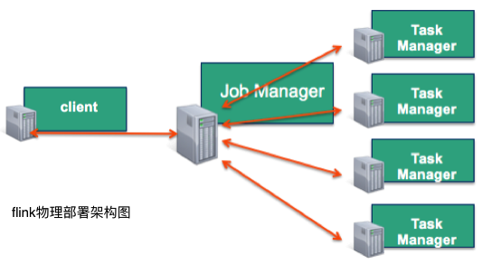
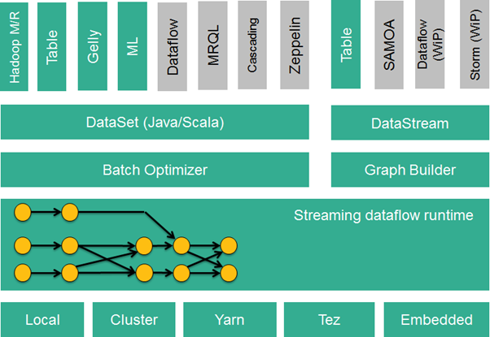
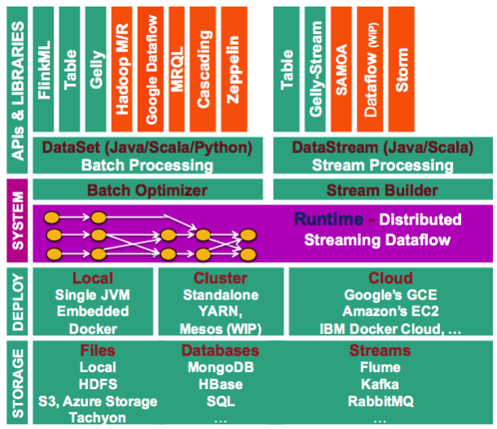
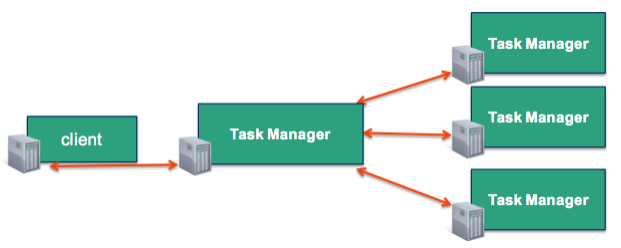
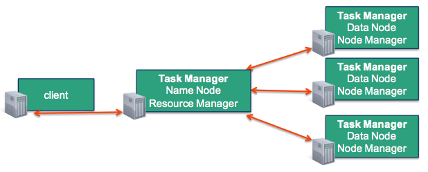
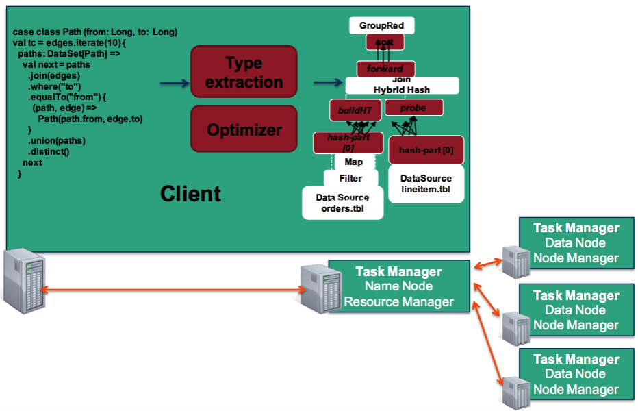
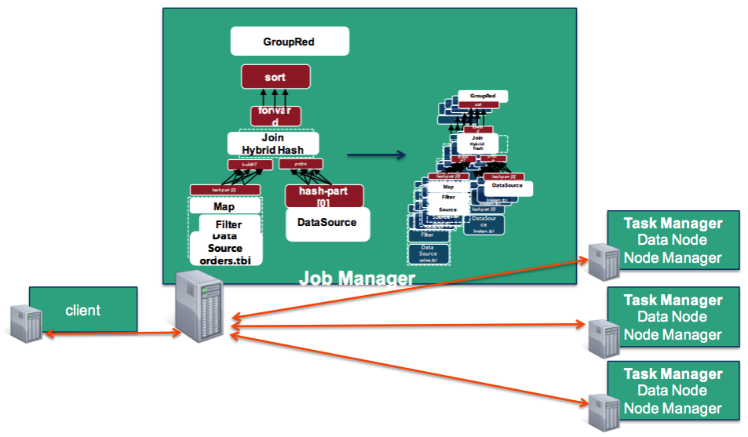
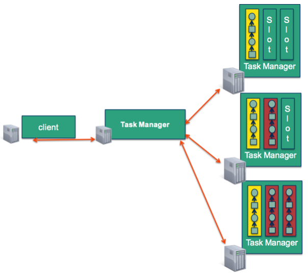

######flink物理部署架构图
 
######flink和HDFS结合后的架构
 
```
Flink运行时包含了两种类型的处理器：
    1.Master (Job Manager): 处理job的提交，资源的调度，元数据的管理，运行状态监控等。
    2.Workers (Task Managers):分解job变成各种operation，并执行operation完成job任务。
    3.数据在node之间流动，优先计算本datanode中的data block，本node没有，才考虑拉取其他node上的block。
    4.所有操作都基于内存，在计算完成后可以写入各种持久化存储系统，如hdfs,hbase等。
```


 
 
######flink运行时架构
 
>
```
Flink运行时包含了两种类型的处理器：
master处理器：也称之为JobManagers用于协调分布式执行。它们用来调度task，协调检查点，协调失败时恢复等。
Flink运行时至少存在一个master处理器。一个高可用的运行模式会存在多个master处理器，它们其中有一个是leader，而其他的都是standby。
worker处理器：也称之为TaskManagers用于执行一个dataflow的task(或者特殊的subtask)、数据缓冲和data stream的交换。
Flink运行时至少会存在一个worker处理器。
```

####flink软件栈


####flink生态圈
 


####flink大数据生态圈的软件栈1
 
####flink大数据生态圈的软件栈2
 

---
######flink的物理部署架构

######flink和Hadoop的物理部署架构

######client的作用
Type extraction
Optimize: in all APIs not just SQL queries as in Spark
Construct job Dataflow graph
Pass job Dataflow graph to job manager
Retrieve job results


######job manager的作用
Parallelization: Create Execution Graph
Scheduling: Assign tasks to task managers
State tracking: Supervise the execution

######task manager的作用
Operations are split up into tasks depending on the specified parallelism
Each parallel instance of an operation runs in a separate task slot
The scheduler may run several tasks from different operators in one task slot


