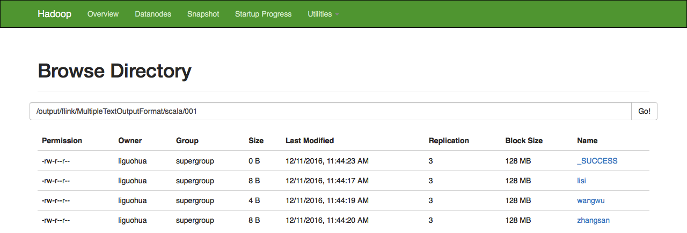
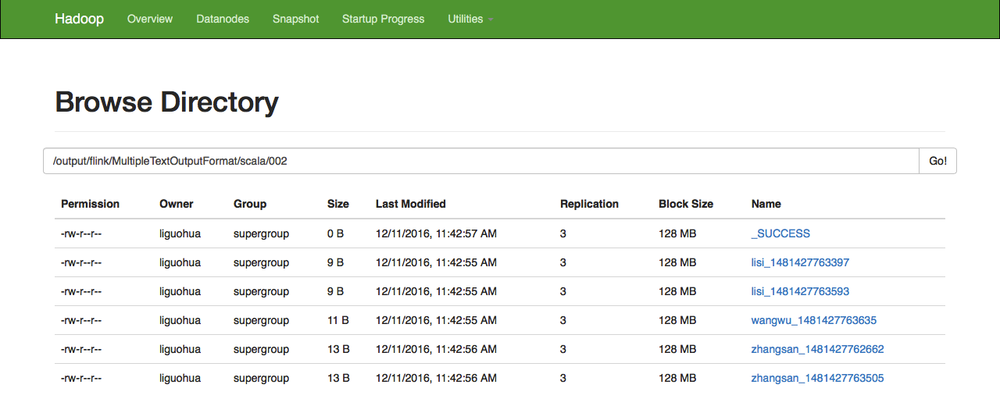
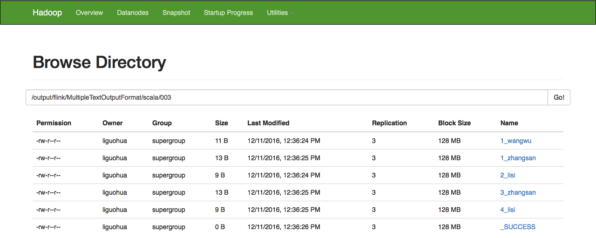

##一、MultipleTextOutputFormat设置一
```
使用DataSet的key作为文件名称，将DataSet输出到多个文件中。
```

###1.自定义MultipleTextOutputFormat
```scala
package code.book.batch.outputformat.scala

import org.apache.hadoop.io.NullWritable
import org.apache.hadoop.mapred.lib.MultipleTextOutputFormat

class MultipleTextOutputFormat001[K, V] extends MultipleTextOutputFormat[K, V] {
  /**
    * 此方法用于产生文件名称,这里将key_DateTime直接作为文件名称
    *
    * @param key   DataSet的key
    * @param value DataSet的value
    * @param name  DataSet的partition的id(从1开始)
    * @return file的name
    */
  override def generateFileNameForKeyValue(key: K, value: V, name: String): String = key.asInstanceOf[String]

  /**
    * 此方法用于产生文件内容中的key，这里文件内容中的key是就是DataSet的key
    *
    * @param key   DataSet的key
    * @param value DataSet的value
    * @return file的key
    */
  override def generateActualKey(key: K, value: V): K = NullWritable.get().asInstanceOf[K]

  /**
    * 此方法用于产生文件内容中的value，这里文件内容中的value是就是DataSet的value
    *
    * @param key   DataSet的key
    * @param value DataSet的value
    * @return file的value
    */
  override def generateActualValue(key: K, value: V): V = value.asInstanceOf[V]
}
```
###2.自定义MultipleTextOutputFormat测试入口
```scala
package code.book.batch.outputformat.scala

import org.apache.flink.api.scala.hadoop.mapred.HadoopOutputFormat
import org.apache.flink.api.scala.{ExecutionEnvironment, _}
import org.apache.hadoop.fs.Path
import org.apache.hadoop.mapred.{FileOutputFormat, JobConf}
/**
  * hadoop fs -text /output/flink/MultipleTextOutputFormat/scala/001/lisi
 */
object MultipleTextOutputFormat001Test {
  def main(args: Array[String]) {

    //1.创建批处理环境
    val env = ExecutionEnvironment.getExecutionEnvironment

    //2.准备数据
    val data1 = env.fromCollection(List(("zhangsan", "120"), ("lisi", "123"),
      ("zhangsan", "309"), ("lisi", "207"), ("wangwu", "315")))

    //3.多路径输出的HadoopOutputFormat
    val multipleTextOutputFormat = new MultipleTextOutputFormat001[String, String]()
    val jobConf = new JobConf()
    val filePath = "hdfs://qingcheng11:9000/output/flink/MultipleTextOutputFormat/scala/001"
    FileOutputFormat.setOutputPath(jobConf, new Path(filePath))
    val format = new HadoopOutputFormat[String, String](multipleTextOutputFormat, jobConf)

    //4.将数据输出出去
    data1.output(format)

    //5.触发批处理执行
    env.execute()
  }
}
```
###2.自定义MultipleTextOutputFormat执行效果
 
 

##二、MultipleTextOutputFormat设置二
```
使用DataSet的key和时间戳作为文件名称，将DataSet输出到多个文件中。
```

###1.自定义MultipleTextOutputFormat
```scala
package code.book.batch.outputformat.scala

import java.util.Date

import org.apache.hadoop.mapred.lib.MultipleTextOutputFormat

/**
  * Created by liguohua on 11/12/2016.
  */
class MultipleTextOutputFormat002[K, V] extends MultipleTextOutputFormat[K, V] {
  /**
    * 此方法用于产生文件名称,这里将key_DateTime直接作为文件名称
    *
    * @param key   DataSet的key
    * @param value DataSet的value
    * @param name  DataSet的partition的id(从1开始)
    * @return file的name
    */
  override def generateFileNameForKeyValue(key: K, value: V, name: String): String = (key + "_" + new Date().getTime).asInstanceOf[String]

  /**
    * 此方法用于产生文件内容中的key，这里文件内容中的key是就是DataSet的key
    *
    * @param key   DataSet的key
    * @param value DataSet的value
    * @return file的key
    */
  override def generateActualKey(key: K, value: V): K = key.asInstanceOf[K]

  /**
    * 此方法用于产生文件内容中的value，这里文件内容中的value是就是DataSet的value
    *
    * @param key   DataSet的key
    * @param value DataSet的value
    * @return file的value
    */
  override def generateActualValue(key: K, value: V): V = value.asInstanceOf[V]
}
```
###2.自定义MultipleTextOutputFormat测试入口
```scala
package code.book.batch.outputformat.scala

import org.apache.flink.api.scala.hadoop.mapred.HadoopOutputFormat
import org.apache.flink.api.scala.{ExecutionEnvironment, _}
import org.apache.hadoop.fs.Path
import org.apache.hadoop.mapred.{FileOutputFormat, JobConf}

object MultipleTextOutputFormat002Test {
  def main(args: Array[String]) {

    //1.创建批处理环境
    val env = ExecutionEnvironment.getExecutionEnvironment

    //2.准备数据
    val data1 = env.fromCollection(List(("zhangsan", "120"), ("lisi", "123"),
      ("zhangsan", "309"), ("lisi", "207"), ("wangwu", "315")))

    //3.多路径输出的HadoopOutputFormat
    val multipleTextOutputFormat = new MultipleTextOutputFormat002[String, String]()
    val jobConf = new JobConf()
    val filePath = "hdfs://qingcheng11:9000/output/flink/MultipleTextOutputFormat/scala/002"
    FileOutputFormat.setOutputPath(jobConf, new Path(filePath))
    val format = new HadoopOutputFormat[String, String](multipleTextOutputFormat, jobConf)

    //4.将数据输出出去
    data1.output(format)

    //5.触发批处理执行
    env.execute()
  }
}
```
###2.自定义MultipleTextOutputFormat执行效果
 


##三、MultipleTextOutputFormat设置三
```
使用DataSet的key做为文件名称，文件内容以键值对的形式存在，将DataSet输出到多个文件中。
```

###1.自定义MultipleTextOutputFormat
```scala
package code.book.batch.outputformat.scala

import org.apache.hadoop.mapred.lib.MultipleTextOutputFormat

/**
  * Created by liguohua on 11/12/2016.
  */
class MultipleTextOutputFormat003[K, V] extends MultipleTextOutputFormat[K, V] {
  /**
    * 此方法用于产生文件名称,这里将name_key直接作为文件名称
    *
    * @param key   DataSet的key
    * @param value DataSet的value
    * @param name  DataSet的partition的id(从1开始)
    * @return file的name
    */
  override def generateFileNameForKeyValue(key: K, value: V, name: String): String = ( name + "_" +key).asInstanceOf[String]

  /**
    * 此方法用于产生文件内容中的key，这里文件内容中的key是就是DataSet的key
    *
    * @param key   DataSet的key
    * @param value DataSet的value
    * @return file的key
    */
  override def generateActualKey(key: K, value: V): K = key.asInstanceOf[K]

  /**
    * 此方法用于产生文件内容中的value，这里文件内容中的value是就是DataSet的value
    *
    * @param key   DataSet的key
    * @param value DataSet的value
    * @return file的value
    */
  override def generateActualValue(key: K, value: V): V = value.asInstanceOf[V]
}
```
###2.自定义MultipleTextOutputFormat测试入口
```scala
package code.book.batch.outputformat.scala

import org.apache.flink.api.scala.hadoop.mapred.HadoopOutputFormat
import org.apache.flink.api.scala.{ExecutionEnvironment, _}
import org.apache.hadoop.fs.Path
import org.apache.hadoop.mapred.{FileOutputFormat, JobConf}

object MultipleTextOutputFormat003Test {
  def main(args: Array[String]) {

    //1.创建批处理环境
    val env = ExecutionEnvironment.getExecutionEnvironment

    //2.准备数据
    val data1 = env.fromCollection(List(("zhangsan", "120"), ("lisi", "123"),
      ("zhangsan", "309"), ("lisi", "207"), ("wangwu", "315")))
    data1.setParallelism(4)

    //3.多路径输出的HadoopOutputFormat
    val multipleTextOutputFormat = new MultipleTextOutputFormat003[String, String]()
    val jobConf = new JobConf()
    val filePath = "hdfs://qingcheng12:9000/output/flink/MultipleTextOutputFormat/scala/003"
    FileOutputFormat.setOutputPath(jobConf, new Path(filePath))
    val format = new HadoopOutputFormat[String, String](multipleTextOutputFormat, jobConf)

    //4.将数据输出出去
    data1.output(format)

    //5.触发批处理执行
    env.execute()
  }
}
```
###2.自定义MultipleTextOutputFormat执行效果
 
