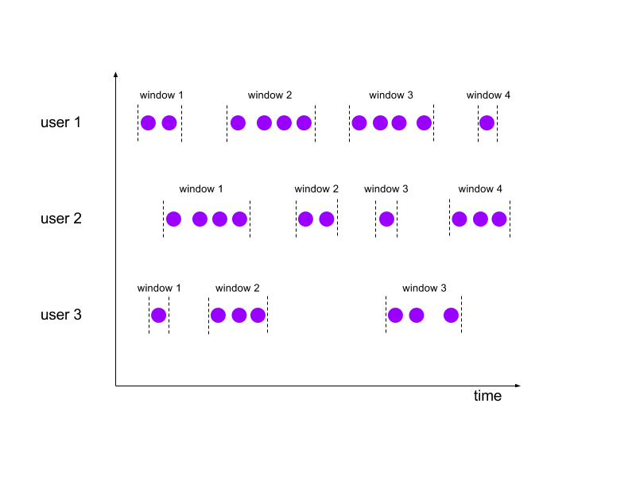
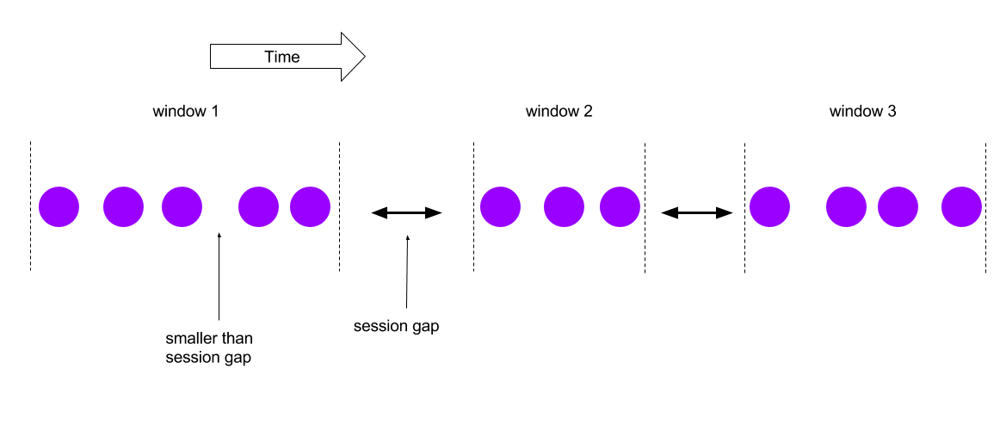

##一、数据流和sessionc窗口
###1.数据流
 
```
1.用户上京东购物，会进行一系列的操作，比如（点击、浏览、搜索、购买、付款等），用户的操作可以被记录为用户操作数据流。
2.京东上的用户会同时有多个，每个用户的操作都是独立的，随机的，因此用户之间的行为没有必然联系，没有统一规律。
```
###2.会话窗口（Session Windows）
####2.1会话窗口概念
 
```
1.用户的行为有时是一连串的，形成的数据流也是一连串的
2.我们把每一串称为一个session，不同的用户的session划分结果是不一样的。
3.我们把这种window称作SessionWindow
```
####2.2会话窗口gap
 
```
1.SessionWindow中的Gap是一个非常重要的概念，它指的是session之间的间隔。
2.如果session之间的间隔大于指定的间隔，数据将会被划分到不同的session中。
  比如，设定5秒的间隔，0-5属于一个session，5-10属于另一个session
```

####2.1会话窗口设定
```  
// event-time session windows
input
    .keyBy(<key selector>)
    .window(EventTimeSessionWindows.withGap(Time.minutes(10)))
    .<windowed transformation>(<window function>)

// processing-time session windows
input
    .keyBy(<key selector>)
    .window(ProcessingTimeSessionWindows.withGap(Time.minutes(10)))
    .<windowed transformation>(<window function>)
```


##二、session窗口实战


##参考链接：
http:http://data-artisans.com/session-windowing-in-flink/