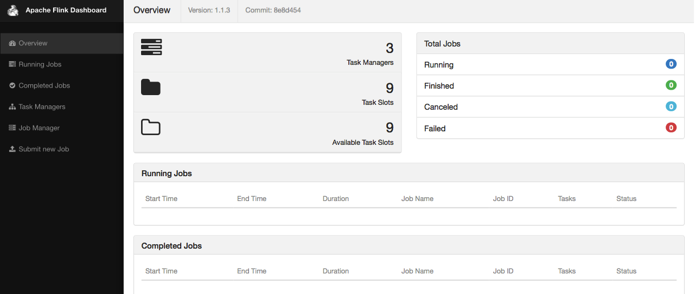

##一、配置yarn
###1.编辑yarn-site.xml
```
1.编辑命令
vim ${HADOOP_HOME}/etc/hadoop/yarn-site.xml

2.配置内容
<property>  
    <name>yarn.nodemanager.vmem-pmem-ratio</name>  
    <value>4</value>  
</property> 
<property>  
    <name>yarn.nodemanager.vmem-check-enabled</name>  
    <value>false</value>  
</property> 

3.配置说明
yarn.nodemanager.vmem-pmem-ratio是yarn内存与虚拟内存的比率默认2.1，适当调大。
yarn.nodemanager.vmem-check-enabled是yarn在启动程序不检查它申请的虚拟内存。
```

###2.分发yarn的配置文件
```
scp  -r ${HADOOP_HOME}/etc/hadoop/yarn-site.xml  qingcheng12:${HADOOP_HOME}/etc/hadoop/
scp  -r ${HADOOP_HOME}/etc/hadoop/yarn-site.xml  qingcheng13:${HADOOP_HOME}/etc/hadoop/
```
###3.重启yarn
```
${HADOOP_HOME}/sbin/stop-yarn.sh
${HADOOP_HOME}/sbin/start-yarn.sh
```

##二、关闭flink-Standalone集群
###1.关闭flink-Standalone集群
```
${FLINK_HOME}/bin/stop-cluster.sh
```
###2.原因说明
```
1.因为yarn可以自动启动受yanr管理flink集群，所以应当将standalone集群关闭掉。
2.standalone集群都关闭掉了，因此再运行flink作业，就不能使用standalone集群的web界面进行监控了。
3.应当使用yarn的监控界面，在yarn中可以进入受yarn管理的flink-cluster-webUI进行监控。
```

##三、使用yarn-session创建flink集群
###1.说明
```
1.首先yarn-session会启动受yarn管理的flink集群。
2.这个flink集群可以运行一个又一个的程序。
3.程序运行结束后集群不结束，只用yarn-session关闭了，集群才会关闭。
```
###2.启动yarn-session
####2.1启动yarn-session
```
1.前台启动
$FLINK_HOME/bin/yarn-session.sh -n 3 -s 3

2.后台启动
$FLINK_HOME/bin/yarn-session.sh -n 3 -s 3 -d
```
####2.2查看yarn-session参数
```
1.查看命令
$FLINK_HOME/bin/yarn-session.sh 

2.参数说明
Usage:
   Required
     -n,--container <arg>   Number of YARN container to allocate (=Number of Task Managers)
   Optional
     -D <arg>                        Dynamic properties
     -d,--detached                   Start detached
     -id,--applicationId <arg>       Attach to running YARN session
     -j,--jar <arg>                  Path to Flink jar file
     -jm,--jobManagerMemory <arg>    Memory for JobManager Container [in MB]
     -n,--container <arg>            Number of YARN container to allocate (=Number of Task Managers)
     -nm,--name <arg>                Set a custom name for the application on YARN
     -q,--query                      Display available YARN resources (memory, cores)
     -qu,--queue <arg>               Specify YARN queue.
     -s,--slots <arg>                Number of slots per TaskManager
     -st,--streaming                 Start Flink in streaming mode
     -t,--ship <arg>                 Ship files in the specified directory (t for transfer)
     -tm,--taskManagerMemory <arg>   Memory per TaskManager Container [in MB]
     -z,--zookeeperNamespace <arg>   Namespace to create the Zookeeper sub-paths for high availability mode
```
####2.3验证yarn-session启动
```
1.查看命令
jps

2.可见进程
FlinkYarnSessionCli
YarnApplicationMasterRunner
```

###3.yarn-session在terminal下的启动效果
 
###4.yarn-session在yarn-web下的启动效果
 
###5.yarn-session代理出来的flink监控界面
 
###6.运行flink程序
```
$FLINK_HOME/bin/flink run /bigdata/software/simple-flink.jar
```
###7.程序运行后flink监控界面的效果
 
 
###8.程序运行后terminal的运行效果
 
 

##四、使用flink-job创建flink集群
###1.说明
```
1.首先flink-client将一个job提交到yarn。
2.yarn为这个application启动一个临时flink集群
3.application运行结束后后,yarn关闭临时flink集群
```
###2.运程序
```
$FLINK_HOME/bin/flink run -m yarn-cluster -yn 3
/bigdata/software/simple-flink.jar
```
###3.yarn-web下的运行效果
 
###4.terminal下的运行效果
 
 


